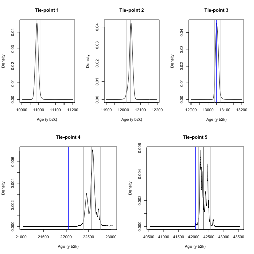
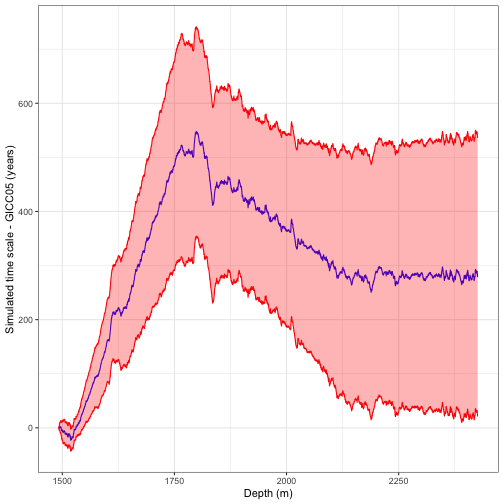
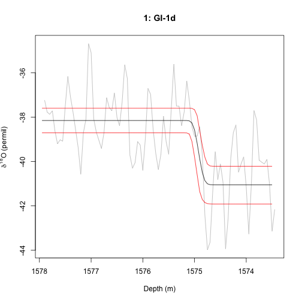
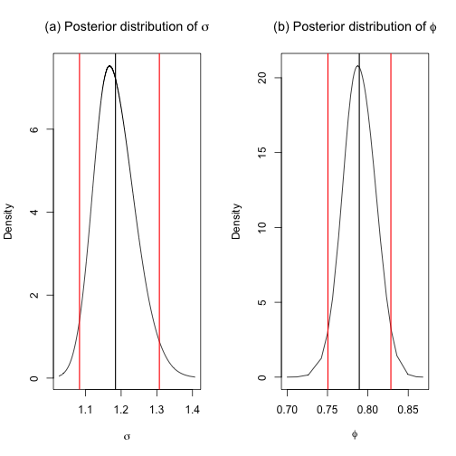
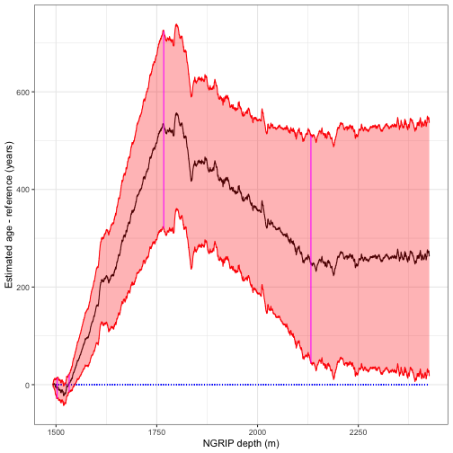

<!-- Paper_results_2.md is generated from paper_results_2.Rmd. Please edit that file -->


# bremla

This file includes the data and code needed to reproduce the results for

Myrvoll-Nilsen, E., Riechers, K. & Boers, N. (202x). Tie-point paper (title TBD)

# Myrvoll-Nilsen et al. (202x)

The data used is the NGRIP/GICC05 data set 'NGRIP_d18O_and_dust_5cm', downloaded from [Centre for Ice and Climate](iceandclimate.nbi.ku.dk) at the Niels Bohr Institute of the University of Copenhagen, Denmark, and the table of stadial-interstadial events presented by [Rasmussen et al. (2014)](https://www.sciencedirect.com/science/article/pii/S0277379114003485). These are included in the package and can be imported as follows. 

```r
#library(bremla)
data("event_intervals")
data("events_rasmussen")
data("NGRIP_5cm")
age = NGRIP_5cm$age
depth = NGRIP_5cm$depth
proxy = NGRIP_5cm$d18O
n=length(diff(age))
data = data.frame(age=age,dy=c(NA,diff(age)),depth=depth,depth2=depth^2,proxy=proxy)
events=list(locations = events_rasmussen$depth,
            locations_unit="depth",degree=1)
plot(depth,proxy,xlab="Age (yb2k)",ylab=expression(paste(d^18,"O (permil)")),type="l",
     xlim=rev(range(depth)))+abline(v=events$locations,col="gray",lwd=0.7)
formula = dy~-1+depth2+proxy
```


We also use tie-points described by probability distributions obtained from Adolphi et al. (2018) and Muscheler et al. (2020). These can be imported as follows.


```r
adolphipdfs = adolphiloader(tieshifts=c(11050,12050,13050,22050,42050),plotdens = TRUE,
                            x.ref=c(11050,12050,13050,22050,42050))
```



The model can be fitted using the \texttt{bremla} function, which estimates the posterior marginal distributions of the hyperparameters and also performs simulations of chronologies.


```r
nsims=10000
results = bremla(formula,data,reference.label="GICC05",
                nsims=nsims,
                events=events,
                control.fit=list(noise="ar1"),
                control.sim=list(synchronized=FALSE) ,
                print.progress=TRUE
                )
{
  
  par(mfrow=c(1,2))
  plot(results$fitting$inla$hyperparameters$posteriors$sigma_epsilon,type="l",xlab=expression(paste(sigma[epsilon])),ylab="Density")
  
  abline(v=results$fitting$inla$hyperparameters$results$sigma_epsilon$mean)
  abline(v=c(results$fitting$inla$hyperparameters$results$sigma_epsilon$quant0.025,
             results$fitting$inla$hyperparameters$results$sigma_epsilon$quant0.975),
             col="red")
         
  plot(results$fitting$inla$hyperparameters$posteriors$phi,type="l",xlab=expression(phi),ylab="Density")
  abline(v=results$fitting$inla$hyperparameters$results$phi$mean)
  abline(v=c(results$fitting$inla$hyperparameters$results$phi$quant0.025,
             results$fitting$inla$hyperparameters$results$phi$quant0.975),
             col="red")
 par(mfrow=c(1,1)) 
}
```

The fitted model to the layer increments and the simulated chronologies (as compared to the GICC05 time scale) can be plotted as follows.


```r
{
  library(ggplot2)
  
  dsims = colDiffs(rbind(matrix(rep(results$initial$age,ncol(results$simulation$age)),nrow=1),results$simulation$age))
  dmeans = rowMeans(dsims)
  dsd = rowSds(dsims)
ggd = data.frame(y = results$data$dy,depth=results$data$depth,
                   mean=dmeans,
                   lower = dmeans-1.96*dsd,
                   upper = dmeans+1.96*dsd)
  ggp = ggplot(data=ggd,aes(x=depth)) + theme_bw()+ #xlim(rev(range(results$data$depth)))+
    geom_line(aes(y=y),col="gray")+
    geom_line(aes(y=mean),col="blue",size=0.3)+
    geom_ribbon(aes(ymin=lower,ymax=upper),color="red",alpha=0,size=0.05)+
    xlab("Depth (m)")+ylab("Layers per 5cm")
 print(ggp) 
 
 #ggsave("fitdiff-4800x2000.eps", device=cairo_ps,width=4800,height=2000,units="px",dpi=500,limitsize=FALSE)
}
#> Need help? Try Stackoverflow: https://stackoverflow.com/tags/ggplot2
#> Error in matrix(rep(results$initial$age, ncol(results$simulation$age)), : object 'results' not found
{
  gicc05=results$original.chron$age[1+1:n]
  ggd = data.frame(depth=results$data$depth,
                   mean=results$simulation$summary$mean-gicc05,
                   lower=results$simulation$summary$lower-gicc05,
                   upper=results$simulation$summary$upper-gicc05,
                   zeros = numeric(n))
  ggp = ggplot(data=ggd,aes(x=depth)) + theme_bw()+
    #geom_line(aes(y=zeros),color="gray",linetype="dashed")+
    geom_line(aes(y=mean),col="blue")+
    geom_ribbon(aes(ymin=lower,ymax=upper),fill="red",col="red",alpha=0.3)+
    xlab("Depth (m)") + ylab("Simulated time scale - GICC05 (years)")
  print(ggp)
  
  #ggsave("unsync-4800x2000.eps", device=cairo_ps,width=4800,height=2000,units="px",dpi=500,limitsize=FALSE)
}
#> Error in eval(expr, envir, enclos): object 'results' not found
```


## Fixed tie-points


In the paper we demonstrate our model first using the Adolphi tie-points fixed to be equal to the mode of the probability distribution. We omit the first tie-point since it falls outside of our considered interval. The constrained chronologies can be computed as follows.


```r
fixedsims = cbind(#rep(inla.mmarginal(adolphipdfs$tie1),nsims),
                  rep(inla.mmarginal(adolphipdfs$tie2),nsims),
                  rep(inla.mmarginal(adolphipdfs$tie3),nsims),
                  rep(inla.mmarginal(adolphipdfs$tie4),nsims),
                  rep(inla.mmarginal(adolphipdfs$tie5),nsims)
                  )
#> Error in inla.mmarginal(adolphipdfs$tie2): could not find function "inla.mmarginal"
synchronization = list(samples = fixedsims,nsims=nsims,
                       locations=c(#1492.50,
                                   1502.80,1532.70,1767.25,2132.40),
                       locations_unit="depth")
#> Error in eval(expr, envir, enclos): object 'fixedsims' not found
results_fixed = bremla(formula,data,reference.label="GICC05",
                nsims=nsims,
                events=events,
                synchronization=synchronization,
                control.fit=list(noise="ar1"),
                control.sim=list(synchronized=TRUE) ,
                print.progress=TRUE
                )
#> Initiating data formatting... completed!
#> Performing least squares fit... completed!
#> Performing INLA fit... completed.
#> Computing remaining posteriors using Monte Carlo simulation...
#> INLA fit completed in 13.40348 seconds!
#> Simulating 5000 hyperparameters from INLA posterior... completed!
#> Sampling fixed coefficients... completed in 30.18307 seconds.
#> Simulating synchronized chronologies...
#> Synchronous age simulation 1000/5000. Elapsed time: 14.0557 seconds...
#> Synchronous age simulation 2000/5000. Elapsed time: 26.95918 seconds...
#> Synchronous age simulation 3000/5000. Elapsed time: 39.95542 seconds...
#> Synchronous age simulation 4000/5000. Elapsed time: 53.15636 seconds...
#> Synchronous age simulation 5000/5000. Elapsed time: 66.24041 seconds...
#> Computing posterior marginal mean and 95% credible intervals from chronology samples...
#>  completed in 2.631492seconds.
{
  gicc05=results_fixed$original.chron$age[1+1:n]
  ggd = data.frame(depth=results_fixed$data$depth,
                   mean=results_fixed$simulation$summary_sync$mean-gicc05,
                   lower=results_fixed$simulation$summary_sync$lower-gicc05,
                   upper=results_fixed$simulation$summary_sync$upper-gicc05,
                   zeros = numeric(n))
  ggp = ggplot(data=ggd,aes(x=depth)) + theme_bw()+
    #geom_line(aes(y=zeros),color="gray",linetype="dashed")+
    geom_line(aes(y=mean),col="blue")+
    geom_ribbon(aes(ymin=lower,ymax=upper),fill="red",col="red",alpha=0.3)+
    xlab("Depth (m)") + ylab("Simulated time scale - GICC05 (years)")
  print(ggp)
  
  #ggsave("fixed-4800x2000.eps", device=cairo_ps,width=4800,height=2000,units="px",dpi=500,limitsize=FALSE)
}
```



Synchronizing our chronologies with the Adolphi tie-points where the uncertainties is incorporated cam be done using Monte Carlo simulations. All of this can be done using the bremla function.


```r
library(ggplot2)
synchronization = list(method="adolphi",nsims=nsims,
                       locations=c(#1492.50,
                                   1502.80,1532.70,1767.25,2132.40),
                       locations_unit="depth")
results_sync = bremla(formula,data,reference.label="GICC05",
                nsims=nsims,
                events=events,
                synchronization=synchronization,
                control.fit=list(noise="ar1"),
                control.sim=list(synchronized=TRUE,summary=list(CI.type="hpd")) ,
                print.progress=TRUE
                )
#> Initiating data formatting... completed!
#> Performing least squares fit... completed!
#> Performing INLA fit... completed.
#> Computing remaining posteriors using Monte Carlo simulation...
#> INLA fit completed in 13.15583 seconds!
#> Simulating 5000 hyperparameters from INLA posterior... completed!
#> Sampling fixed coefficients... completed in 30.74605 seconds.
#> Simulating synchronized chronologies...
#> Synchronous age simulation 1000/5000. Elapsed time: 13.17813 seconds...
#> Synchronous age simulation 2000/5000. Elapsed time: 25.90533 seconds...
#> Synchronous age simulation 3000/5000. Elapsed time: 39.18116 seconds...
#> Synchronous age simulation 4000/5000. Elapsed time: 52.1951 seconds...
#> Synchronous age simulation 5000/5000. Elapsed time: 65.25119 seconds...
#> Computing posterior marginal mean and 95% credible intervals from chronology samples...
#> Warning in regularize.values(x, y, ties, missing(ties)): collapsing to unique
#> 'x' values

#> Warning in regularize.values(x, y, ties, missing(ties)): collapsing to unique
#> 'x' values

#> Warning in regularize.values(x, y, ties, missing(ties)): collapsing to unique
#> 'x' values

#> Warning in regularize.values(x, y, ties, missing(ties)): collapsing to unique
#> 'x' values

#> Warning in regularize.values(x, y, ties, missing(ties)): collapsing to unique
#> 'x' values

#> Warning in regularize.values(x, y, ties, missing(ties)): collapsing to unique
#> 'x' values

#> Warning in regularize.values(x, y, ties, missing(ties)): collapsing to unique
#> 'x' values

#> Warning in regularize.values(x, y, ties, missing(ties)): collapsing to unique
#> 'x' values

#> Warning in regularize.values(x, y, ties, missing(ties)): collapsing to unique
#> 'x' values

#> Warning in regularize.values(x, y, ties, missing(ties)): collapsing to unique
#> 'x' values

#> Warning in regularize.values(x, y, ties, missing(ties)): collapsing to unique
#> 'x' values

#> Warning in regularize.values(x, y, ties, missing(ties)): collapsing to unique
#> 'x' values

#> Warning in regularize.values(x, y, ties, missing(ties)): collapsing to unique
#> 'x' values

#> Warning in regularize.values(x, y, ties, missing(ties)): collapsing to unique
#> 'x' values

#> Warning in regularize.values(x, y, ties, missing(ties)): collapsing to unique
#> 'x' values

#> Warning in regularize.values(x, y, ties, missing(ties)): collapsing to unique
#> 'x' values

#> Warning in regularize.values(x, y, ties, missing(ties)): collapsing to unique
#> 'x' values

#> Warning in regularize.values(x, y, ties, missing(ties)): collapsing to unique
#> 'x' values

#> Warning in regularize.values(x, y, ties, missing(ties)): collapsing to unique
#> 'x' values

#> Warning in regularize.values(x, y, ties, missing(ties)): collapsing to unique
#> 'x' values

#> Warning in regularize.values(x, y, ties, missing(ties)): collapsing to unique
#> 'x' values

#> Warning in regularize.values(x, y, ties, missing(ties)): collapsing to unique
#> 'x' values

#> Warning in regularize.values(x, y, ties, missing(ties)): collapsing to unique
#> 'x' values

#> Warning in regularize.values(x, y, ties, missing(ties)): collapsing to unique
#> 'x' values

#> Warning in regularize.values(x, y, ties, missing(ties)): collapsing to unique
#> 'x' values

#> Warning in regularize.values(x, y, ties, missing(ties)): collapsing to unique
#> 'x' values

#> Warning in regularize.values(x, y, ties, missing(ties)): collapsing to unique
#> 'x' values

#> Warning in regularize.values(x, y, ties, missing(ties)): collapsing to unique
#> 'x' values

#> Warning in regularize.values(x, y, ties, missing(ties)): collapsing to unique
#> 'x' values

#> Warning in regularize.values(x, y, ties, missing(ties)): collapsing to unique
#> 'x' values

#> Warning in regularize.values(x, y, ties, missing(ties)): collapsing to unique
#> 'x' values

#> Warning in regularize.values(x, y, ties, missing(ties)): collapsing to unique
#> 'x' values

#> Warning in regularize.values(x, y, ties, missing(ties)): collapsing to unique
#> 'x' values

#> Warning in regularize.values(x, y, ties, missing(ties)): collapsing to unique
#> 'x' values

#> Warning in regularize.values(x, y, ties, missing(ties)): collapsing to unique
#> 'x' values

#> Warning in regularize.values(x, y, ties, missing(ties)): collapsing to unique
#> 'x' values

#> Warning in regularize.values(x, y, ties, missing(ties)): collapsing to unique
#> 'x' values

#> Warning in regularize.values(x, y, ties, missing(ties)): collapsing to unique
#> 'x' values

#> Warning in regularize.values(x, y, ties, missing(ties)): collapsing to unique
#> 'x' values

#> Warning in regularize.values(x, y, ties, missing(ties)): collapsing to unique
#> 'x' values

#> Warning in regularize.values(x, y, ties, missing(ties)): collapsing to unique
#> 'x' values

#> Warning in regularize.values(x, y, ties, missing(ties)): collapsing to unique
#> 'x' values

#> Warning in regularize.values(x, y, ties, missing(ties)): collapsing to unique
#> 'x' values

#> Warning in regularize.values(x, y, ties, missing(ties)): collapsing to unique
#> 'x' values

#> Warning in regularize.values(x, y, ties, missing(ties)): collapsing to unique
#> 'x' values

#> Warning in regularize.values(x, y, ties, missing(ties)): collapsing to unique
#> 'x' values

#> Warning in regularize.values(x, y, ties, missing(ties)): collapsing to unique
#> 'x' values

#> Warning in regularize.values(x, y, ties, missing(ties)): collapsing to unique
#> 'x' values

#> Warning in regularize.values(x, y, ties, missing(ties)): collapsing to unique
#> 'x' values

#> Warning in regularize.values(x, y, ties, missing(ties)): collapsing to unique
#> 'x' values

#> Warning in regularize.values(x, y, ties, missing(ties)): collapsing to unique
#> 'x' values

#> Warning in regularize.values(x, y, ties, missing(ties)): collapsing to unique
#> 'x' values

#> Warning in regularize.values(x, y, ties, missing(ties)): collapsing to unique
#> 'x' values

#> Warning in regularize.values(x, y, ties, missing(ties)): collapsing to unique
#> 'x' values

#> Warning in regularize.values(x, y, ties, missing(ties)): collapsing to unique
#> 'x' values

#> Warning in regularize.values(x, y, ties, missing(ties)): collapsing to unique
#> 'x' values

#> Warning in regularize.values(x, y, ties, missing(ties)): collapsing to unique
#> 'x' values

#> Warning in regularize.values(x, y, ties, missing(ties)): collapsing to unique
#> 'x' values

#> Warning in regularize.values(x, y, ties, missing(ties)): collapsing to unique
#> 'x' values

#> Warning in regularize.values(x, y, ties, missing(ties)): collapsing to unique
#> 'x' values

#> Warning in regularize.values(x, y, ties, missing(ties)): collapsing to unique
#> 'x' values

#> Warning in regularize.values(x, y, ties, missing(ties)): collapsing to unique
#> 'x' values

#> Warning in regularize.values(x, y, ties, missing(ties)): collapsing to unique
#> 'x' values

#> Warning in regularize.values(x, y, ties, missing(ties)): collapsing to unique
#> 'x' values

#> Warning in regularize.values(x, y, ties, missing(ties)): collapsing to unique
#> 'x' values

#> Warning in regularize.values(x, y, ties, missing(ties)): collapsing to unique
#> 'x' values

#> Warning in regularize.values(x, y, ties, missing(ties)): collapsing to unique
#> 'x' values

#> Warning in regularize.values(x, y, ties, missing(ties)): collapsing to unique
#> 'x' values

#> Warning in regularize.values(x, y, ties, missing(ties)): collapsing to unique
#> 'x' values

#> Warning in regularize.values(x, y, ties, missing(ties)): collapsing to unique
#> 'x' values

#> Warning in regularize.values(x, y, ties, missing(ties)): collapsing to unique
#> 'x' values

#> Warning in regularize.values(x, y, ties, missing(ties)): collapsing to unique
#> 'x' values

#> Warning in regularize.values(x, y, ties, missing(ties)): collapsing to unique
#> 'x' values

#> Warning in regularize.values(x, y, ties, missing(ties)): collapsing to unique
#> 'x' values

#> Warning in regularize.values(x, y, ties, missing(ties)): collapsing to unique
#> 'x' values

#> Warning in regularize.values(x, y, ties, missing(ties)): collapsing to unique
#> 'x' values

#> Warning in regularize.values(x, y, ties, missing(ties)): collapsing to unique
#> 'x' values

#> Warning in regularize.values(x, y, ties, missing(ties)): collapsing to unique
#> 'x' values

#> Warning in regularize.values(x, y, ties, missing(ties)): collapsing to unique
#> 'x' values

#> Warning in regularize.values(x, y, ties, missing(ties)): collapsing to unique
#> 'x' values

#> Warning in regularize.values(x, y, ties, missing(ties)): collapsing to unique
#> 'x' values

#> Warning in regularize.values(x, y, ties, missing(ties)): collapsing to unique
#> 'x' values

#> Warning in regularize.values(x, y, ties, missing(ties)): collapsing to unique
#> 'x' values

#> Warning in regularize.values(x, y, ties, missing(ties)): collapsing to unique
#> 'x' values

#> Warning in regularize.values(x, y, ties, missing(ties)): collapsing to unique
#> 'x' values

#> Warning in regularize.values(x, y, ties, missing(ties)): collapsing to unique
#> 'x' values

#> Warning in regularize.values(x, y, ties, missing(ties)): collapsing to unique
#> 'x' values

#> Warning in regularize.values(x, y, ties, missing(ties)): collapsing to unique
#> 'x' values

#> Warning in regularize.values(x, y, ties, missing(ties)): collapsing to unique
#> 'x' values

#> Warning in regularize.values(x, y, ties, missing(ties)): collapsing to unique
#> 'x' values

#> Warning in regularize.values(x, y, ties, missing(ties)): collapsing to unique
#> 'x' values

#> Warning in regularize.values(x, y, ties, missing(ties)): collapsing to unique
#> 'x' values

#> Warning in regularize.values(x, y, ties, missing(ties)): collapsing to unique
#> 'x' values

#> Warning in regularize.values(x, y, ties, missing(ties)): collapsing to unique
#> 'x' values

#> Warning in regularize.values(x, y, ties, missing(ties)): collapsing to unique
#> 'x' values

#> Warning in regularize.values(x, y, ties, missing(ties)): collapsing to unique
#> 'x' values

#> Warning in regularize.values(x, y, ties, missing(ties)): collapsing to unique
#> 'x' values

#> Warning in regularize.values(x, y, ties, missing(ties)): collapsing to unique
#> 'x' values

#> Warning in regularize.values(x, y, ties, missing(ties)): collapsing to unique
#> 'x' values

#> Warning in regularize.values(x, y, ties, missing(ties)): collapsing to unique
#> 'x' values

#> Warning in regularize.values(x, y, ties, missing(ties)): collapsing to unique
#> 'x' values

#> Warning in regularize.values(x, y, ties, missing(ties)): collapsing to unique
#> 'x' values

#> Warning in regularize.values(x, y, ties, missing(ties)): collapsing to unique
#> 'x' values

#> Warning in regularize.values(x, y, ties, missing(ties)): collapsing to unique
#> 'x' values

#> Warning in regularize.values(x, y, ties, missing(ties)): collapsing to unique
#> 'x' values

#> Warning in regularize.values(x, y, ties, missing(ties)): collapsing to unique
#> 'x' values

#> Warning in regularize.values(x, y, ties, missing(ties)): collapsing to unique
#> 'x' values

#> Warning in regularize.values(x, y, ties, missing(ties)): collapsing to unique
#> 'x' values

#> Warning in regularize.values(x, y, ties, missing(ties)): collapsing to unique
#> 'x' values

#> Warning in regularize.values(x, y, ties, missing(ties)): collapsing to unique
#> 'x' values

#> Warning in regularize.values(x, y, ties, missing(ties)): collapsing to unique
#> 'x' values

#> Warning in regularize.values(x, y, ties, missing(ties)): collapsing to unique
#> 'x' values

#> Warning in regularize.values(x, y, ties, missing(ties)): collapsing to unique
#> 'x' values

#> Warning in regularize.values(x, y, ties, missing(ties)): collapsing to unique
#> 'x' values

#> Warning in regularize.values(x, y, ties, missing(ties)): collapsing to unique
#> 'x' values

#> Warning in regularize.values(x, y, ties, missing(ties)): collapsing to unique
#> 'x' values

#> Warning in regularize.values(x, y, ties, missing(ties)): collapsing to unique
#> 'x' values

#> Warning in regularize.values(x, y, ties, missing(ties)): collapsing to unique
#> 'x' values

#> Warning in regularize.values(x, y, ties, missing(ties)): collapsing to unique
#> 'x' values

#> Warning in regularize.values(x, y, ties, missing(ties)): collapsing to unique
#> 'x' values

#> Warning in regularize.values(x, y, ties, missing(ties)): collapsing to unique
#> 'x' values

#> Warning in regularize.values(x, y, ties, missing(ties)): collapsing to unique
#> 'x' values

#> Warning in regularize.values(x, y, ties, missing(ties)): collapsing to unique
#> 'x' values

#> Warning in regularize.values(x, y, ties, missing(ties)): collapsing to unique
#> 'x' values

#> Warning in regularize.values(x, y, ties, missing(ties)): collapsing to unique
#> 'x' values

#> Warning in regularize.values(x, y, ties, missing(ties)): collapsing to unique
#> 'x' values

#> Warning in regularize.values(x, y, ties, missing(ties)): collapsing to unique
#> 'x' values

#> Warning in regularize.values(x, y, ties, missing(ties)): collapsing to unique
#> 'x' values

#> Warning in regularize.values(x, y, ties, missing(ties)): collapsing to unique
#> 'x' values

#> Warning in regularize.values(x, y, ties, missing(ties)): collapsing to unique
#> 'x' values

#> Warning in regularize.values(x, y, ties, missing(ties)): collapsing to unique
#> 'x' values

#> Warning in regularize.values(x, y, ties, missing(ties)): collapsing to unique
#> 'x' values

#> Warning in regularize.values(x, y, ties, missing(ties)): collapsing to unique
#> 'x' values

#> Warning in regularize.values(x, y, ties, missing(ties)): collapsing to unique
#> 'x' values

#> Warning in regularize.values(x, y, ties, missing(ties)): collapsing to unique
#> 'x' values

#> Warning in regularize.values(x, y, ties, missing(ties)): collapsing to unique
#> 'x' values

#> Warning in regularize.values(x, y, ties, missing(ties)): collapsing to unique
#> 'x' values

#> Warning in regularize.values(x, y, ties, missing(ties)): collapsing to unique
#> 'x' values

#> Warning in regularize.values(x, y, ties, missing(ties)): collapsing to unique
#> 'x' values

#> Warning in regularize.values(x, y, ties, missing(ties)): collapsing to unique
#> 'x' values

#> Warning in regularize.values(x, y, ties, missing(ties)): collapsing to unique
#> 'x' values

#> Warning in regularize.values(x, y, ties, missing(ties)): collapsing to unique
#> 'x' values

#> Warning in regularize.values(x, y, ties, missing(ties)): collapsing to unique
#> 'x' values

#> Warning in regularize.values(x, y, ties, missing(ties)): collapsing to unique
#> 'x' values

#> Warning in regularize.values(x, y, ties, missing(ties)): collapsing to unique
#> 'x' values

#> Warning in regularize.values(x, y, ties, missing(ties)): collapsing to unique
#> 'x' values

#> Warning in regularize.values(x, y, ties, missing(ties)): collapsing to unique
#> 'x' values

#> Warning in regularize.values(x, y, ties, missing(ties)): collapsing to unique
#> 'x' values

#> Warning in regularize.values(x, y, ties, missing(ties)): collapsing to unique
#> 'x' values

#> Warning in regularize.values(x, y, ties, missing(ties)): collapsing to unique
#> 'x' values

#> Warning in regularize.values(x, y, ties, missing(ties)): collapsing to unique
#> 'x' values

#> Warning in regularize.values(x, y, ties, missing(ties)): collapsing to unique
#> 'x' values

#> Warning in regularize.values(x, y, ties, missing(ties)): collapsing to unique
#> 'x' values

#> Warning in regularize.values(x, y, ties, missing(ties)): collapsing to unique
#> 'x' values

#> Warning in regularize.values(x, y, ties, missing(ties)): collapsing to unique
#> 'x' values

#> Warning in regularize.values(x, y, ties, missing(ties)): collapsing to unique
#> 'x' values

#> Warning in regularize.values(x, y, ties, missing(ties)): collapsing to unique
#> 'x' values

#> Warning in regularize.values(x, y, ties, missing(ties)): collapsing to unique
#> 'x' values

#> Warning in regularize.values(x, y, ties, missing(ties)): collapsing to unique
#> 'x' values

#> Warning in regularize.values(x, y, ties, missing(ties)): collapsing to unique
#> 'x' values

#> Warning in regularize.values(x, y, ties, missing(ties)): collapsing to unique
#> 'x' values

#> Warning in regularize.values(x, y, ties, missing(ties)): collapsing to unique
#> 'x' values

#> Warning in regularize.values(x, y, ties, missing(ties)): collapsing to unique
#> 'x' values

#> Warning in regularize.values(x, y, ties, missing(ties)): collapsing to unique
#> 'x' values

#> Warning in regularize.values(x, y, ties, missing(ties)): collapsing to unique
#> 'x' values

#> Warning in regularize.values(x, y, ties, missing(ties)): collapsing to unique
#> 'x' values

#> Warning in regularize.values(x, y, ties, missing(ties)): collapsing to unique
#> 'x' values

#> Warning in regularize.values(x, y, ties, missing(ties)): collapsing to unique
#> 'x' values

#> Warning in regularize.values(x, y, ties, missing(ties)): collapsing to unique
#> 'x' values

#> Warning in regularize.values(x, y, ties, missing(ties)): collapsing to unique
#> 'x' values

#> Warning in regularize.values(x, y, ties, missing(ties)): collapsing to unique
#> 'x' values

#> Warning in regularize.values(x, y, ties, missing(ties)): collapsing to unique
#> 'x' values

#> Warning in regularize.values(x, y, ties, missing(ties)): collapsing to unique
#> 'x' values

#> Warning in regularize.values(x, y, ties, missing(ties)): collapsing to unique
#> 'x' values

#> Warning in regularize.values(x, y, ties, missing(ties)): collapsing to unique
#> 'x' values

#> Warning in regularize.values(x, y, ties, missing(ties)): collapsing to unique
#> 'x' values

#> Warning in regularize.values(x, y, ties, missing(ties)): collapsing to unique
#> 'x' values

#> Warning in regularize.values(x, y, ties, missing(ties)): collapsing to unique
#> 'x' values

#> Warning in regularize.values(x, y, ties, missing(ties)): collapsing to unique
#> 'x' values

#> Warning in regularize.values(x, y, ties, missing(ties)): collapsing to unique
#> 'x' values

#> Warning in regularize.values(x, y, ties, missing(ties)): collapsing to unique
#> 'x' values

#> Warning in regularize.values(x, y, ties, missing(ties)): collapsing to unique
#> 'x' values

#> Warning in regularize.values(x, y, ties, missing(ties)): collapsing to unique
#> 'x' values

#> Warning in regularize.values(x, y, ties, missing(ties)): collapsing to unique
#> 'x' values

#> Warning in regularize.values(x, y, ties, missing(ties)): collapsing to unique
#> 'x' values

#> Warning in regularize.values(x, y, ties, missing(ties)): collapsing to unique
#> 'x' values

#> Warning in regularize.values(x, y, ties, missing(ties)): collapsing to unique
#> 'x' values

#> Warning in regularize.values(x, y, ties, missing(ties)): collapsing to unique
#> 'x' values

#> Warning in regularize.values(x, y, ties, missing(ties)): collapsing to unique
#> 'x' values

#> Warning in regularize.values(x, y, ties, missing(ties)): collapsing to unique
#> 'x' values

#> Warning in regularize.values(x, y, ties, missing(ties)): collapsing to unique
#> 'x' values

#> Warning in regularize.values(x, y, ties, missing(ties)): collapsing to unique
#> 'x' values

#> Warning in regularize.values(x, y, ties, missing(ties)): collapsing to unique
#> 'x' values

#> Warning in regularize.values(x, y, ties, missing(ties)): collapsing to unique
#> 'x' values

#> Warning in regularize.values(x, y, ties, missing(ties)): collapsing to unique
#> 'x' values

#> Warning in regularize.values(x, y, ties, missing(ties)): collapsing to unique
#> 'x' values

#> Warning in regularize.values(x, y, ties, missing(ties)): collapsing to unique
#> 'x' values

#> Warning in regularize.values(x, y, ties, missing(ties)): collapsing to unique
#> 'x' values

#> Warning in regularize.values(x, y, ties, missing(ties)): collapsing to unique
#> 'x' values

#> Warning in regularize.values(x, y, ties, missing(ties)): collapsing to unique
#> 'x' values

#> Warning in regularize.values(x, y, ties, missing(ties)): collapsing to unique
#> 'x' values

#> Warning in regularize.values(x, y, ties, missing(ties)): collapsing to unique
#> 'x' values

#> Warning in regularize.values(x, y, ties, missing(ties)): collapsing to unique
#> 'x' values

#> Warning in regularize.values(x, y, ties, missing(ties)): collapsing to unique
#> 'x' values

#> Warning in regularize.values(x, y, ties, missing(ties)): collapsing to unique
#> 'x' values

#> Warning in regularize.values(x, y, ties, missing(ties)): collapsing to unique
#> 'x' values

#> Warning in regularize.values(x, y, ties, missing(ties)): collapsing to unique
#> 'x' values

#> Warning in regularize.values(x, y, ties, missing(ties)): collapsing to unique
#> 'x' values

#> Warning in regularize.values(x, y, ties, missing(ties)): collapsing to unique
#> 'x' values

#> Warning in regularize.values(x, y, ties, missing(ties)): collapsing to unique
#> 'x' values

#> Warning in regularize.values(x, y, ties, missing(ties)): collapsing to unique
#> 'x' values

#> Warning in regularize.values(x, y, ties, missing(ties)): collapsing to unique
#> 'x' values

#> Warning in regularize.values(x, y, ties, missing(ties)): collapsing to unique
#> 'x' values

#> Warning in regularize.values(x, y, ties, missing(ties)): collapsing to unique
#> 'x' values

#> Warning in regularize.values(x, y, ties, missing(ties)): collapsing to unique
#> 'x' values

#> Warning in regularize.values(x, y, ties, missing(ties)): collapsing to unique
#> 'x' values

#> Warning in regularize.values(x, y, ties, missing(ties)): collapsing to unique
#> 'x' values

#> Warning in regularize.values(x, y, ties, missing(ties)): collapsing to unique
#> 'x' values

#> Warning in regularize.values(x, y, ties, missing(ties)): collapsing to unique
#> 'x' values

#> Warning in regularize.values(x, y, ties, missing(ties)): collapsing to unique
#> 'x' values

#> Warning in regularize.values(x, y, ties, missing(ties)): collapsing to unique
#> 'x' values

#> Warning in regularize.values(x, y, ties, missing(ties)): collapsing to unique
#> 'x' values

#> Warning in regularize.values(x, y, ties, missing(ties)): collapsing to unique
#> 'x' values

#> Warning in regularize.values(x, y, ties, missing(ties)): collapsing to unique
#> 'x' values

#> Warning in regularize.values(x, y, ties, missing(ties)): collapsing to unique
#> 'x' values

#> Warning in regularize.values(x, y, ties, missing(ties)): collapsing to unique
#> 'x' values

#> Warning in regularize.values(x, y, ties, missing(ties)): collapsing to unique
#> 'x' values

#> Warning in regularize.values(x, y, ties, missing(ties)): collapsing to unique
#> 'x' values

#> Warning in regularize.values(x, y, ties, missing(ties)): collapsing to unique
#> 'x' values

#> Warning in regularize.values(x, y, ties, missing(ties)): collapsing to unique
#> 'x' values

#> Warning in regularize.values(x, y, ties, missing(ties)): collapsing to unique
#> 'x' values

#> Warning in regularize.values(x, y, ties, missing(ties)): collapsing to unique
#> 'x' values

#> Warning in regularize.values(x, y, ties, missing(ties)): collapsing to unique
#> 'x' values

#> Warning in regularize.values(x, y, ties, missing(ties)): collapsing to unique
#> 'x' values

#> Warning in regularize.values(x, y, ties, missing(ties)): collapsing to unique
#> 'x' values

#> Warning in regularize.values(x, y, ties, missing(ties)): collapsing to unique
#> 'x' values

#> Warning in regularize.values(x, y, ties, missing(ties)): collapsing to unique
#> 'x' values

#> Warning in regularize.values(x, y, ties, missing(ties)): collapsing to unique
#> 'x' values

#> Warning in regularize.values(x, y, ties, missing(ties)): collapsing to unique
#> 'x' values

#> Warning in regularize.values(x, y, ties, missing(ties)): collapsing to unique
#> 'x' values

#> Warning in regularize.values(x, y, ties, missing(ties)): collapsing to unique
#> 'x' values

#> Warning in regularize.values(x, y, ties, missing(ties)): collapsing to unique
#> 'x' values

#> Warning in regularize.values(x, y, ties, missing(ties)): collapsing to unique
#> 'x' values

#> Warning in regularize.values(x, y, ties, missing(ties)): collapsing to unique
#> 'x' values

#> Warning in regularize.values(x, y, ties, missing(ties)): collapsing to unique
#> 'x' values

#> Warning in regularize.values(x, y, ties, missing(ties)): collapsing to unique
#> 'x' values

#> Warning in regularize.values(x, y, ties, missing(ties)): collapsing to unique
#> 'x' values

#> Warning in regularize.values(x, y, ties, missing(ties)): collapsing to unique
#> 'x' values

#> Warning in regularize.values(x, y, ties, missing(ties)): collapsing to unique
#> 'x' values

#> Warning in regularize.values(x, y, ties, missing(ties)): collapsing to unique
#> 'x' values

#> Warning in regularize.values(x, y, ties, missing(ties)): collapsing to unique
#> 'x' values

#> Warning in regularize.values(x, y, ties, missing(ties)): collapsing to unique
#> 'x' values

#> Warning in regularize.values(x, y, ties, missing(ties)): collapsing to unique
#> 'x' values

#> Warning in regularize.values(x, y, ties, missing(ties)): collapsing to unique
#> 'x' values

#> Warning in regularize.values(x, y, ties, missing(ties)): collapsing to unique
#> 'x' values

#> Warning in regularize.values(x, y, ties, missing(ties)): collapsing to unique
#> 'x' values

#> Warning in regularize.values(x, y, ties, missing(ties)): collapsing to unique
#> 'x' values

#> Warning in regularize.values(x, y, ties, missing(ties)): collapsing to unique
#> 'x' values

#> Warning in regularize.values(x, y, ties, missing(ties)): collapsing to unique
#> 'x' values

#> Warning in regularize.values(x, y, ties, missing(ties)): collapsing to unique
#> 'x' values

#> Warning in regularize.values(x, y, ties, missing(ties)): collapsing to unique
#> 'x' values

#> Warning in regularize.values(x, y, ties, missing(ties)): collapsing to unique
#> 'x' values

#> Warning in regularize.values(x, y, ties, missing(ties)): collapsing to unique
#> 'x' values

#> Warning in regularize.values(x, y, ties, missing(ties)): collapsing to unique
#> 'x' values

#> Warning in regularize.values(x, y, ties, missing(ties)): collapsing to unique
#> 'x' values

#> Warning in regularize.values(x, y, ties, missing(ties)): collapsing to unique
#> 'x' values

#> Warning in regularize.values(x, y, ties, missing(ties)): collapsing to unique
#> 'x' values

#> Warning in regularize.values(x, y, ties, missing(ties)): collapsing to unique
#> 'x' values

#> Warning in regularize.values(x, y, ties, missing(ties)): collapsing to unique
#> 'x' values

#> Warning in regularize.values(x, y, ties, missing(ties)): collapsing to unique
#> 'x' values

#> Warning in regularize.values(x, y, ties, missing(ties)): collapsing to unique
#> 'x' values

#> Warning in regularize.values(x, y, ties, missing(ties)): collapsing to unique
#> 'x' values

#> Warning in regularize.values(x, y, ties, missing(ties)): collapsing to unique
#> 'x' values

#> Warning in regularize.values(x, y, ties, missing(ties)): collapsing to unique
#> 'x' values

#> Warning in regularize.values(x, y, ties, missing(ties)): collapsing to unique
#> 'x' values

#> Warning in regularize.values(x, y, ties, missing(ties)): collapsing to unique
#> 'x' values

#> Warning in regularize.values(x, y, ties, missing(ties)): collapsing to unique
#> 'x' values

#> Warning in regularize.values(x, y, ties, missing(ties)): collapsing to unique
#> 'x' values

#> Warning in regularize.values(x, y, ties, missing(ties)): collapsing to unique
#> 'x' values

#> Warning in regularize.values(x, y, ties, missing(ties)): collapsing to unique
#> 'x' values

#> Warning in regularize.values(x, y, ties, missing(ties)): collapsing to unique
#> 'x' values

#> Warning in regularize.values(x, y, ties, missing(ties)): collapsing to unique
#> 'x' values

#> Warning in regularize.values(x, y, ties, missing(ties)): collapsing to unique
#> 'x' values

#> Warning in regularize.values(x, y, ties, missing(ties)): collapsing to unique
#> 'x' values

#> Warning in regularize.values(x, y, ties, missing(ties)): collapsing to unique
#> 'x' values

#> Warning in regularize.values(x, y, ties, missing(ties)): collapsing to unique
#> 'x' values

#> Warning in regularize.values(x, y, ties, missing(ties)): collapsing to unique
#> 'x' values

#> Warning in regularize.values(x, y, ties, missing(ties)): collapsing to unique
#> 'x' values

#> Warning in regularize.values(x, y, ties, missing(ties)): collapsing to unique
#> 'x' values

#> Warning in regularize.values(x, y, ties, missing(ties)): collapsing to unique
#> 'x' values

#> Warning in regularize.values(x, y, ties, missing(ties)): collapsing to unique
#> 'x' values

#> Warning in regularize.values(x, y, ties, missing(ties)): collapsing to unique
#> 'x' values

#> Warning in regularize.values(x, y, ties, missing(ties)): collapsing to unique
#> 'x' values

#> Warning in regularize.values(x, y, ties, missing(ties)): collapsing to unique
#> 'x' values

#> Warning in regularize.values(x, y, ties, missing(ties)): collapsing to unique
#> 'x' values

#> Warning in regularize.values(x, y, ties, missing(ties)): collapsing to unique
#> 'x' values

#> Warning in regularize.values(x, y, ties, missing(ties)): collapsing to unique
#> 'x' values

#> Warning in regularize.values(x, y, ties, missing(ties)): collapsing to unique
#> 'x' values

#> Warning in regularize.values(x, y, ties, missing(ties)): collapsing to unique
#> 'x' values

#> Warning in regularize.values(x, y, ties, missing(ties)): collapsing to unique
#> 'x' values

#> Warning in regularize.values(x, y, ties, missing(ties)): collapsing to unique
#> 'x' values

#> Warning in regularize.values(x, y, ties, missing(ties)): collapsing to unique
#> 'x' values

#> Warning in regularize.values(x, y, ties, missing(ties)): collapsing to unique
#> 'x' values

#> Warning in regularize.values(x, y, ties, missing(ties)): collapsing to unique
#> 'x' values

#> Warning in regularize.values(x, y, ties, missing(ties)): collapsing to unique
#> 'x' values

#> Warning in regularize.values(x, y, ties, missing(ties)): collapsing to unique
#> 'x' values

#> Warning in regularize.values(x, y, ties, missing(ties)): collapsing to unique
#> 'x' values

#> Warning in regularize.values(x, y, ties, missing(ties)): collapsing to unique
#> 'x' values

#> Warning in regularize.values(x, y, ties, missing(ties)): collapsing to unique
#> 'x' values

#> Warning in regularize.values(x, y, ties, missing(ties)): collapsing to unique
#> 'x' values

#> Warning in regularize.values(x, y, ties, missing(ties)): collapsing to unique
#> 'x' values

#> Warning in regularize.values(x, y, ties, missing(ties)): collapsing to unique
#> 'x' values

#> Warning in regularize.values(x, y, ties, missing(ties)): collapsing to unique
#> 'x' values

#> Warning in regularize.values(x, y, ties, missing(ties)): collapsing to unique
#> 'x' values

#> Warning in regularize.values(x, y, ties, missing(ties)): collapsing to unique
#> 'x' values

#> Warning in regularize.values(x, y, ties, missing(ties)): collapsing to unique
#> 'x' values

#> Warning in regularize.values(x, y, ties, missing(ties)): collapsing to unique
#> 'x' values

#> Warning in regularize.values(x, y, ties, missing(ties)): collapsing to unique
#> 'x' values

#> Warning in regularize.values(x, y, ties, missing(ties)): collapsing to unique
#> 'x' values

#> Warning in regularize.values(x, y, ties, missing(ties)): collapsing to unique
#> 'x' values

#> Warning in regularize.values(x, y, ties, missing(ties)): collapsing to unique
#> 'x' values

#> Warning in regularize.values(x, y, ties, missing(ties)): collapsing to unique
#> 'x' values

#> Warning in regularize.values(x, y, ties, missing(ties)): collapsing to unique
#> 'x' values

#> Warning in regularize.values(x, y, ties, missing(ties)): collapsing to unique
#> 'x' values

#> Warning in regularize.values(x, y, ties, missing(ties)): collapsing to unique
#> 'x' values

#> Warning in regularize.values(x, y, ties, missing(ties)): collapsing to unique
#> 'x' values

#> Warning in regularize.values(x, y, ties, missing(ties)): collapsing to unique
#> 'x' values

#> Warning in regularize.values(x, y, ties, missing(ties)): collapsing to unique
#> 'x' values

#> Warning in regularize.values(x, y, ties, missing(ties)): collapsing to unique
#> 'x' values

#> Warning in regularize.values(x, y, ties, missing(ties)): collapsing to unique
#> 'x' values

#> Warning in regularize.values(x, y, ties, missing(ties)): collapsing to unique
#> 'x' values

#> Warning in regularize.values(x, y, ties, missing(ties)): collapsing to unique
#> 'x' values

#> Warning in regularize.values(x, y, ties, missing(ties)): collapsing to unique
#> 'x' values

#> Warning in regularize.values(x, y, ties, missing(ties)): collapsing to unique
#> 'x' values

#> Warning in regularize.values(x, y, ties, missing(ties)): collapsing to unique
#> 'x' values

#> Warning in regularize.values(x, y, ties, missing(ties)): collapsing to unique
#> 'x' values

#> Warning in regularize.values(x, y, ties, missing(ties)): collapsing to unique
#> 'x' values

#> Warning in regularize.values(x, y, ties, missing(ties)): collapsing to unique
#> 'x' values

#> Warning in regularize.values(x, y, ties, missing(ties)): collapsing to unique
#> 'x' values

#> Warning in regularize.values(x, y, ties, missing(ties)): collapsing to unique
#> 'x' values

#> Warning in regularize.values(x, y, ties, missing(ties)): collapsing to unique
#> 'x' values

#> Warning in regularize.values(x, y, ties, missing(ties)): collapsing to unique
#> 'x' values

#> Warning in regularize.values(x, y, ties, missing(ties)): collapsing to unique
#> 'x' values

#> Warning in regularize.values(x, y, ties, missing(ties)): collapsing to unique
#> 'x' values

#> Warning in regularize.values(x, y, ties, missing(ties)): collapsing to unique
#> 'x' values

#> Warning in regularize.values(x, y, ties, missing(ties)): collapsing to unique
#> 'x' values

#> Warning in regularize.values(x, y, ties, missing(ties)): collapsing to unique
#> 'x' values

#> Warning in regularize.values(x, y, ties, missing(ties)): collapsing to unique
#> 'x' values

#> Warning in regularize.values(x, y, ties, missing(ties)): collapsing to unique
#> 'x' values

#> Warning in regularize.values(x, y, ties, missing(ties)): collapsing to unique
#> 'x' values

#> Warning in regularize.values(x, y, ties, missing(ties)): collapsing to unique
#> 'x' values

#> Warning in regularize.values(x, y, ties, missing(ties)): collapsing to unique
#> 'x' values

#> Warning in regularize.values(x, y, ties, missing(ties)): collapsing to unique
#> 'x' values

#> Warning in regularize.values(x, y, ties, missing(ties)): collapsing to unique
#> 'x' values

#> Warning in regularize.values(x, y, ties, missing(ties)): collapsing to unique
#> 'x' values

#> Warning in regularize.values(x, y, ties, missing(ties)): collapsing to unique
#> 'x' values

#> Warning in regularize.values(x, y, ties, missing(ties)): collapsing to unique
#> 'x' values

#> Warning in regularize.values(x, y, ties, missing(ties)): collapsing to unique
#> 'x' values

#> Warning in regularize.values(x, y, ties, missing(ties)): collapsing to unique
#> 'x' values

#> Warning in regularize.values(x, y, ties, missing(ties)): collapsing to unique
#> 'x' values

#> Warning in regularize.values(x, y, ties, missing(ties)): collapsing to unique
#> 'x' values

#> Warning in regularize.values(x, y, ties, missing(ties)): collapsing to unique
#> 'x' values

#> Warning in regularize.values(x, y, ties, missing(ties)): collapsing to unique
#> 'x' values

#> Warning in regularize.values(x, y, ties, missing(ties)): collapsing to unique
#> 'x' values

#> Warning in regularize.values(x, y, ties, missing(ties)): collapsing to unique
#> 'x' values

#> Warning in regularize.values(x, y, ties, missing(ties)): collapsing to unique
#> 'x' values

#> Warning in regularize.values(x, y, ties, missing(ties)): collapsing to unique
#> 'x' values

#> Warning in regularize.values(x, y, ties, missing(ties)): collapsing to unique
#> 'x' values

#> Warning in regularize.values(x, y, ties, missing(ties)): collapsing to unique
#> 'x' values

#> Warning in regularize.values(x, y, ties, missing(ties)): collapsing to unique
#> 'x' values

#> Warning in regularize.values(x, y, ties, missing(ties)): collapsing to unique
#> 'x' values

#> Warning in regularize.values(x, y, ties, missing(ties)): collapsing to unique
#> 'x' values

#> Warning in regularize.values(x, y, ties, missing(ties)): collapsing to unique
#> 'x' values

#> Warning in regularize.values(x, y, ties, missing(ties)): collapsing to unique
#> 'x' values

#> Warning in regularize.values(x, y, ties, missing(ties)): collapsing to unique
#> 'x' values

#> Warning in regularize.values(x, y, ties, missing(ties)): collapsing to unique
#> 'x' values

#> Warning in regularize.values(x, y, ties, missing(ties)): collapsing to unique
#> 'x' values

#> Warning in regularize.values(x, y, ties, missing(ties)): collapsing to unique
#> 'x' values

#> Warning in regularize.values(x, y, ties, missing(ties)): collapsing to unique
#> 'x' values

#> Warning in regularize.values(x, y, ties, missing(ties)): collapsing to unique
#> 'x' values

#> Warning in regularize.values(x, y, ties, missing(ties)): collapsing to unique
#> 'x' values

#> Warning in regularize.values(x, y, ties, missing(ties)): collapsing to unique
#> 'x' values

#> Warning in regularize.values(x, y, ties, missing(ties)): collapsing to unique
#> 'x' values

#> Warning in regularize.values(x, y, ties, missing(ties)): collapsing to unique
#> 'x' values

#> Warning in regularize.values(x, y, ties, missing(ties)): collapsing to unique
#> 'x' values

#> Warning in regularize.values(x, y, ties, missing(ties)): collapsing to unique
#> 'x' values

#> Warning in regularize.values(x, y, ties, missing(ties)): collapsing to unique
#> 'x' values

#> Warning in regularize.values(x, y, ties, missing(ties)): collapsing to unique
#> 'x' values

#> Warning in regularize.values(x, y, ties, missing(ties)): collapsing to unique
#> 'x' values

#> Warning in regularize.values(x, y, ties, missing(ties)): collapsing to unique
#> 'x' values

#> Warning in regularize.values(x, y, ties, missing(ties)): collapsing to unique
#> 'x' values

#> Warning in regularize.values(x, y, ties, missing(ties)): collapsing to unique
#> 'x' values

#> Warning in regularize.values(x, y, ties, missing(ties)): collapsing to unique
#> 'x' values

#> Warning in regularize.values(x, y, ties, missing(ties)): collapsing to unique
#> 'x' values

#> Warning in regularize.values(x, y, ties, missing(ties)): collapsing to unique
#> 'x' values

#> Warning in regularize.values(x, y, ties, missing(ties)): collapsing to unique
#> 'x' values

#> Warning in regularize.values(x, y, ties, missing(ties)): collapsing to unique
#> 'x' values

#> Warning in regularize.values(x, y, ties, missing(ties)): collapsing to unique
#> 'x' values

#> Warning in regularize.values(x, y, ties, missing(ties)): collapsing to unique
#> 'x' values

#> Warning in regularize.values(x, y, ties, missing(ties)): collapsing to unique
#> 'x' values

#> Warning in regularize.values(x, y, ties, missing(ties)): collapsing to unique
#> 'x' values

#> Warning in regularize.values(x, y, ties, missing(ties)): collapsing to unique
#> 'x' values

#> Warning in regularize.values(x, y, ties, missing(ties)): collapsing to unique
#> 'x' values

#> Warning in regularize.values(x, y, ties, missing(ties)): collapsing to unique
#> 'x' values

#> Warning in regularize.values(x, y, ties, missing(ties)): collapsing to unique
#> 'x' values

#> Warning in regularize.values(x, y, ties, missing(ties)): collapsing to unique
#> 'x' values

#> Warning in regularize.values(x, y, ties, missing(ties)): collapsing to unique
#> 'x' values

#> Warning in regularize.values(x, y, ties, missing(ties)): collapsing to unique
#> 'x' values

#> Warning in regularize.values(x, y, ties, missing(ties)): collapsing to unique
#> 'x' values

#> Warning in regularize.values(x, y, ties, missing(ties)): collapsing to unique
#> 'x' values

#> Warning in regularize.values(x, y, ties, missing(ties)): collapsing to unique
#> 'x' values

#> Warning in regularize.values(x, y, ties, missing(ties)): collapsing to unique
#> 'x' values

#> Warning in regularize.values(x, y, ties, missing(ties)): collapsing to unique
#> 'x' values

#> Warning in regularize.values(x, y, ties, missing(ties)): collapsing to unique
#> 'x' values

#> Warning in regularize.values(x, y, ties, missing(ties)): collapsing to unique
#> 'x' values

#> Warning in regularize.values(x, y, ties, missing(ties)): collapsing to unique
#> 'x' values

#> Warning in regularize.values(x, y, ties, missing(ties)): collapsing to unique
#> 'x' values

#> Warning in regularize.values(x, y, ties, missing(ties)): collapsing to unique
#> 'x' values

#> Warning in regularize.values(x, y, ties, missing(ties)): collapsing to unique
#> 'x' values

#> Warning in regularize.values(x, y, ties, missing(ties)): collapsing to unique
#> 'x' values

#> Warning in regularize.values(x, y, ties, missing(ties)): collapsing to unique
#> 'x' values

#> Warning in regularize.values(x, y, ties, missing(ties)): collapsing to unique
#> 'x' values

#> Warning in regularize.values(x, y, ties, missing(ties)): collapsing to unique
#> 'x' values

#> Warning in regularize.values(x, y, ties, missing(ties)): collapsing to unique
#> 'x' values

#> Warning in regularize.values(x, y, ties, missing(ties)): collapsing to unique
#> 'x' values

#> Warning in regularize.values(x, y, ties, missing(ties)): collapsing to unique
#> 'x' values

#> Warning in regularize.values(x, y, ties, missing(ties)): collapsing to unique
#> 'x' values

#> Warning in regularize.values(x, y, ties, missing(ties)): collapsing to unique
#> 'x' values

#> Warning in regularize.values(x, y, ties, missing(ties)): collapsing to unique
#> 'x' values

#> Warning in regularize.values(x, y, ties, missing(ties)): collapsing to unique
#> 'x' values

#> Warning in regularize.values(x, y, ties, missing(ties)): collapsing to unique
#> 'x' values

#> Warning in regularize.values(x, y, ties, missing(ties)): collapsing to unique
#> 'x' values

#> Warning in regularize.values(x, y, ties, missing(ties)): collapsing to unique
#> 'x' values

#> Warning in regularize.values(x, y, ties, missing(ties)): collapsing to unique
#> 'x' values

#> Warning in regularize.values(x, y, ties, missing(ties)): collapsing to unique
#> 'x' values

#> Warning in regularize.values(x, y, ties, missing(ties)): collapsing to unique
#> 'x' values

#> Warning in regularize.values(x, y, ties, missing(ties)): collapsing to unique
#> 'x' values

#> Warning in regularize.values(x, y, ties, missing(ties)): collapsing to unique
#> 'x' values

#> Warning in regularize.values(x, y, ties, missing(ties)): collapsing to unique
#> 'x' values

#> Warning in regularize.values(x, y, ties, missing(ties)): collapsing to unique
#> 'x' values

#> Warning in regularize.values(x, y, ties, missing(ties)): collapsing to unique
#> 'x' values

#> Warning in regularize.values(x, y, ties, missing(ties)): collapsing to unique
#> 'x' values

#> Warning in regularize.values(x, y, ties, missing(ties)): collapsing to unique
#> 'x' values

#> Warning in regularize.values(x, y, ties, missing(ties)): collapsing to unique
#> 'x' values

#> Warning in regularize.values(x, y, ties, missing(ties)): collapsing to unique
#> 'x' values

#> Warning in regularize.values(x, y, ties, missing(ties)): collapsing to unique
#> 'x' values

#> Warning in regularize.values(x, y, ties, missing(ties)): collapsing to unique
#> 'x' values

#> Warning in regularize.values(x, y, ties, missing(ties)): collapsing to unique
#> 'x' values

#> Warning in regularize.values(x, y, ties, missing(ties)): collapsing to unique
#> 'x' values

#> Warning in regularize.values(x, y, ties, missing(ties)): collapsing to unique
#> 'x' values

#> Warning in regularize.values(x, y, ties, missing(ties)): collapsing to unique
#> 'x' values

#> Warning in regularize.values(x, y, ties, missing(ties)): collapsing to unique
#> 'x' values

#> Warning in regularize.values(x, y, ties, missing(ties)): collapsing to unique
#> 'x' values

#> Warning in regularize.values(x, y, ties, missing(ties)): collapsing to unique
#> 'x' values

#> Warning in regularize.values(x, y, ties, missing(ties)): collapsing to unique
#> 'x' values

#> Warning in regularize.values(x, y, ties, missing(ties)): collapsing to unique
#> 'x' values

#> Warning in regularize.values(x, y, ties, missing(ties)): collapsing to unique
#> 'x' values

#> Warning in regularize.values(x, y, ties, missing(ties)): collapsing to unique
#> 'x' values

#> Warning in regularize.values(x, y, ties, missing(ties)): collapsing to unique
#> 'x' values

#> Warning in regularize.values(x, y, ties, missing(ties)): collapsing to unique
#> 'x' values

#> Warning in regularize.values(x, y, ties, missing(ties)): collapsing to unique
#> 'x' values

#> Warning in regularize.values(x, y, ties, missing(ties)): collapsing to unique
#> 'x' values

#> Warning in regularize.values(x, y, ties, missing(ties)): collapsing to unique
#> 'x' values

#> Warning in regularize.values(x, y, ties, missing(ties)): collapsing to unique
#> 'x' values

#> Warning in regularize.values(x, y, ties, missing(ties)): collapsing to unique
#> 'x' values

#> Warning in regularize.values(x, y, ties, missing(ties)): collapsing to unique
#> 'x' values

#> Warning in regularize.values(x, y, ties, missing(ties)): collapsing to unique
#> 'x' values

#> Warning in regularize.values(x, y, ties, missing(ties)): collapsing to unique
#> 'x' values

#> Warning in regularize.values(x, y, ties, missing(ties)): collapsing to unique
#> 'x' values

#> Warning in regularize.values(x, y, ties, missing(ties)): collapsing to unique
#> 'x' values

#> Warning in regularize.values(x, y, ties, missing(ties)): collapsing to unique
#> 'x' values

#> Warning in regularize.values(x, y, ties, missing(ties)): collapsing to unique
#> 'x' values

#> Warning in regularize.values(x, y, ties, missing(ties)): collapsing to unique
#> 'x' values

#> Warning in regularize.values(x, y, ties, missing(ties)): collapsing to unique
#> 'x' values

#> Warning in regularize.values(x, y, ties, missing(ties)): collapsing to unique
#> 'x' values

#> Warning in regularize.values(x, y, ties, missing(ties)): collapsing to unique
#> 'x' values

#> Warning in regularize.values(x, y, ties, missing(ties)): collapsing to unique
#> 'x' values

#> Warning in regularize.values(x, y, ties, missing(ties)): collapsing to unique
#> 'x' values

#> Warning in regularize.values(x, y, ties, missing(ties)): collapsing to unique
#> 'x' values

#> Warning in regularize.values(x, y, ties, missing(ties)): collapsing to unique
#> 'x' values

#> Warning in regularize.values(x, y, ties, missing(ties)): collapsing to unique
#> 'x' values

#> Warning in regularize.values(x, y, ties, missing(ties)): collapsing to unique
#> 'x' values

#> Warning in regularize.values(x, y, ties, missing(ties)): collapsing to unique
#> 'x' values

#> Warning in regularize.values(x, y, ties, missing(ties)): collapsing to unique
#> 'x' values

#> Warning in regularize.values(x, y, ties, missing(ties)): collapsing to unique
#> 'x' values

#> Warning in regularize.values(x, y, ties, missing(ties)): collapsing to unique
#> 'x' values

#> Warning in regularize.values(x, y, ties, missing(ties)): collapsing to unique
#> 'x' values

#> Warning in regularize.values(x, y, ties, missing(ties)): collapsing to unique
#> 'x' values

#> Warning in regularize.values(x, y, ties, missing(ties)): collapsing to unique
#> 'x' values

#> Warning in regularize.values(x, y, ties, missing(ties)): collapsing to unique
#> 'x' values

#> Warning in regularize.values(x, y, ties, missing(ties)): collapsing to unique
#> 'x' values

#> Warning in regularize.values(x, y, ties, missing(ties)): collapsing to unique
#> 'x' values

#> Warning in regularize.values(x, y, ties, missing(ties)): collapsing to unique
#> 'x' values

#> Warning in regularize.values(x, y, ties, missing(ties)): collapsing to unique
#> 'x' values

#> Warning in regularize.values(x, y, ties, missing(ties)): collapsing to unique
#> 'x' values

#> Warning in regularize.values(x, y, ties, missing(ties)): collapsing to unique
#> 'x' values

#> Warning in regularize.values(x, y, ties, missing(ties)): collapsing to unique
#> 'x' values

#> Warning in regularize.values(x, y, ties, missing(ties)): collapsing to unique
#> 'x' values

#> Warning in regularize.values(x, y, ties, missing(ties)): collapsing to unique
#> 'x' values

#> Warning in regularize.values(x, y, ties, missing(ties)): collapsing to unique
#> 'x' values

#> Warning in regularize.values(x, y, ties, missing(ties)): collapsing to unique
#> 'x' values

#> Warning in regularize.values(x, y, ties, missing(ties)): collapsing to unique
#> 'x' values

#> Warning in regularize.values(x, y, ties, missing(ties)): collapsing to unique
#> 'x' values

#> Warning in regularize.values(x, y, ties, missing(ties)): collapsing to unique
#> 'x' values

#> Warning in regularize.values(x, y, ties, missing(ties)): collapsing to unique
#> 'x' values

#> Warning in regularize.values(x, y, ties, missing(ties)): collapsing to unique
#> 'x' values

#> Warning in regularize.values(x, y, ties, missing(ties)): collapsing to unique
#> 'x' values

#> Warning in regularize.values(x, y, ties, missing(ties)): collapsing to unique
#> 'x' values

#> Warning in regularize.values(x, y, ties, missing(ties)): collapsing to unique
#> 'x' values

#> Warning in regularize.values(x, y, ties, missing(ties)): collapsing to unique
#> 'x' values

#> Warning in regularize.values(x, y, ties, missing(ties)): collapsing to unique
#> 'x' values

#> Warning in regularize.values(x, y, ties, missing(ties)): collapsing to unique
#> 'x' values

#> Warning in regularize.values(x, y, ties, missing(ties)): collapsing to unique
#> 'x' values

#> Warning in regularize.values(x, y, ties, missing(ties)): collapsing to unique
#> 'x' values

#> Warning in regularize.values(x, y, ties, missing(ties)): collapsing to unique
#> 'x' values

#> Warning in regularize.values(x, y, ties, missing(ties)): collapsing to unique
#> 'x' values

#> Warning in regularize.values(x, y, ties, missing(ties)): collapsing to unique
#> 'x' values

#> Warning in regularize.values(x, y, ties, missing(ties)): collapsing to unique
#> 'x' values

#> Warning in regularize.values(x, y, ties, missing(ties)): collapsing to unique
#> 'x' values

#> Warning in regularize.values(x, y, ties, missing(ties)): collapsing to unique
#> 'x' values

#> Warning in regularize.values(x, y, ties, missing(ties)): collapsing to unique
#> 'x' values

#> Warning in regularize.values(x, y, ties, missing(ties)): collapsing to unique
#> 'x' values

#> Warning in regularize.values(x, y, ties, missing(ties)): collapsing to unique
#> 'x' values

#> Warning in regularize.values(x, y, ties, missing(ties)): collapsing to unique
#> 'x' values

#> Warning in regularize.values(x, y, ties, missing(ties)): collapsing to unique
#> 'x' values

#> Warning in regularize.values(x, y, ties, missing(ties)): collapsing to unique
#> 'x' values

#> Warning in regularize.values(x, y, ties, missing(ties)): collapsing to unique
#> 'x' values

#> Warning in regularize.values(x, y, ties, missing(ties)): collapsing to unique
#> 'x' values

#> Warning in regularize.values(x, y, ties, missing(ties)): collapsing to unique
#> 'x' values

#> Warning in regularize.values(x, y, ties, missing(ties)): collapsing to unique
#> 'x' values

#> Warning in regularize.values(x, y, ties, missing(ties)): collapsing to unique
#> 'x' values

#> Warning in regularize.values(x, y, ties, missing(ties)): collapsing to unique
#> 'x' values

#> Warning in regularize.values(x, y, ties, missing(ties)): collapsing to unique
#> 'x' values

#> Warning in regularize.values(x, y, ties, missing(ties)): collapsing to unique
#> 'x' values

#> Warning in regularize.values(x, y, ties, missing(ties)): collapsing to unique
#> 'x' values

#> Warning in regularize.values(x, y, ties, missing(ties)): collapsing to unique
#> 'x' values

#> Warning in regularize.values(x, y, ties, missing(ties)): collapsing to unique
#> 'x' values

#> Warning in regularize.values(x, y, ties, missing(ties)): collapsing to unique
#> 'x' values

#> Warning in regularize.values(x, y, ties, missing(ties)): collapsing to unique
#> 'x' values

#> Warning in regularize.values(x, y, ties, missing(ties)): collapsing to unique
#> 'x' values

#> Warning in regularize.values(x, y, ties, missing(ties)): collapsing to unique
#> 'x' values

#> Warning in regularize.values(x, y, ties, missing(ties)): collapsing to unique
#> 'x' values

#> Warning in regularize.values(x, y, ties, missing(ties)): collapsing to unique
#> 'x' values

#> Warning in regularize.values(x, y, ties, missing(ties)): collapsing to unique
#> 'x' values

#> Warning in regularize.values(x, y, ties, missing(ties)): collapsing to unique
#> 'x' values

#> Warning in regularize.values(x, y, ties, missing(ties)): collapsing to unique
#> 'x' values

#> Warning in regularize.values(x, y, ties, missing(ties)): collapsing to unique
#> 'x' values

#> Warning in regularize.values(x, y, ties, missing(ties)): collapsing to unique
#> 'x' values

#> Warning in regularize.values(x, y, ties, missing(ties)): collapsing to unique
#> 'x' values

#> Warning in regularize.values(x, y, ties, missing(ties)): collapsing to unique
#> 'x' values

#> Warning in regularize.values(x, y, ties, missing(ties)): collapsing to unique
#> 'x' values

#> Warning in regularize.values(x, y, ties, missing(ties)): collapsing to unique
#> 'x' values

#> Warning in regularize.values(x, y, ties, missing(ties)): collapsing to unique
#> 'x' values

#> Warning in regularize.values(x, y, ties, missing(ties)): collapsing to unique
#> 'x' values

#> Warning in regularize.values(x, y, ties, missing(ties)): collapsing to unique
#> 'x' values

#> Warning in regularize.values(x, y, ties, missing(ties)): collapsing to unique
#> 'x' values

#> Warning in regularize.values(x, y, ties, missing(ties)): collapsing to unique
#> 'x' values

#> Warning in regularize.values(x, y, ties, missing(ties)): collapsing to unique
#> 'x' values

#> Warning in regularize.values(x, y, ties, missing(ties)): collapsing to unique
#> 'x' values

#> Warning in regularize.values(x, y, ties, missing(ties)): collapsing to unique
#> 'x' values

#> Warning in regularize.values(x, y, ties, missing(ties)): collapsing to unique
#> 'x' values

#> Warning in regularize.values(x, y, ties, missing(ties)): collapsing to unique
#> 'x' values

#> Warning in regularize.values(x, y, ties, missing(ties)): collapsing to unique
#> 'x' values

#> Warning in regularize.values(x, y, ties, missing(ties)): collapsing to unique
#> 'x' values

#> Warning in regularize.values(x, y, ties, missing(ties)): collapsing to unique
#> 'x' values

#> Warning in regularize.values(x, y, ties, missing(ties)): collapsing to unique
#> 'x' values

#> Warning in regularize.values(x, y, ties, missing(ties)): collapsing to unique
#> 'x' values

#> Warning in regularize.values(x, y, ties, missing(ties)): collapsing to unique
#> 'x' values

#> Warning in regularize.values(x, y, ties, missing(ties)): collapsing to unique
#> 'x' values

#> Warning in regularize.values(x, y, ties, missing(ties)): collapsing to unique
#> 'x' values

#> Warning in regularize.values(x, y, ties, missing(ties)): collapsing to unique
#> 'x' values

#> Warning in regularize.values(x, y, ties, missing(ties)): collapsing to unique
#> 'x' values

#> Warning in regularize.values(x, y, ties, missing(ties)): collapsing to unique
#> 'x' values

#> Warning in regularize.values(x, y, ties, missing(ties)): collapsing to unique
#> 'x' values

#> Warning in regularize.values(x, y, ties, missing(ties)): collapsing to unique
#> 'x' values

#> Warning in regularize.values(x, y, ties, missing(ties)): collapsing to unique
#> 'x' values

#> Warning in regularize.values(x, y, ties, missing(ties)): collapsing to unique
#> 'x' values

#> Warning in regularize.values(x, y, ties, missing(ties)): collapsing to unique
#> 'x' values

#> Warning in regularize.values(x, y, ties, missing(ties)): collapsing to unique
#> 'x' values

#> Warning in regularize.values(x, y, ties, missing(ties)): collapsing to unique
#> 'x' values

#> Warning in regularize.values(x, y, ties, missing(ties)): collapsing to unique
#> 'x' values

#> Warning in regularize.values(x, y, ties, missing(ties)): collapsing to unique
#> 'x' values

#> Warning in regularize.values(x, y, ties, missing(ties)): collapsing to unique
#> 'x' values

#> Warning in regularize.values(x, y, ties, missing(ties)): collapsing to unique
#> 'x' values

#> Warning in regularize.values(x, y, ties, missing(ties)): collapsing to unique
#> 'x' values

#> Warning in regularize.values(x, y, ties, missing(ties)): collapsing to unique
#> 'x' values

#> Warning in regularize.values(x, y, ties, missing(ties)): collapsing to unique
#> 'x' values

#> Warning in regularize.values(x, y, ties, missing(ties)): collapsing to unique
#> 'x' values

#> Warning in regularize.values(x, y, ties, missing(ties)): collapsing to unique
#> 'x' values

#> Warning in regularize.values(x, y, ties, missing(ties)): collapsing to unique
#> 'x' values

#> Warning in regularize.values(x, y, ties, missing(ties)): collapsing to unique
#> 'x' values

#> Warning in regularize.values(x, y, ties, missing(ties)): collapsing to unique
#> 'x' values

#> Warning in regularize.values(x, y, ties, missing(ties)): collapsing to unique
#> 'x' values

#> Warning in regularize.values(x, y, ties, missing(ties)): collapsing to unique
#> 'x' values

#> Warning in regularize.values(x, y, ties, missing(ties)): collapsing to unique
#> 'x' values

#> Warning in regularize.values(x, y, ties, missing(ties)): collapsing to unique
#> 'x' values

#> Warning in regularize.values(x, y, ties, missing(ties)): collapsing to unique
#> 'x' values

#> Warning in regularize.values(x, y, ties, missing(ties)): collapsing to unique
#> 'x' values

#> Warning in regularize.values(x, y, ties, missing(ties)): collapsing to unique
#> 'x' values

#> Warning in regularize.values(x, y, ties, missing(ties)): collapsing to unique
#> 'x' values

#> Warning in regularize.values(x, y, ties, missing(ties)): collapsing to unique
#> 'x' values

#> Warning in regularize.values(x, y, ties, missing(ties)): collapsing to unique
#> 'x' values

#> Warning in regularize.values(x, y, ties, missing(ties)): collapsing to unique
#> 'x' values

#> Warning in regularize.values(x, y, ties, missing(ties)): collapsing to unique
#> 'x' values

#> Warning in regularize.values(x, y, ties, missing(ties)): collapsing to unique
#> 'x' values

#> Warning in regularize.values(x, y, ties, missing(ties)): collapsing to unique
#> 'x' values

#> Warning in regularize.values(x, y, ties, missing(ties)): collapsing to unique
#> 'x' values

#> Warning in regularize.values(x, y, ties, missing(ties)): collapsing to unique
#> 'x' values

#> Warning in regularize.values(x, y, ties, missing(ties)): collapsing to unique
#> 'x' values

#> Warning in regularize.values(x, y, ties, missing(ties)): collapsing to unique
#> 'x' values

#> Warning in regularize.values(x, y, ties, missing(ties)): collapsing to unique
#> 'x' values

#> Warning in regularize.values(x, y, ties, missing(ties)): collapsing to unique
#> 'x' values

#> Warning in regularize.values(x, y, ties, missing(ties)): collapsing to unique
#> 'x' values

#> Warning in regularize.values(x, y, ties, missing(ties)): collapsing to unique
#> 'x' values

#> Warning in regularize.values(x, y, ties, missing(ties)): collapsing to unique
#> 'x' values

#> Warning in regularize.values(x, y, ties, missing(ties)): collapsing to unique
#> 'x' values

#> Warning in regularize.values(x, y, ties, missing(ties)): collapsing to unique
#> 'x' values

#> Warning in regularize.values(x, y, ties, missing(ties)): collapsing to unique
#> 'x' values

#> Warning in regularize.values(x, y, ties, missing(ties)): collapsing to unique
#> 'x' values

#> Warning in regularize.values(x, y, ties, missing(ties)): collapsing to unique
#> 'x' values

#> Warning in regularize.values(x, y, ties, missing(ties)): collapsing to unique
#> 'x' values

#> Warning in regularize.values(x, y, ties, missing(ties)): collapsing to unique
#> 'x' values

#> Warning in regularize.values(x, y, ties, missing(ties)): collapsing to unique
#> 'x' values

#> Warning in regularize.values(x, y, ties, missing(ties)): collapsing to unique
#> 'x' values

#> Warning in regularize.values(x, y, ties, missing(ties)): collapsing to unique
#> 'x' values

#> Warning in regularize.values(x, y, ties, missing(ties)): collapsing to unique
#> 'x' values

#> Warning in regularize.values(x, y, ties, missing(ties)): collapsing to unique
#> 'x' values

#> Warning in regularize.values(x, y, ties, missing(ties)): collapsing to unique
#> 'x' values

#> Warning in regularize.values(x, y, ties, missing(ties)): collapsing to unique
#> 'x' values

#> Warning in regularize.values(x, y, ties, missing(ties)): collapsing to unique
#> 'x' values

#> Warning in regularize.values(x, y, ties, missing(ties)): collapsing to unique
#> 'x' values

#> Warning in regularize.values(x, y, ties, missing(ties)): collapsing to unique
#> 'x' values

#> Warning in regularize.values(x, y, ties, missing(ties)): collapsing to unique
#> 'x' values

#> Warning in regularize.values(x, y, ties, missing(ties)): collapsing to unique
#> 'x' values

#> Warning in regularize.values(x, y, ties, missing(ties)): collapsing to unique
#> 'x' values

#> Warning in regularize.values(x, y, ties, missing(ties)): collapsing to unique
#> 'x' values

#> Warning in regularize.values(x, y, ties, missing(ties)): collapsing to unique
#> 'x' values

#> Warning in regularize.values(x, y, ties, missing(ties)): collapsing to unique
#> 'x' values

#> Warning in regularize.values(x, y, ties, missing(ties)): collapsing to unique
#> 'x' values

#> Warning in regularize.values(x, y, ties, missing(ties)): collapsing to unique
#> 'x' values

#> Warning in regularize.values(x, y, ties, missing(ties)): collapsing to unique
#> 'x' values

#> Warning in regularize.values(x, y, ties, missing(ties)): collapsing to unique
#> 'x' values

#> Warning in regularize.values(x, y, ties, missing(ties)): collapsing to unique
#> 'x' values

#> Warning in regularize.values(x, y, ties, missing(ties)): collapsing to unique
#> 'x' values

#> Warning in regularize.values(x, y, ties, missing(ties)): collapsing to unique
#> 'x' values

#> Warning in regularize.values(x, y, ties, missing(ties)): collapsing to unique
#> 'x' values

#> Warning in regularize.values(x, y, ties, missing(ties)): collapsing to unique
#> 'x' values

#> Warning in regularize.values(x, y, ties, missing(ties)): collapsing to unique
#> 'x' values

#> Warning in regularize.values(x, y, ties, missing(ties)): collapsing to unique
#> 'x' values

#> Warning in regularize.values(x, y, ties, missing(ties)): collapsing to unique
#> 'x' values

#> Warning in regularize.values(x, y, ties, missing(ties)): collapsing to unique
#> 'x' values

#> Warning in regularize.values(x, y, ties, missing(ties)): collapsing to unique
#> 'x' values

#> Warning in regularize.values(x, y, ties, missing(ties)): collapsing to unique
#> 'x' values

#> Warning in regularize.values(x, y, ties, missing(ties)): collapsing to unique
#> 'x' values

#> Warning in regularize.values(x, y, ties, missing(ties)): collapsing to unique
#> 'x' values

#> Warning in regularize.values(x, y, ties, missing(ties)): collapsing to unique
#> 'x' values

#> Warning in regularize.values(x, y, ties, missing(ties)): collapsing to unique
#> 'x' values

#> Warning in regularize.values(x, y, ties, missing(ties)): collapsing to unique
#> 'x' values

#> Warning in regularize.values(x, y, ties, missing(ties)): collapsing to unique
#> 'x' values

#> Warning in regularize.values(x, y, ties, missing(ties)): collapsing to unique
#> 'x' values

#> Warning in regularize.values(x, y, ties, missing(ties)): collapsing to unique
#> 'x' values

#> Warning in regularize.values(x, y, ties, missing(ties)): collapsing to unique
#> 'x' values

#> Warning in regularize.values(x, y, ties, missing(ties)): collapsing to unique
#> 'x' values

#> Warning in regularize.values(x, y, ties, missing(ties)): collapsing to unique
#> 'x' values

#> Warning in regularize.values(x, y, ties, missing(ties)): collapsing to unique
#> 'x' values

#> Warning in regularize.values(x, y, ties, missing(ties)): collapsing to unique
#> 'x' values

#> Warning in regularize.values(x, y, ties, missing(ties)): collapsing to unique
#> 'x' values

#> Warning in regularize.values(x, y, ties, missing(ties)): collapsing to unique
#> 'x' values

#> Warning in regularize.values(x, y, ties, missing(ties)): collapsing to unique
#> 'x' values

#> Warning in regularize.values(x, y, ties, missing(ties)): collapsing to unique
#> 'x' values

#> Warning in regularize.values(x, y, ties, missing(ties)): collapsing to unique
#> 'x' values

#> Warning in regularize.values(x, y, ties, missing(ties)): collapsing to unique
#> 'x' values

#> Warning in regularize.values(x, y, ties, missing(ties)): collapsing to unique
#> 'x' values

#> Warning in regularize.values(x, y, ties, missing(ties)): collapsing to unique
#> 'x' values

#> Warning in regularize.values(x, y, ties, missing(ties)): collapsing to unique
#> 'x' values

#> Warning in regularize.values(x, y, ties, missing(ties)): collapsing to unique
#> 'x' values

#> Warning in regularize.values(x, y, ties, missing(ties)): collapsing to unique
#> 'x' values

#> Warning in regularize.values(x, y, ties, missing(ties)): collapsing to unique
#> 'x' values

#> Warning in regularize.values(x, y, ties, missing(ties)): collapsing to unique
#> 'x' values

#> Warning in regularize.values(x, y, ties, missing(ties)): collapsing to unique
#> 'x' values

#> Warning in regularize.values(x, y, ties, missing(ties)): collapsing to unique
#> 'x' values

#> Warning in regularize.values(x, y, ties, missing(ties)): collapsing to unique
#> 'x' values

#> Warning in regularize.values(x, y, ties, missing(ties)): collapsing to unique
#> 'x' values

#> Warning in regularize.values(x, y, ties, missing(ties)): collapsing to unique
#> 'x' values

#> Warning in regularize.values(x, y, ties, missing(ties)): collapsing to unique
#> 'x' values

#> Warning in regularize.values(x, y, ties, missing(ties)): collapsing to unique
#> 'x' values

#> Warning in regularize.values(x, y, ties, missing(ties)): collapsing to unique
#> 'x' values

#> Warning in regularize.values(x, y, ties, missing(ties)): collapsing to unique
#> 'x' values

#> Warning in regularize.values(x, y, ties, missing(ties)): collapsing to unique
#> 'x' values

#> Warning in regularize.values(x, y, ties, missing(ties)): collapsing to unique
#> 'x' values

#> Warning in regularize.values(x, y, ties, missing(ties)): collapsing to unique
#> 'x' values

#> Warning in regularize.values(x, y, ties, missing(ties)): collapsing to unique
#> 'x' values

#> Warning in regularize.values(x, y, ties, missing(ties)): collapsing to unique
#> 'x' values

#> Warning in regularize.values(x, y, ties, missing(ties)): collapsing to unique
#> 'x' values

#> Warning in regularize.values(x, y, ties, missing(ties)): collapsing to unique
#> 'x' values

#> Warning in regularize.values(x, y, ties, missing(ties)): collapsing to unique
#> 'x' values

#> Warning in regularize.values(x, y, ties, missing(ties)): collapsing to unique
#> 'x' values

#> Warning in regularize.values(x, y, ties, missing(ties)): collapsing to unique
#> 'x' values

#> Warning in regularize.values(x, y, ties, missing(ties)): collapsing to unique
#> 'x' values

#> Warning in regularize.values(x, y, ties, missing(ties)): collapsing to unique
#> 'x' values

#> Warning in regularize.values(x, y, ties, missing(ties)): collapsing to unique
#> 'x' values

#> Warning in regularize.values(x, y, ties, missing(ties)): collapsing to unique
#> 'x' values

#> Warning in regularize.values(x, y, ties, missing(ties)): collapsing to unique
#> 'x' values

#> Warning in regularize.values(x, y, ties, missing(ties)): collapsing to unique
#> 'x' values

#> Warning in regularize.values(x, y, ties, missing(ties)): collapsing to unique
#> 'x' values

#> Warning in regularize.values(x, y, ties, missing(ties)): collapsing to unique
#> 'x' values

#> Warning in regularize.values(x, y, ties, missing(ties)): collapsing to unique
#> 'x' values

#> Warning in regularize.values(x, y, ties, missing(ties)): collapsing to unique
#> 'x' values

#> Warning in regularize.values(x, y, ties, missing(ties)): collapsing to unique
#> 'x' values

#> Warning in regularize.values(x, y, ties, missing(ties)): collapsing to unique
#> 'x' values

#> Warning in regularize.values(x, y, ties, missing(ties)): collapsing to unique
#> 'x' values

#> Warning in regularize.values(x, y, ties, missing(ties)): collapsing to unique
#> 'x' values

#> Warning in regularize.values(x, y, ties, missing(ties)): collapsing to unique
#> 'x' values

#> Warning in regularize.values(x, y, ties, missing(ties)): collapsing to unique
#> 'x' values

#> Warning in regularize.values(x, y, ties, missing(ties)): collapsing to unique
#> 'x' values

#> Warning in regularize.values(x, y, ties, missing(ties)): collapsing to unique
#> 'x' values

#> Warning in regularize.values(x, y, ties, missing(ties)): collapsing to unique
#> 'x' values

#> Warning in regularize.values(x, y, ties, missing(ties)): collapsing to unique
#> 'x' values

#> Warning in regularize.values(x, y, ties, missing(ties)): collapsing to unique
#> 'x' values

#> Warning in regularize.values(x, y, ties, missing(ties)): collapsing to unique
#> 'x' values

#> Warning in regularize.values(x, y, ties, missing(ties)): collapsing to unique
#> 'x' values

#> Warning in regularize.values(x, y, ties, missing(ties)): collapsing to unique
#> 'x' values

#> Warning in regularize.values(x, y, ties, missing(ties)): collapsing to unique
#> 'x' values

#> Warning in regularize.values(x, y, ties, missing(ties)): collapsing to unique
#> 'x' values

#> Warning in regularize.values(x, y, ties, missing(ties)): collapsing to unique
#> 'x' values

#> Warning in regularize.values(x, y, ties, missing(ties)): collapsing to unique
#> 'x' values

#> Warning in regularize.values(x, y, ties, missing(ties)): collapsing to unique
#> 'x' values

#> Warning in regularize.values(x, y, ties, missing(ties)): collapsing to unique
#> 'x' values

#> Warning in regularize.values(x, y, ties, missing(ties)): collapsing to unique
#> 'x' values

#> Warning in regularize.values(x, y, ties, missing(ties)): collapsing to unique
#> 'x' values

#> Warning in regularize.values(x, y, ties, missing(ties)): collapsing to unique
#> 'x' values

#> Warning in regularize.values(x, y, ties, missing(ties)): collapsing to unique
#> 'x' values

#> Warning in regularize.values(x, y, ties, missing(ties)): collapsing to unique
#> 'x' values

#> Warning in regularize.values(x, y, ties, missing(ties)): collapsing to unique
#> 'x' values

#> Warning in regularize.values(x, y, ties, missing(ties)): collapsing to unique
#> 'x' values

#> Warning in regularize.values(x, y, ties, missing(ties)): collapsing to unique
#> 'x' values

#> Warning in regularize.values(x, y, ties, missing(ties)): collapsing to unique
#> 'x' values

#> Warning in regularize.values(x, y, ties, missing(ties)): collapsing to unique
#> 'x' values

#> Warning in regularize.values(x, y, ties, missing(ties)): collapsing to unique
#> 'x' values

#> Warning in regularize.values(x, y, ties, missing(ties)): collapsing to unique
#> 'x' values

#> Warning in regularize.values(x, y, ties, missing(ties)): collapsing to unique
#> 'x' values

#> Warning in regularize.values(x, y, ties, missing(ties)): collapsing to unique
#> 'x' values

#> Warning in regularize.values(x, y, ties, missing(ties)): collapsing to unique
#> 'x' values

#> Warning in regularize.values(x, y, ties, missing(ties)): collapsing to unique
#> 'x' values

#> Warning in regularize.values(x, y, ties, missing(ties)): collapsing to unique
#> 'x' values

#> Warning in regularize.values(x, y, ties, missing(ties)): collapsing to unique
#> 'x' values

#> Warning in regularize.values(x, y, ties, missing(ties)): collapsing to unique
#> 'x' values

#> Warning in regularize.values(x, y, ties, missing(ties)): collapsing to unique
#> 'x' values

#> Warning in regularize.values(x, y, ties, missing(ties)): collapsing to unique
#> 'x' values

#> Warning in regularize.values(x, y, ties, missing(ties)): collapsing to unique
#> 'x' values

#> Warning in regularize.values(x, y, ties, missing(ties)): collapsing to unique
#> 'x' values

#> Warning in regularize.values(x, y, ties, missing(ties)): collapsing to unique
#> 'x' values

#> Warning in regularize.values(x, y, ties, missing(ties)): collapsing to unique
#> 'x' values

#> Warning in regularize.values(x, y, ties, missing(ties)): collapsing to unique
#> 'x' values

#> Warning in regularize.values(x, y, ties, missing(ties)): collapsing to unique
#> 'x' values

#> Warning in regularize.values(x, y, ties, missing(ties)): collapsing to unique
#> 'x' values

#> Warning in regularize.values(x, y, ties, missing(ties)): collapsing to unique
#> 'x' values

#> Warning in regularize.values(x, y, ties, missing(ties)): collapsing to unique
#> 'x' values

#> Warning in regularize.values(x, y, ties, missing(ties)): collapsing to unique
#> 'x' values

#> Warning in regularize.values(x, y, ties, missing(ties)): collapsing to unique
#> 'x' values

#> Warning in regularize.values(x, y, ties, missing(ties)): collapsing to unique
#> 'x' values

#> Warning in regularize.values(x, y, ties, missing(ties)): collapsing to unique
#> 'x' values

#> Warning in regularize.values(x, y, ties, missing(ties)): collapsing to unique
#> 'x' values

#> Warning in regularize.values(x, y, ties, missing(ties)): collapsing to unique
#> 'x' values

#> Warning in regularize.values(x, y, ties, missing(ties)): collapsing to unique
#> 'x' values

#> Warning in regularize.values(x, y, ties, missing(ties)): collapsing to unique
#> 'x' values

#> Warning in regularize.values(x, y, ties, missing(ties)): collapsing to unique
#> 'x' values

#> Warning in regularize.values(x, y, ties, missing(ties)): collapsing to unique
#> 'x' values

#> Warning in regularize.values(x, y, ties, missing(ties)): collapsing to unique
#> 'x' values

#> Warning in regularize.values(x, y, ties, missing(ties)): collapsing to unique
#> 'x' values

#> Warning in regularize.values(x, y, ties, missing(ties)): collapsing to unique
#> 'x' values

#> Warning in regularize.values(x, y, ties, missing(ties)): collapsing to unique
#> 'x' values

#> Warning in regularize.values(x, y, ties, missing(ties)): collapsing to unique
#> 'x' values

#> Warning in regularize.values(x, y, ties, missing(ties)): collapsing to unique
#> 'x' values

#> Warning in regularize.values(x, y, ties, missing(ties)): collapsing to unique
#> 'x' values

#> Warning in regularize.values(x, y, ties, missing(ties)): collapsing to unique
#> 'x' values

#> Warning in regularize.values(x, y, ties, missing(ties)): collapsing to unique
#> 'x' values

#> Warning in regularize.values(x, y, ties, missing(ties)): collapsing to unique
#> 'x' values

#> Warning in regularize.values(x, y, ties, missing(ties)): collapsing to unique
#> 'x' values

#> Warning in regularize.values(x, y, ties, missing(ties)): collapsing to unique
#> 'x' values

#> Warning in regularize.values(x, y, ties, missing(ties)): collapsing to unique
#> 'x' values

#> Warning in regularize.values(x, y, ties, missing(ties)): collapsing to unique
#> 'x' values

#> Warning in regularize.values(x, y, ties, missing(ties)): collapsing to unique
#> 'x' values

#> Warning in regularize.values(x, y, ties, missing(ties)): collapsing to unique
#> 'x' values

#> Warning in regularize.values(x, y, ties, missing(ties)): collapsing to unique
#> 'x' values

#> Warning in regularize.values(x, y, ties, missing(ties)): collapsing to unique
#> 'x' values

#> Warning in regularize.values(x, y, ties, missing(ties)): collapsing to unique
#> 'x' values

#> Warning in regularize.values(x, y, ties, missing(ties)): collapsing to unique
#> 'x' values

#> Warning in regularize.values(x, y, ties, missing(ties)): collapsing to unique
#> 'x' values

#> Warning in regularize.values(x, y, ties, missing(ties)): collapsing to unique
#> 'x' values

#> Warning in regularize.values(x, y, ties, missing(ties)): collapsing to unique
#> 'x' values

#> Warning in regularize.values(x, y, ties, missing(ties)): collapsing to unique
#> 'x' values

#> Warning in regularize.values(x, y, ties, missing(ties)): collapsing to unique
#> 'x' values

#> Warning in regularize.values(x, y, ties, missing(ties)): collapsing to unique
#> 'x' values

#> Warning in regularize.values(x, y, ties, missing(ties)): collapsing to unique
#> 'x' values

#> Warning in regularize.values(x, y, ties, missing(ties)): collapsing to unique
#> 'x' values

#> Warning in regularize.values(x, y, ties, missing(ties)): collapsing to unique
#> 'x' values

#> Warning in regularize.values(x, y, ties, missing(ties)): collapsing to unique
#> 'x' values

#> Warning in regularize.values(x, y, ties, missing(ties)): collapsing to unique
#> 'x' values

#> Warning in regularize.values(x, y, ties, missing(ties)): collapsing to unique
#> 'x' values

#> Warning in regularize.values(x, y, ties, missing(ties)): collapsing to unique
#> 'x' values

#> Warning in regularize.values(x, y, ties, missing(ties)): collapsing to unique
#> 'x' values

#> Warning in regularize.values(x, y, ties, missing(ties)): collapsing to unique
#> 'x' values

#> Warning in regularize.values(x, y, ties, missing(ties)): collapsing to unique
#> 'x' values

#> Warning in regularize.values(x, y, ties, missing(ties)): collapsing to unique
#> 'x' values

#> Warning in regularize.values(x, y, ties, missing(ties)): collapsing to unique
#> 'x' values

#> Warning in regularize.values(x, y, ties, missing(ties)): collapsing to unique
#> 'x' values

#> Warning in regularize.values(x, y, ties, missing(ties)): collapsing to unique
#> 'x' values

#> Warning in regularize.values(x, y, ties, missing(ties)): collapsing to unique
#> 'x' values

#> Warning in regularize.values(x, y, ties, missing(ties)): collapsing to unique
#> 'x' values

#> Warning in regularize.values(x, y, ties, missing(ties)): collapsing to unique
#> 'x' values

#> Warning in regularize.values(x, y, ties, missing(ties)): collapsing to unique
#> 'x' values

#> Warning in regularize.values(x, y, ties, missing(ties)): collapsing to unique
#> 'x' values

#> Warning in regularize.values(x, y, ties, missing(ties)): collapsing to unique
#> 'x' values

#> Warning in regularize.values(x, y, ties, missing(ties)): collapsing to unique
#> 'x' values

#> Warning in regularize.values(x, y, ties, missing(ties)): collapsing to unique
#> 'x' values

#> Warning in regularize.values(x, y, ties, missing(ties)): collapsing to unique
#> 'x' values

#> Warning in regularize.values(x, y, ties, missing(ties)): collapsing to unique
#> 'x' values

#> Warning in regularize.values(x, y, ties, missing(ties)): collapsing to unique
#> 'x' values

#> Warning in regularize.values(x, y, ties, missing(ties)): collapsing to unique
#> 'x' values

#> Warning in regularize.values(x, y, ties, missing(ties)): collapsing to unique
#> 'x' values

#> Warning in regularize.values(x, y, ties, missing(ties)): collapsing to unique
#> 'x' values

#> Warning in regularize.values(x, y, ties, missing(ties)): collapsing to unique
#> 'x' values

#> Warning in regularize.values(x, y, ties, missing(ties)): collapsing to unique
#> 'x' values

#> Warning in regularize.values(x, y, ties, missing(ties)): collapsing to unique
#> 'x' values

#> Warning in regularize.values(x, y, ties, missing(ties)): collapsing to unique
#> 'x' values

#> Warning in regularize.values(x, y, ties, missing(ties)): collapsing to unique
#> 'x' values

#> Warning in regularize.values(x, y, ties, missing(ties)): collapsing to unique
#> 'x' values

#> Warning in regularize.values(x, y, ties, missing(ties)): collapsing to unique
#> 'x' values

#> Warning in regularize.values(x, y, ties, missing(ties)): collapsing to unique
#> 'x' values

#> Warning in regularize.values(x, y, ties, missing(ties)): collapsing to unique
#> 'x' values

#> Warning in regularize.values(x, y, ties, missing(ties)): collapsing to unique
#> 'x' values

#> Warning in regularize.values(x, y, ties, missing(ties)): collapsing to unique
#> 'x' values

#> Warning in regularize.values(x, y, ties, missing(ties)): collapsing to unique
#> 'x' values

#> Warning in regularize.values(x, y, ties, missing(ties)): collapsing to unique
#> 'x' values

#> Warning in regularize.values(x, y, ties, missing(ties)): collapsing to unique
#> 'x' values

#> Warning in regularize.values(x, y, ties, missing(ties)): collapsing to unique
#> 'x' values

#> Warning in regularize.values(x, y, ties, missing(ties)): collapsing to unique
#> 'x' values

#> Warning in regularize.values(x, y, ties, missing(ties)): collapsing to unique
#> 'x' values

#> Warning in regularize.values(x, y, ties, missing(ties)): collapsing to unique
#> 'x' values

#> Warning in regularize.values(x, y, ties, missing(ties)): collapsing to unique
#> 'x' values

#> Warning in regularize.values(x, y, ties, missing(ties)): collapsing to unique
#> 'x' values

#> Warning in regularize.values(x, y, ties, missing(ties)): collapsing to unique
#> 'x' values

#> Warning in regularize.values(x, y, ties, missing(ties)): collapsing to unique
#> 'x' values

#> Warning in regularize.values(x, y, ties, missing(ties)): collapsing to unique
#> 'x' values

#> Warning in regularize.values(x, y, ties, missing(ties)): collapsing to unique
#> 'x' values

#> Warning in regularize.values(x, y, ties, missing(ties)): collapsing to unique
#> 'x' values

#> Warning in regularize.values(x, y, ties, missing(ties)): collapsing to unique
#> 'x' values

#> Warning in regularize.values(x, y, ties, missing(ties)): collapsing to unique
#> 'x' values

#> Warning in regularize.values(x, y, ties, missing(ties)): collapsing to unique
#> 'x' values

#> Warning in regularize.values(x, y, ties, missing(ties)): collapsing to unique
#> 'x' values

#> Warning in regularize.values(x, y, ties, missing(ties)): collapsing to unique
#> 'x' values

#> Warning in regularize.values(x, y, ties, missing(ties)): collapsing to unique
#> 'x' values

#> Warning in regularize.values(x, y, ties, missing(ties)): collapsing to unique
#> 'x' values

#> Warning in regularize.values(x, y, ties, missing(ties)): collapsing to unique
#> 'x' values

#> Warning in regularize.values(x, y, ties, missing(ties)): collapsing to unique
#> 'x' values

#> Warning in regularize.values(x, y, ties, missing(ties)): collapsing to unique
#> 'x' values

#> Warning in regularize.values(x, y, ties, missing(ties)): collapsing to unique
#> 'x' values

#> Warning in regularize.values(x, y, ties, missing(ties)): collapsing to unique
#> 'x' values

#> Warning in regularize.values(x, y, ties, missing(ties)): collapsing to unique
#> 'x' values

#> Warning in regularize.values(x, y, ties, missing(ties)): collapsing to unique
#> 'x' values

#> Warning in regularize.values(x, y, ties, missing(ties)): collapsing to unique
#> 'x' values

#> Warning in regularize.values(x, y, ties, missing(ties)): collapsing to unique
#> 'x' values

#> Warning in regularize.values(x, y, ties, missing(ties)): collapsing to unique
#> 'x' values

#> Warning in regularize.values(x, y, ties, missing(ties)): collapsing to unique
#> 'x' values

#> Warning in regularize.values(x, y, ties, missing(ties)): collapsing to unique
#> 'x' values

#> Warning in regularize.values(x, y, ties, missing(ties)): collapsing to unique
#> 'x' values

#> Warning in regularize.values(x, y, ties, missing(ties)): collapsing to unique
#> 'x' values

#> Warning in regularize.values(x, y, ties, missing(ties)): collapsing to unique
#> 'x' values

#> Warning in regularize.values(x, y, ties, missing(ties)): collapsing to unique
#> 'x' values

#> Warning in regularize.values(x, y, ties, missing(ties)): collapsing to unique
#> 'x' values

#> Warning in regularize.values(x, y, ties, missing(ties)): collapsing to unique
#> 'x' values

#> Warning in regularize.values(x, y, ties, missing(ties)): collapsing to unique
#> 'x' values

#> Warning in regularize.values(x, y, ties, missing(ties)): collapsing to unique
#> 'x' values

#> Warning in regularize.values(x, y, ties, missing(ties)): collapsing to unique
#> 'x' values

#> Warning in regularize.values(x, y, ties, missing(ties)): collapsing to unique
#> 'x' values

#> Warning in regularize.values(x, y, ties, missing(ties)): collapsing to unique
#> 'x' values

#> Warning in regularize.values(x, y, ties, missing(ties)): collapsing to unique
#> 'x' values

#> Warning in regularize.values(x, y, ties, missing(ties)): collapsing to unique
#> 'x' values

#> Warning in regularize.values(x, y, ties, missing(ties)): collapsing to unique
#> 'x' values

#> Warning in regularize.values(x, y, ties, missing(ties)): collapsing to unique
#> 'x' values

#> Warning in regularize.values(x, y, ties, missing(ties)): collapsing to unique
#> 'x' values

#> Warning in regularize.values(x, y, ties, missing(ties)): collapsing to unique
#> 'x' values

#> Warning in regularize.values(x, y, ties, missing(ties)): collapsing to unique
#> 'x' values

#> Warning in regularize.values(x, y, ties, missing(ties)): collapsing to unique
#> 'x' values

#> Warning in regularize.values(x, y, ties, missing(ties)): collapsing to unique
#> 'x' values

#> Warning in regularize.values(x, y, ties, missing(ties)): collapsing to unique
#> 'x' values

#> Warning in regularize.values(x, y, ties, missing(ties)): collapsing to unique
#> 'x' values

#> Warning in regularize.values(x, y, ties, missing(ties)): collapsing to unique
#> 'x' values

#> Warning in regularize.values(x, y, ties, missing(ties)): collapsing to unique
#> 'x' values

#> Warning in regularize.values(x, y, ties, missing(ties)): collapsing to unique
#> 'x' values

#> Warning in regularize.values(x, y, ties, missing(ties)): collapsing to unique
#> 'x' values

#> Warning in regularize.values(x, y, ties, missing(ties)): collapsing to unique
#> 'x' values

#> Warning in regularize.values(x, y, ties, missing(ties)): collapsing to unique
#> 'x' values

#> Warning in regularize.values(x, y, ties, missing(ties)): collapsing to unique
#> 'x' values

#> Warning in regularize.values(x, y, ties, missing(ties)): collapsing to unique
#> 'x' values

#> Warning in regularize.values(x, y, ties, missing(ties)): collapsing to unique
#> 'x' values

#> Warning in regularize.values(x, y, ties, missing(ties)): collapsing to unique
#> 'x' values

#> Warning in regularize.values(x, y, ties, missing(ties)): collapsing to unique
#> 'x' values

#> Warning in regularize.values(x, y, ties, missing(ties)): collapsing to unique
#> 'x' values

#> Warning in regularize.values(x, y, ties, missing(ties)): collapsing to unique
#> 'x' values

#> Warning in regularize.values(x, y, ties, missing(ties)): collapsing to unique
#> 'x' values

#> Warning in regularize.values(x, y, ties, missing(ties)): collapsing to unique
#> 'x' values

#> Warning in regularize.values(x, y, ties, missing(ties)): collapsing to unique
#> 'x' values

#> Warning in regularize.values(x, y, ties, missing(ties)): collapsing to unique
#> 'x' values

#> Warning in regularize.values(x, y, ties, missing(ties)): collapsing to unique
#> 'x' values

#> Warning in regularize.values(x, y, ties, missing(ties)): collapsing to unique
#> 'x' values

#> Warning in regularize.values(x, y, ties, missing(ties)): collapsing to unique
#> 'x' values

#> Warning in regularize.values(x, y, ties, missing(ties)): collapsing to unique
#> 'x' values

#> Warning in regularize.values(x, y, ties, missing(ties)): collapsing to unique
#> 'x' values

#> Warning in regularize.values(x, y, ties, missing(ties)): collapsing to unique
#> 'x' values

#> Warning in regularize.values(x, y, ties, missing(ties)): collapsing to unique
#> 'x' values

#> Warning in regularize.values(x, y, ties, missing(ties)): collapsing to unique
#> 'x' values

#> Warning in regularize.values(x, y, ties, missing(ties)): collapsing to unique
#> 'x' values

#> Warning in regularize.values(x, y, ties, missing(ties)): collapsing to unique
#> 'x' values

#> Warning in regularize.values(x, y, ties, missing(ties)): collapsing to unique
#> 'x' values

#> Warning in regularize.values(x, y, ties, missing(ties)): collapsing to unique
#> 'x' values

#> Warning in regularize.values(x, y, ties, missing(ties)): collapsing to unique
#> 'x' values

#> Warning in regularize.values(x, y, ties, missing(ties)): collapsing to unique
#> 'x' values

#> Warning in regularize.values(x, y, ties, missing(ties)): collapsing to unique
#> 'x' values

#> Warning in regularize.values(x, y, ties, missing(ties)): collapsing to unique
#> 'x' values

#> Warning in regularize.values(x, y, ties, missing(ties)): collapsing to unique
#> 'x' values

#> Warning in regularize.values(x, y, ties, missing(ties)): collapsing to unique
#> 'x' values

#> Warning in regularize.values(x, y, ties, missing(ties)): collapsing to unique
#> 'x' values

#> Warning in regularize.values(x, y, ties, missing(ties)): collapsing to unique
#> 'x' values

#> Warning in regularize.values(x, y, ties, missing(ties)): collapsing to unique
#> 'x' values

#> Warning in regularize.values(x, y, ties, missing(ties)): collapsing to unique
#> 'x' values

#> Warning in regularize.values(x, y, ties, missing(ties)): collapsing to unique
#> 'x' values

#> Warning in regularize.values(x, y, ties, missing(ties)): collapsing to unique
#> 'x' values

#> Warning in regularize.values(x, y, ties, missing(ties)): collapsing to unique
#> 'x' values

#> Warning in regularize.values(x, y, ties, missing(ties)): collapsing to unique
#> 'x' values

#> Warning in regularize.values(x, y, ties, missing(ties)): collapsing to unique
#> 'x' values

#> Warning in regularize.values(x, y, ties, missing(ties)): collapsing to unique
#> 'x' values

#> Warning in regularize.values(x, y, ties, missing(ties)): collapsing to unique
#> 'x' values

#> Warning in regularize.values(x, y, ties, missing(ties)): collapsing to unique
#> 'x' values

#> Warning in regularize.values(x, y, ties, missing(ties)): collapsing to unique
#> 'x' values

#> Warning in regularize.values(x, y, ties, missing(ties)): collapsing to unique
#> 'x' values

#> Warning in regularize.values(x, y, ties, missing(ties)): collapsing to unique
#> 'x' values

#> Warning in regularize.values(x, y, ties, missing(ties)): collapsing to unique
#> 'x' values

#> Warning in regularize.values(x, y, ties, missing(ties)): collapsing to unique
#> 'x' values

#> Warning in regularize.values(x, y, ties, missing(ties)): collapsing to unique
#> 'x' values

#> Warning in regularize.values(x, y, ties, missing(ties)): collapsing to unique
#> 'x' values

#> Warning in regularize.values(x, y, ties, missing(ties)): collapsing to unique
#> 'x' values

#> Warning in regularize.values(x, y, ties, missing(ties)): collapsing to unique
#> 'x' values

#> Warning in regularize.values(x, y, ties, missing(ties)): collapsing to unique
#> 'x' values

#> Warning in regularize.values(x, y, ties, missing(ties)): collapsing to unique
#> 'x' values

#> Warning in regularize.values(x, y, ties, missing(ties)): collapsing to unique
#> 'x' values

#> Warning in regularize.values(x, y, ties, missing(ties)): collapsing to unique
#> 'x' values

#> Warning in regularize.values(x, y, ties, missing(ties)): collapsing to unique
#> 'x' values

#> Warning in regularize.values(x, y, ties, missing(ties)): collapsing to unique
#> 'x' values

#> Warning in regularize.values(x, y, ties, missing(ties)): collapsing to unique
#> 'x' values

#> Warning in regularize.values(x, y, ties, missing(ties)): collapsing to unique
#> 'x' values

#> Warning in regularize.values(x, y, ties, missing(ties)): collapsing to unique
#> 'x' values

#> Warning in regularize.values(x, y, ties, missing(ties)): collapsing to unique
#> 'x' values

#> Warning in regularize.values(x, y, ties, missing(ties)): collapsing to unique
#> 'x' values

#> Warning in regularize.values(x, y, ties, missing(ties)): collapsing to unique
#> 'x' values

#> Warning in regularize.values(x, y, ties, missing(ties)): collapsing to unique
#> 'x' values

#> Warning in regularize.values(x, y, ties, missing(ties)): collapsing to unique
#> 'x' values

#> Warning in regularize.values(x, y, ties, missing(ties)): collapsing to unique
#> 'x' values

#> Warning in regularize.values(x, y, ties, missing(ties)): collapsing to unique
#> 'x' values

#> Warning in regularize.values(x, y, ties, missing(ties)): collapsing to unique
#> 'x' values

#> Warning in regularize.values(x, y, ties, missing(ties)): collapsing to unique
#> 'x' values

#> Warning in regularize.values(x, y, ties, missing(ties)): collapsing to unique
#> 'x' values

#> Warning in regularize.values(x, y, ties, missing(ties)): collapsing to unique
#> 'x' values

#> Warning in regularize.values(x, y, ties, missing(ties)): collapsing to unique
#> 'x' values

#> Warning in regularize.values(x, y, ties, missing(ties)): collapsing to unique
#> 'x' values

#> Warning in regularize.values(x, y, ties, missing(ties)): collapsing to unique
#> 'x' values

#> Warning in regularize.values(x, y, ties, missing(ties)): collapsing to unique
#> 'x' values

#> Warning in regularize.values(x, y, ties, missing(ties)): collapsing to unique
#> 'x' values

#> Warning in regularize.values(x, y, ties, missing(ties)): collapsing to unique
#> 'x' values

#> Warning in regularize.values(x, y, ties, missing(ties)): collapsing to unique
#> 'x' values

#> Warning in regularize.values(x, y, ties, missing(ties)): collapsing to unique
#> 'x' values

#> Warning in regularize.values(x, y, ties, missing(ties)): collapsing to unique
#> 'x' values

#> Warning in regularize.values(x, y, ties, missing(ties)): collapsing to unique
#> 'x' values

#> Warning in regularize.values(x, y, ties, missing(ties)): collapsing to unique
#> 'x' values

#> Warning in regularize.values(x, y, ties, missing(ties)): collapsing to unique
#> 'x' values

#> Warning in regularize.values(x, y, ties, missing(ties)): collapsing to unique
#> 'x' values

#> Warning in regularize.values(x, y, ties, missing(ties)): collapsing to unique
#> 'x' values

#> Warning in regularize.values(x, y, ties, missing(ties)): collapsing to unique
#> 'x' values

#> Warning in regularize.values(x, y, ties, missing(ties)): collapsing to unique
#> 'x' values

#> Warning in regularize.values(x, y, ties, missing(ties)): collapsing to unique
#> 'x' values

#> Warning in regularize.values(x, y, ties, missing(ties)): collapsing to unique
#> 'x' values

#> Warning in regularize.values(x, y, ties, missing(ties)): collapsing to unique
#> 'x' values

#> Warning in regularize.values(x, y, ties, missing(ties)): collapsing to unique
#> 'x' values

#> Warning in regularize.values(x, y, ties, missing(ties)): collapsing to unique
#> 'x' values

#> Warning in regularize.values(x, y, ties, missing(ties)): collapsing to unique
#> 'x' values

#> Warning in regularize.values(x, y, ties, missing(ties)): collapsing to unique
#> 'x' values

#> Warning in regularize.values(x, y, ties, missing(ties)): collapsing to unique
#> 'x' values

#> Warning in regularize.values(x, y, ties, missing(ties)): collapsing to unique
#> 'x' values

#> Warning in regularize.values(x, y, ties, missing(ties)): collapsing to unique
#> 'x' values

#> Warning in regularize.values(x, y, ties, missing(ties)): collapsing to unique
#> 'x' values

#> Warning in regularize.values(x, y, ties, missing(ties)): collapsing to unique
#> 'x' values

#> Warning in regularize.values(x, y, ties, missing(ties)): collapsing to unique
#> 'x' values

#> Warning in regularize.values(x, y, ties, missing(ties)): collapsing to unique
#> 'x' values

#> Warning in regularize.values(x, y, ties, missing(ties)): collapsing to unique
#> 'x' values

#> Warning in regularize.values(x, y, ties, missing(ties)): collapsing to unique
#> 'x' values

#> Warning in regularize.values(x, y, ties, missing(ties)): collapsing to unique
#> 'x' values

#> Warning in regularize.values(x, y, ties, missing(ties)): collapsing to unique
#> 'x' values

#> Warning in regularize.values(x, y, ties, missing(ties)): collapsing to unique
#> 'x' values

#> Warning in regularize.values(x, y, ties, missing(ties)): collapsing to unique
#> 'x' values

#> Warning in regularize.values(x, y, ties, missing(ties)): collapsing to unique
#> 'x' values

#> Warning in regularize.values(x, y, ties, missing(ties)): collapsing to unique
#> 'x' values

#> Warning in regularize.values(x, y, ties, missing(ties)): collapsing to unique
#> 'x' values

#> Warning in regularize.values(x, y, ties, missing(ties)): collapsing to unique
#> 'x' values

#> Warning in regularize.values(x, y, ties, missing(ties)): collapsing to unique
#> 'x' values

#> Warning in regularize.values(x, y, ties, missing(ties)): collapsing to unique
#> 'x' values

#> Warning in regularize.values(x, y, ties, missing(ties)): collapsing to unique
#> 'x' values

#> Warning in regularize.values(x, y, ties, missing(ties)): collapsing to unique
#> 'x' values

#> Warning in regularize.values(x, y, ties, missing(ties)): collapsing to unique
#> 'x' values

#> Warning in regularize.values(x, y, ties, missing(ties)): collapsing to unique
#> 'x' values

#> Warning in regularize.values(x, y, ties, missing(ties)): collapsing to unique
#> 'x' values

#> Warning in regularize.values(x, y, ties, missing(ties)): collapsing to unique
#> 'x' values

#> Warning in regularize.values(x, y, ties, missing(ties)): collapsing to unique
#> 'x' values

#> Warning in regularize.values(x, y, ties, missing(ties)): collapsing to unique
#> 'x' values

#> Warning in regularize.values(x, y, ties, missing(ties)): collapsing to unique
#> 'x' values

#> Warning in regularize.values(x, y, ties, missing(ties)): collapsing to unique
#> 'x' values

#> Warning in regularize.values(x, y, ties, missing(ties)): collapsing to unique
#> 'x' values

#> Warning in regularize.values(x, y, ties, missing(ties)): collapsing to unique
#> 'x' values

#> Warning in regularize.values(x, y, ties, missing(ties)): collapsing to unique
#> 'x' values

#> Warning in regularize.values(x, y, ties, missing(ties)): collapsing to unique
#> 'x' values

#> Warning in regularize.values(x, y, ties, missing(ties)): collapsing to unique
#> 'x' values

#> Warning in regularize.values(x, y, ties, missing(ties)): collapsing to unique
#> 'x' values

#> Warning in regularize.values(x, y, ties, missing(ties)): collapsing to unique
#> 'x' values

#> Warning in regularize.values(x, y, ties, missing(ties)): collapsing to unique
#> 'x' values

#> Warning in regularize.values(x, y, ties, missing(ties)): collapsing to unique
#> 'x' values

#> Warning in regularize.values(x, y, ties, missing(ties)): collapsing to unique
#> 'x' values

#> Warning in regularize.values(x, y, ties, missing(ties)): collapsing to unique
#> 'x' values

#> Warning in regularize.values(x, y, ties, missing(ties)): collapsing to unique
#> 'x' values

#> Warning in regularize.values(x, y, ties, missing(ties)): collapsing to unique
#> 'x' values

#> Warning in regularize.values(x, y, ties, missing(ties)): collapsing to unique
#> 'x' values

#> Warning in regularize.values(x, y, ties, missing(ties)): collapsing to unique
#> 'x' values

#> Warning in regularize.values(x, y, ties, missing(ties)): collapsing to unique
#> 'x' values

#> Warning in regularize.values(x, y, ties, missing(ties)): collapsing to unique
#> 'x' values

#> Warning in regularize.values(x, y, ties, missing(ties)): collapsing to unique
#> 'x' values

#> Warning in regularize.values(x, y, ties, missing(ties)): collapsing to unique
#> 'x' values

#> Warning in regularize.values(x, y, ties, missing(ties)): collapsing to unique
#> 'x' values

#> Warning in regularize.values(x, y, ties, missing(ties)): collapsing to unique
#> 'x' values

#> Warning in regularize.values(x, y, ties, missing(ties)): collapsing to unique
#> 'x' values

#> Warning in regularize.values(x, y, ties, missing(ties)): collapsing to unique
#> 'x' values

#> Warning in regularize.values(x, y, ties, missing(ties)): collapsing to unique
#> 'x' values

#> Warning in regularize.values(x, y, ties, missing(ties)): collapsing to unique
#> 'x' values

#> Warning in regularize.values(x, y, ties, missing(ties)): collapsing to unique
#> 'x' values

#> Warning in regularize.values(x, y, ties, missing(ties)): collapsing to unique
#> 'x' values

#> Warning in regularize.values(x, y, ties, missing(ties)): collapsing to unique
#> 'x' values

#> Warning in regularize.values(x, y, ties, missing(ties)): collapsing to unique
#> 'x' values

#> Warning in regularize.values(x, y, ties, missing(ties)): collapsing to unique
#> 'x' values

#> Warning in regularize.values(x, y, ties, missing(ties)): collapsing to unique
#> 'x' values

#> Warning in regularize.values(x, y, ties, missing(ties)): collapsing to unique
#> 'x' values

#> Warning in regularize.values(x, y, ties, missing(ties)): collapsing to unique
#> 'x' values

#> Warning in regularize.values(x, y, ties, missing(ties)): collapsing to unique
#> 'x' values

#> Warning in regularize.values(x, y, ties, missing(ties)): collapsing to unique
#> 'x' values

#> Warning in regularize.values(x, y, ties, missing(ties)): collapsing to unique
#> 'x' values

#> Warning in regularize.values(x, y, ties, missing(ties)): collapsing to unique
#> 'x' values

#> Warning in regularize.values(x, y, ties, missing(ties)): collapsing to unique
#> 'x' values

#> Warning in regularize.values(x, y, ties, missing(ties)): collapsing to unique
#> 'x' values

#> Warning in regularize.values(x, y, ties, missing(ties)): collapsing to unique
#> 'x' values

#> Warning in regularize.values(x, y, ties, missing(ties)): collapsing to unique
#> 'x' values

#> Warning in regularize.values(x, y, ties, missing(ties)): collapsing to unique
#> 'x' values

#> Warning in regularize.values(x, y, ties, missing(ties)): collapsing to unique
#> 'x' values

#> Warning in regularize.values(x, y, ties, missing(ties)): collapsing to unique
#> 'x' values

#> Warning in regularize.values(x, y, ties, missing(ties)): collapsing to unique
#> 'x' values

#> Warning in regularize.values(x, y, ties, missing(ties)): collapsing to unique
#> 'x' values

#> Warning in regularize.values(x, y, ties, missing(ties)): collapsing to unique
#> 'x' values

#> Warning in regularize.values(x, y, ties, missing(ties)): collapsing to unique
#> 'x' values

#> Warning in regularize.values(x, y, ties, missing(ties)): collapsing to unique
#> 'x' values

#> Warning in regularize.values(x, y, ties, missing(ties)): collapsing to unique
#> 'x' values

#> Warning in regularize.values(x, y, ties, missing(ties)): collapsing to unique
#> 'x' values

#> Warning in regularize.values(x, y, ties, missing(ties)): collapsing to unique
#> 'x' values

#> Warning in regularize.values(x, y, ties, missing(ties)): collapsing to unique
#> 'x' values

#> Warning in regularize.values(x, y, ties, missing(ties)): collapsing to unique
#> 'x' values

#> Warning in regularize.values(x, y, ties, missing(ties)): collapsing to unique
#> 'x' values

#> Warning in regularize.values(x, y, ties, missing(ties)): collapsing to unique
#> 'x' values

#> Warning in regularize.values(x, y, ties, missing(ties)): collapsing to unique
#> 'x' values

#> Warning in regularize.values(x, y, ties, missing(ties)): collapsing to unique
#> 'x' values

#> Warning in regularize.values(x, y, ties, missing(ties)): collapsing to unique
#> 'x' values

#> Warning in regularize.values(x, y, ties, missing(ties)): collapsing to unique
#> 'x' values

#> Warning in regularize.values(x, y, ties, missing(ties)): collapsing to unique
#> 'x' values

#> Warning in regularize.values(x, y, ties, missing(ties)): collapsing to unique
#> 'x' values

#> Warning in regularize.values(x, y, ties, missing(ties)): collapsing to unique
#> 'x' values

#> Warning in regularize.values(x, y, ties, missing(ties)): collapsing to unique
#> 'x' values

#> Warning in regularize.values(x, y, ties, missing(ties)): collapsing to unique
#> 'x' values

#> Warning in regularize.values(x, y, ties, missing(ties)): collapsing to unique
#> 'x' values

#> Warning in regularize.values(x, y, ties, missing(ties)): collapsing to unique
#> 'x' values

#> Warning in regularize.values(x, y, ties, missing(ties)): collapsing to unique
#> 'x' values

#> Warning in regularize.values(x, y, ties, missing(ties)): collapsing to unique
#> 'x' values

#> Warning in regularize.values(x, y, ties, missing(ties)): collapsing to unique
#> 'x' values

#> Warning in regularize.values(x, y, ties, missing(ties)): collapsing to unique
#> 'x' values

#> Warning in regularize.values(x, y, ties, missing(ties)): collapsing to unique
#> 'x' values

#> Warning in regularize.values(x, y, ties, missing(ties)): collapsing to unique
#> 'x' values

#> Warning in regularize.values(x, y, ties, missing(ties)): collapsing to unique
#> 'x' values

#> Warning in regularize.values(x, y, ties, missing(ties)): collapsing to unique
#> 'x' values

#> Warning in regularize.values(x, y, ties, missing(ties)): collapsing to unique
#> 'x' values

#> Warning in regularize.values(x, y, ties, missing(ties)): collapsing to unique
#> 'x' values

#> Warning in regularize.values(x, y, ties, missing(ties)): collapsing to unique
#> 'x' values

#> Warning in regularize.values(x, y, ties, missing(ties)): collapsing to unique
#> 'x' values

#> Warning in regularize.values(x, y, ties, missing(ties)): collapsing to unique
#> 'x' values

#> Warning in regularize.values(x, y, ties, missing(ties)): collapsing to unique
#> 'x' values

#> Warning in regularize.values(x, y, ties, missing(ties)): collapsing to unique
#> 'x' values

#> Warning in regularize.values(x, y, ties, missing(ties)): collapsing to unique
#> 'x' values

#> Warning in regularize.values(x, y, ties, missing(ties)): collapsing to unique
#> 'x' values

#> Warning in regularize.values(x, y, ties, missing(ties)): collapsing to unique
#> 'x' values

#> Warning in regularize.values(x, y, ties, missing(ties)): collapsing to unique
#> 'x' values

#> Warning in regularize.values(x, y, ties, missing(ties)): collapsing to unique
#> 'x' values

#> Warning in regularize.values(x, y, ties, missing(ties)): collapsing to unique
#> 'x' values

#> Warning in regularize.values(x, y, ties, missing(ties)): collapsing to unique
#> 'x' values

#> Warning in regularize.values(x, y, ties, missing(ties)): collapsing to unique
#> 'x' values

#> Warning in regularize.values(x, y, ties, missing(ties)): collapsing to unique
#> 'x' values

#> Warning in regularize.values(x, y, ties, missing(ties)): collapsing to unique
#> 'x' values

#> Warning in regularize.values(x, y, ties, missing(ties)): collapsing to unique
#> 'x' values

#> Warning in regularize.values(x, y, ties, missing(ties)): collapsing to unique
#> 'x' values

#> Warning in regularize.values(x, y, ties, missing(ties)): collapsing to unique
#> 'x' values

#> Warning in regularize.values(x, y, ties, missing(ties)): collapsing to unique
#> 'x' values

#> Warning in regularize.values(x, y, ties, missing(ties)): collapsing to unique
#> 'x' values

#> Warning in regularize.values(x, y, ties, missing(ties)): collapsing to unique
#> 'x' values

#> Warning in regularize.values(x, y, ties, missing(ties)): collapsing to unique
#> 'x' values

#> Warning in regularize.values(x, y, ties, missing(ties)): collapsing to unique
#> 'x' values

#> Warning in regularize.values(x, y, ties, missing(ties)): collapsing to unique
#> 'x' values

#> Warning in regularize.values(x, y, ties, missing(ties)): collapsing to unique
#> 'x' values

#> Warning in regularize.values(x, y, ties, missing(ties)): collapsing to unique
#> 'x' values

#> Warning in regularize.values(x, y, ties, missing(ties)): collapsing to unique
#> 'x' values

#> Warning in regularize.values(x, y, ties, missing(ties)): collapsing to unique
#> 'x' values

#> Warning in regularize.values(x, y, ties, missing(ties)): collapsing to unique
#> 'x' values

#> Warning in regularize.values(x, y, ties, missing(ties)): collapsing to unique
#> 'x' values

#> Warning in regularize.values(x, y, ties, missing(ties)): collapsing to unique
#> 'x' values

#> Warning in regularize.values(x, y, ties, missing(ties)): collapsing to unique
#> 'x' values

#> Warning in regularize.values(x, y, ties, missing(ties)): collapsing to unique
#> 'x' values

#> Warning in regularize.values(x, y, ties, missing(ties)): collapsing to unique
#> 'x' values

#> Warning in regularize.values(x, y, ties, missing(ties)): collapsing to unique
#> 'x' values

#> Warning in regularize.values(x, y, ties, missing(ties)): collapsing to unique
#> 'x' values

#> Warning in regularize.values(x, y, ties, missing(ties)): collapsing to unique
#> 'x' values

#> Warning in regularize.values(x, y, ties, missing(ties)): collapsing to unique
#> 'x' values

#> Warning in regularize.values(x, y, ties, missing(ties)): collapsing to unique
#> 'x' values

#> Warning in regularize.values(x, y, ties, missing(ties)): collapsing to unique
#> 'x' values

#> Warning in regularize.values(x, y, ties, missing(ties)): collapsing to unique
#> 'x' values

#> Warning in regularize.values(x, y, ties, missing(ties)): collapsing to unique
#> 'x' values

#> Warning in regularize.values(x, y, ties, missing(ties)): collapsing to unique
#> 'x' values

#> Warning in regularize.values(x, y, ties, missing(ties)): collapsing to unique
#> 'x' values

#> Warning in regularize.values(x, y, ties, missing(ties)): collapsing to unique
#> 'x' values

#> Warning in regularize.values(x, y, ties, missing(ties)): collapsing to unique
#> 'x' values

#> Warning in regularize.values(x, y, ties, missing(ties)): collapsing to unique
#> 'x' values

#> Warning in regularize.values(x, y, ties, missing(ties)): collapsing to unique
#> 'x' values

#> Warning in regularize.values(x, y, ties, missing(ties)): collapsing to unique
#> 'x' values

#> Warning in regularize.values(x, y, ties, missing(ties)): collapsing to unique
#> 'x' values

#> Warning in regularize.values(x, y, ties, missing(ties)): collapsing to unique
#> 'x' values

#> Warning in regularize.values(x, y, ties, missing(ties)): collapsing to unique
#> 'x' values

#> Warning in regularize.values(x, y, ties, missing(ties)): collapsing to unique
#> 'x' values

#> Warning in regularize.values(x, y, ties, missing(ties)): collapsing to unique
#> 'x' values

#> Warning in regularize.values(x, y, ties, missing(ties)): collapsing to unique
#> 'x' values

#> Warning in regularize.values(x, y, ties, missing(ties)): collapsing to unique
#> 'x' values

#> Warning in regularize.values(x, y, ties, missing(ties)): collapsing to unique
#> 'x' values

#> Warning in regularize.values(x, y, ties, missing(ties)): collapsing to unique
#> 'x' values

#> Warning in regularize.values(x, y, ties, missing(ties)): collapsing to unique
#> 'x' values

#> Warning in regularize.values(x, y, ties, missing(ties)): collapsing to unique
#> 'x' values

#> Warning in regularize.values(x, y, ties, missing(ties)): collapsing to unique
#> 'x' values

#> Warning in regularize.values(x, y, ties, missing(ties)): collapsing to unique
#> 'x' values

#> Warning in regularize.values(x, y, ties, missing(ties)): collapsing to unique
#> 'x' values

#> Warning in regularize.values(x, y, ties, missing(ties)): collapsing to unique
#> 'x' values

#> Warning in regularize.values(x, y, ties, missing(ties)): collapsing to unique
#> 'x' values

#> Warning in regularize.values(x, y, ties, missing(ties)): collapsing to unique
#> 'x' values

#> Warning in regularize.values(x, y, ties, missing(ties)): collapsing to unique
#> 'x' values

#> Warning in regularize.values(x, y, ties, missing(ties)): collapsing to unique
#> 'x' values

#> Warning in regularize.values(x, y, ties, missing(ties)): collapsing to unique
#> 'x' values

#> Warning in regularize.values(x, y, ties, missing(ties)): collapsing to unique
#> 'x' values

#> Warning in regularize.values(x, y, ties, missing(ties)): collapsing to unique
#> 'x' values

#> Warning in regularize.values(x, y, ties, missing(ties)): collapsing to unique
#> 'x' values

#> Warning in regularize.values(x, y, ties, missing(ties)): collapsing to unique
#> 'x' values

#> Warning in regularize.values(x, y, ties, missing(ties)): collapsing to unique
#> 'x' values

#> Warning in regularize.values(x, y, ties, missing(ties)): collapsing to unique
#> 'x' values

#> Warning in regularize.values(x, y, ties, missing(ties)): collapsing to unique
#> 'x' values

#> Warning in regularize.values(x, y, ties, missing(ties)): collapsing to unique
#> 'x' values

#> Warning in regularize.values(x, y, ties, missing(ties)): collapsing to unique
#> 'x' values

#> Warning in regularize.values(x, y, ties, missing(ties)): collapsing to unique
#> 'x' values

#> Warning in regularize.values(x, y, ties, missing(ties)): collapsing to unique
#> 'x' values

#> Warning in regularize.values(x, y, ties, missing(ties)): collapsing to unique
#> 'x' values

#> Warning in regularize.values(x, y, ties, missing(ties)): collapsing to unique
#> 'x' values

#> Warning in regularize.values(x, y, ties, missing(ties)): collapsing to unique
#> 'x' values

#> Warning in regularize.values(x, y, ties, missing(ties)): collapsing to unique
#> 'x' values

#> Warning in regularize.values(x, y, ties, missing(ties)): collapsing to unique
#> 'x' values

#> Warning in regularize.values(x, y, ties, missing(ties)): collapsing to unique
#> 'x' values

#> Warning in regularize.values(x, y, ties, missing(ties)): collapsing to unique
#> 'x' values

#> Warning in regularize.values(x, y, ties, missing(ties)): collapsing to unique
#> 'x' values

#> Warning in regularize.values(x, y, ties, missing(ties)): collapsing to unique
#> 'x' values

#> Warning in regularize.values(x, y, ties, missing(ties)): collapsing to unique
#> 'x' values

#> Warning in regularize.values(x, y, ties, missing(ties)): collapsing to unique
#> 'x' values

#> Warning in regularize.values(x, y, ties, missing(ties)): collapsing to unique
#> 'x' values

#> Warning in regularize.values(x, y, ties, missing(ties)): collapsing to unique
#> 'x' values

#> Warning in regularize.values(x, y, ties, missing(ties)): collapsing to unique
#> 'x' values

#> Warning in regularize.values(x, y, ties, missing(ties)): collapsing to unique
#> 'x' values

#> Warning in regularize.values(x, y, ties, missing(ties)): collapsing to unique
#> 'x' values

#> Warning in regularize.values(x, y, ties, missing(ties)): collapsing to unique
#> 'x' values

#> Warning in regularize.values(x, y, ties, missing(ties)): collapsing to unique
#> 'x' values

#> Warning in regularize.values(x, y, ties, missing(ties)): collapsing to unique
#> 'x' values

#> Warning in regularize.values(x, y, ties, missing(ties)): collapsing to unique
#> 'x' values

#> Warning in regularize.values(x, y, ties, missing(ties)): collapsing to unique
#> 'x' values

#> Warning in regularize.values(x, y, ties, missing(ties)): collapsing to unique
#> 'x' values

#> Warning in regularize.values(x, y, ties, missing(ties)): collapsing to unique
#> 'x' values

#> Warning in regularize.values(x, y, ties, missing(ties)): collapsing to unique
#> 'x' values

#> Warning in regularize.values(x, y, ties, missing(ties)): collapsing to unique
#> 'x' values

#> Warning in regularize.values(x, y, ties, missing(ties)): collapsing to unique
#> 'x' values

#> Warning in regularize.values(x, y, ties, missing(ties)): collapsing to unique
#> 'x' values

#> Warning in regularize.values(x, y, ties, missing(ties)): collapsing to unique
#> 'x' values

#> Warning in regularize.values(x, y, ties, missing(ties)): collapsing to unique
#> 'x' values

#> Warning in regularize.values(x, y, ties, missing(ties)): collapsing to unique
#> 'x' values

#> Warning in regularize.values(x, y, ties, missing(ties)): collapsing to unique
#> 'x' values

#> Warning in regularize.values(x, y, ties, missing(ties)): collapsing to unique
#> 'x' values

#> Warning in regularize.values(x, y, ties, missing(ties)): collapsing to unique
#> 'x' values

#> Warning in regularize.values(x, y, ties, missing(ties)): collapsing to unique
#> 'x' values

#> Warning in regularize.values(x, y, ties, missing(ties)): collapsing to unique
#> 'x' values

#> Warning in regularize.values(x, y, ties, missing(ties)): collapsing to unique
#> 'x' values

#> Warning in regularize.values(x, y, ties, missing(ties)): collapsing to unique
#> 'x' values

#> Warning in regularize.values(x, y, ties, missing(ties)): collapsing to unique
#> 'x' values

#> Warning in regularize.values(x, y, ties, missing(ties)): collapsing to unique
#> 'x' values

#> Warning in regularize.values(x, y, ties, missing(ties)): collapsing to unique
#> 'x' values

#> Warning in regularize.values(x, y, ties, missing(ties)): collapsing to unique
#> 'x' values

#> Warning in regularize.values(x, y, ties, missing(ties)): collapsing to unique
#> 'x' values

#> Warning in regularize.values(x, y, ties, missing(ties)): collapsing to unique
#> 'x' values

#> Warning in regularize.values(x, y, ties, missing(ties)): collapsing to unique
#> 'x' values

#> Warning in regularize.values(x, y, ties, missing(ties)): collapsing to unique
#> 'x' values

#> Warning in regularize.values(x, y, ties, missing(ties)): collapsing to unique
#> 'x' values

#> Warning in regularize.values(x, y, ties, missing(ties)): collapsing to unique
#> 'x' values

#> Warning in regularize.values(x, y, ties, missing(ties)): collapsing to unique
#> 'x' values

#> Warning in regularize.values(x, y, ties, missing(ties)): collapsing to unique
#> 'x' values

#> Warning in regularize.values(x, y, ties, missing(ties)): collapsing to unique
#> 'x' values

#> Warning in regularize.values(x, y, ties, missing(ties)): collapsing to unique
#> 'x' values

#> Warning in regularize.values(x, y, ties, missing(ties)): collapsing to unique
#> 'x' values

#> Warning in regularize.values(x, y, ties, missing(ties)): collapsing to unique
#> 'x' values

#> Warning in regularize.values(x, y, ties, missing(ties)): collapsing to unique
#> 'x' values

#> Warning in regularize.values(x, y, ties, missing(ties)): collapsing to unique
#> 'x' values

#> Warning in regularize.values(x, y, ties, missing(ties)): collapsing to unique
#> 'x' values

#> Warning in regularize.values(x, y, ties, missing(ties)): collapsing to unique
#> 'x' values

#> Warning in regularize.values(x, y, ties, missing(ties)): collapsing to unique
#> 'x' values

#> Warning in regularize.values(x, y, ties, missing(ties)): collapsing to unique
#> 'x' values

#> Warning in regularize.values(x, y, ties, missing(ties)): collapsing to unique
#> 'x' values

#> Warning in regularize.values(x, y, ties, missing(ties)): collapsing to unique
#> 'x' values

#> Warning in regularize.values(x, y, ties, missing(ties)): collapsing to unique
#> 'x' values

#> Warning in regularize.values(x, y, ties, missing(ties)): collapsing to unique
#> 'x' values

#> Warning in regularize.values(x, y, ties, missing(ties)): collapsing to unique
#> 'x' values

#> Warning in regularize.values(x, y, ties, missing(ties)): collapsing to unique
#> 'x' values

#> Warning in regularize.values(x, y, ties, missing(ties)): collapsing to unique
#> 'x' values

#> Warning in regularize.values(x, y, ties, missing(ties)): collapsing to unique
#> 'x' values

#> Warning in regularize.values(x, y, ties, missing(ties)): collapsing to unique
#> 'x' values

#> Warning in regularize.values(x, y, ties, missing(ties)): collapsing to unique
#> 'x' values

#> Warning in regularize.values(x, y, ties, missing(ties)): collapsing to unique
#> 'x' values

#> Warning in regularize.values(x, y, ties, missing(ties)): collapsing to unique
#> 'x' values

#> Warning in regularize.values(x, y, ties, missing(ties)): collapsing to unique
#> 'x' values

#> Warning in regularize.values(x, y, ties, missing(ties)): collapsing to unique
#> 'x' values

#> Warning in regularize.values(x, y, ties, missing(ties)): collapsing to unique
#> 'x' values

#> Warning in regularize.values(x, y, ties, missing(ties)): collapsing to unique
#> 'x' values

#> Warning in regularize.values(x, y, ties, missing(ties)): collapsing to unique
#> 'x' values

#> Warning in regularize.values(x, y, ties, missing(ties)): collapsing to unique
#> 'x' values

#> Warning in regularize.values(x, y, ties, missing(ties)): collapsing to unique
#> 'x' values

#> Warning in regularize.values(x, y, ties, missing(ties)): collapsing to unique
#> 'x' values

#> Warning in regularize.values(x, y, ties, missing(ties)): collapsing to unique
#> 'x' values

#> Warning in regularize.values(x, y, ties, missing(ties)): collapsing to unique
#> 'x' values

#> Warning in regularize.values(x, y, ties, missing(ties)): collapsing to unique
#> 'x' values

#> Warning in regularize.values(x, y, ties, missing(ties)): collapsing to unique
#> 'x' values

#> Warning in regularize.values(x, y, ties, missing(ties)): collapsing to unique
#> 'x' values

#> Warning in regularize.values(x, y, ties, missing(ties)): collapsing to unique
#> 'x' values

#> Warning in regularize.values(x, y, ties, missing(ties)): collapsing to unique
#> 'x' values

#> Warning in regularize.values(x, y, ties, missing(ties)): collapsing to unique
#> 'x' values

#> Warning in regularize.values(x, y, ties, missing(ties)): collapsing to unique
#> 'x' values

#> Warning in regularize.values(x, y, ties, missing(ties)): collapsing to unique
#> 'x' values

#> Warning in regularize.values(x, y, ties, missing(ties)): collapsing to unique
#> 'x' values

#> Warning in regularize.values(x, y, ties, missing(ties)): collapsing to unique
#> 'x' values

#> Warning in regularize.values(x, y, ties, missing(ties)): collapsing to unique
#> 'x' values

#> Warning in regularize.values(x, y, ties, missing(ties)): collapsing to unique
#> 'x' values

#> Warning in regularize.values(x, y, ties, missing(ties)): collapsing to unique
#> 'x' values

#> Warning in regularize.values(x, y, ties, missing(ties)): collapsing to unique
#> 'x' values

#> Warning in regularize.values(x, y, ties, missing(ties)): collapsing to unique
#> 'x' values

#> Warning in regularize.values(x, y, ties, missing(ties)): collapsing to unique
#> 'x' values

#> Warning in regularize.values(x, y, ties, missing(ties)): collapsing to unique
#> 'x' values

#> Warning in regularize.values(x, y, ties, missing(ties)): collapsing to unique
#> 'x' values

#> Warning in regularize.values(x, y, ties, missing(ties)): collapsing to unique
#> 'x' values

#> Warning in regularize.values(x, y, ties, missing(ties)): collapsing to unique
#> 'x' values

#> Warning in regularize.values(x, y, ties, missing(ties)): collapsing to unique
#> 'x' values

#> Warning in regularize.values(x, y, ties, missing(ties)): collapsing to unique
#> 'x' values

#> Warning in regularize.values(x, y, ties, missing(ties)): collapsing to unique
#> 'x' values

#> Warning in regularize.values(x, y, ties, missing(ties)): collapsing to unique
#> 'x' values

#> Warning in regularize.values(x, y, ties, missing(ties)): collapsing to unique
#> 'x' values

#> Warning in regularize.values(x, y, ties, missing(ties)): collapsing to unique
#> 'x' values

#> Warning in regularize.values(x, y, ties, missing(ties)): collapsing to unique
#> 'x' values

#> Warning in regularize.values(x, y, ties, missing(ties)): collapsing to unique
#> 'x' values

#> Warning in regularize.values(x, y, ties, missing(ties)): collapsing to unique
#> 'x' values

#> Warning in regularize.values(x, y, ties, missing(ties)): collapsing to unique
#> 'x' values

#> Warning in regularize.values(x, y, ties, missing(ties)): collapsing to unique
#> 'x' values

#> Warning in regularize.values(x, y, ties, missing(ties)): collapsing to unique
#> 'x' values

#> Warning in regularize.values(x, y, ties, missing(ties)): collapsing to unique
#> 'x' values

#> Warning in regularize.values(x, y, ties, missing(ties)): collapsing to unique
#> 'x' values

#> Warning in regularize.values(x, y, ties, missing(ties)): collapsing to unique
#> 'x' values

#> Warning in regularize.values(x, y, ties, missing(ties)): collapsing to unique
#> 'x' values

#> Warning in regularize.values(x, y, ties, missing(ties)): collapsing to unique
#> 'x' values

#> Warning in regularize.values(x, y, ties, missing(ties)): collapsing to unique
#> 'x' values

#> Warning in regularize.values(x, y, ties, missing(ties)): collapsing to unique
#> 'x' values

#> Warning in regularize.values(x, y, ties, missing(ties)): collapsing to unique
#> 'x' values

#> Warning in regularize.values(x, y, ties, missing(ties)): collapsing to unique
#> 'x' values

#> Warning in regularize.values(x, y, ties, missing(ties)): collapsing to unique
#> 'x' values

#> Warning in regularize.values(x, y, ties, missing(ties)): collapsing to unique
#> 'x' values

#> Warning in regularize.values(x, y, ties, missing(ties)): collapsing to unique
#> 'x' values

#> Warning in regularize.values(x, y, ties, missing(ties)): collapsing to unique
#> 'x' values

#> Warning in regularize.values(x, y, ties, missing(ties)): collapsing to unique
#> 'x' values

#> Warning in regularize.values(x, y, ties, missing(ties)): collapsing to unique
#> 'x' values

#> Warning in regularize.values(x, y, ties, missing(ties)): collapsing to unique
#> 'x' values

#> Warning in regularize.values(x, y, ties, missing(ties)): collapsing to unique
#> 'x' values

#> Warning in regularize.values(x, y, ties, missing(ties)): collapsing to unique
#> 'x' values

#> Warning in regularize.values(x, y, ties, missing(ties)): collapsing to unique
#> 'x' values

#> Warning in regularize.values(x, y, ties, missing(ties)): collapsing to unique
#> 'x' values

#> Warning in regularize.values(x, y, ties, missing(ties)): collapsing to unique
#> 'x' values

#> Warning in regularize.values(x, y, ties, missing(ties)): collapsing to unique
#> 'x' values

#> Warning in regularize.values(x, y, ties, missing(ties)): collapsing to unique
#> 'x' values

#> Warning in regularize.values(x, y, ties, missing(ties)): collapsing to unique
#> 'x' values

#> Warning in regularize.values(x, y, ties, missing(ties)): collapsing to unique
#> 'x' values

#> Warning in regularize.values(x, y, ties, missing(ties)): collapsing to unique
#> 'x' values

#> Warning in regularize.values(x, y, ties, missing(ties)): collapsing to unique
#> 'x' values

#> Warning in regularize.values(x, y, ties, missing(ties)): collapsing to unique
#> 'x' values

#> Warning in regularize.values(x, y, ties, missing(ties)): collapsing to unique
#> 'x' values

#> Warning in regularize.values(x, y, ties, missing(ties)): collapsing to unique
#> 'x' values

#> Warning in regularize.values(x, y, ties, missing(ties)): collapsing to unique
#> 'x' values

#> Warning in regularize.values(x, y, ties, missing(ties)): collapsing to unique
#> 'x' values

#> Warning in regularize.values(x, y, ties, missing(ties)): collapsing to unique
#> 'x' values

#> Warning in regularize.values(x, y, ties, missing(ties)): collapsing to unique
#> 'x' values

#> Warning in regularize.values(x, y, ties, missing(ties)): collapsing to unique
#> 'x' values

#> Warning in regularize.values(x, y, ties, missing(ties)): collapsing to unique
#> 'x' values

#> Warning in regularize.values(x, y, ties, missing(ties)): collapsing to unique
#> 'x' values

#> Warning in regularize.values(x, y, ties, missing(ties)): collapsing to unique
#> 'x' values

#> Warning in regularize.values(x, y, ties, missing(ties)): collapsing to unique
#> 'x' values

#> Warning in regularize.values(x, y, ties, missing(ties)): collapsing to unique
#> 'x' values

#> Warning in regularize.values(x, y, ties, missing(ties)): collapsing to unique
#> 'x' values

#> Warning in regularize.values(x, y, ties, missing(ties)): collapsing to unique
#> 'x' values

#> Warning in regularize.values(x, y, ties, missing(ties)): collapsing to unique
#> 'x' values

#> Warning in regularize.values(x, y, ties, missing(ties)): collapsing to unique
#> 'x' values

#> Warning in regularize.values(x, y, ties, missing(ties)): collapsing to unique
#> 'x' values

#> Warning in regularize.values(x, y, ties, missing(ties)): collapsing to unique
#> 'x' values

#> Warning in regularize.values(x, y, ties, missing(ties)): collapsing to unique
#> 'x' values

#> Warning in regularize.values(x, y, ties, missing(ties)): collapsing to unique
#> 'x' values

#> Warning in regularize.values(x, y, ties, missing(ties)): collapsing to unique
#> 'x' values

#> Warning in regularize.values(x, y, ties, missing(ties)): collapsing to unique
#> 'x' values

#> Warning in regularize.values(x, y, ties, missing(ties)): collapsing to unique
#> 'x' values

#> Warning in regularize.values(x, y, ties, missing(ties)): collapsing to unique
#> 'x' values

#> Warning in regularize.values(x, y, ties, missing(ties)): collapsing to unique
#> 'x' values

#> Warning in regularize.values(x, y, ties, missing(ties)): collapsing to unique
#> 'x' values

#> Warning in regularize.values(x, y, ties, missing(ties)): collapsing to unique
#> 'x' values

#> Warning in regularize.values(x, y, ties, missing(ties)): collapsing to unique
#> 'x' values

#> Warning in regularize.values(x, y, ties, missing(ties)): collapsing to unique
#> 'x' values

#> Warning in regularize.values(x, y, ties, missing(ties)): collapsing to unique
#> 'x' values

#> Warning in regularize.values(x, y, ties, missing(ties)): collapsing to unique
#> 'x' values

#> Warning in regularize.values(x, y, ties, missing(ties)): collapsing to unique
#> 'x' values

#> Warning in regularize.values(x, y, ties, missing(ties)): collapsing to unique
#> 'x' values

#> Warning in regularize.values(x, y, ties, missing(ties)): collapsing to unique
#> 'x' values

#> Warning in regularize.values(x, y, ties, missing(ties)): collapsing to unique
#> 'x' values

#> Warning in regularize.values(x, y, ties, missing(ties)): collapsing to unique
#> 'x' values

#> Warning in regularize.values(x, y, ties, missing(ties)): collapsing to unique
#> 'x' values

#> Warning in regularize.values(x, y, ties, missing(ties)): collapsing to unique
#> 'x' values

#> Warning in regularize.values(x, y, ties, missing(ties)): collapsing to unique
#> 'x' values

#> Warning in regularize.values(x, y, ties, missing(ties)): collapsing to unique
#> 'x' values

#> Warning in regularize.values(x, y, ties, missing(ties)): collapsing to unique
#> 'x' values

#> Warning in regularize.values(x, y, ties, missing(ties)): collapsing to unique
#> 'x' values

#> Warning in regularize.values(x, y, ties, missing(ties)): collapsing to unique
#> 'x' values

#> Warning in regularize.values(x, y, ties, missing(ties)): collapsing to unique
#> 'x' values

#> Warning in regularize.values(x, y, ties, missing(ties)): collapsing to unique
#> 'x' values

#> Warning in regularize.values(x, y, ties, missing(ties)): collapsing to unique
#> 'x' values

#> Warning in regularize.values(x, y, ties, missing(ties)): collapsing to unique
#> 'x' values

#> Warning in regularize.values(x, y, ties, missing(ties)): collapsing to unique
#> 'x' values

#> Warning in regularize.values(x, y, ties, missing(ties)): collapsing to unique
#> 'x' values

#> Warning in regularize.values(x, y, ties, missing(ties)): collapsing to unique
#> 'x' values

#> Warning in regularize.values(x, y, ties, missing(ties)): collapsing to unique
#> 'x' values

#> Warning in regularize.values(x, y, ties, missing(ties)): collapsing to unique
#> 'x' values

#> Warning in regularize.values(x, y, ties, missing(ties)): collapsing to unique
#> 'x' values

#> Warning in regularize.values(x, y, ties, missing(ties)): collapsing to unique
#> 'x' values

#> Warning in regularize.values(x, y, ties, missing(ties)): collapsing to unique
#> 'x' values

#> Warning in regularize.values(x, y, ties, missing(ties)): collapsing to unique
#> 'x' values

#> Warning in regularize.values(x, y, ties, missing(ties)): collapsing to unique
#> 'x' values

#> Warning in regularize.values(x, y, ties, missing(ties)): collapsing to unique
#> 'x' values

#> Warning in regularize.values(x, y, ties, missing(ties)): collapsing to unique
#> 'x' values

#> Warning in regularize.values(x, y, ties, missing(ties)): collapsing to unique
#> 'x' values

#> Warning in regularize.values(x, y, ties, missing(ties)): collapsing to unique
#> 'x' values

#> Warning in regularize.values(x, y, ties, missing(ties)): collapsing to unique
#> 'x' values

#> Warning in regularize.values(x, y, ties, missing(ties)): collapsing to unique
#> 'x' values

#> Warning in regularize.values(x, y, ties, missing(ties)): collapsing to unique
#> 'x' values

#> Warning in regularize.values(x, y, ties, missing(ties)): collapsing to unique
#> 'x' values

#> Warning in regularize.values(x, y, ties, missing(ties)): collapsing to unique
#> 'x' values

#> Warning in regularize.values(x, y, ties, missing(ties)): collapsing to unique
#> 'x' values

#> Warning in regularize.values(x, y, ties, missing(ties)): collapsing to unique
#> 'x' values

#> Warning in regularize.values(x, y, ties, missing(ties)): collapsing to unique
#> 'x' values

#> Warning in regularize.values(x, y, ties, missing(ties)): collapsing to unique
#> 'x' values

#> Warning in regularize.values(x, y, ties, missing(ties)): collapsing to unique
#> 'x' values

#> Warning in regularize.values(x, y, ties, missing(ties)): collapsing to unique
#> 'x' values

#> Warning in regularize.values(x, y, ties, missing(ties)): collapsing to unique
#> 'x' values

#> Warning in regularize.values(x, y, ties, missing(ties)): collapsing to unique
#> 'x' values

#> Warning in regularize.values(x, y, ties, missing(ties)): collapsing to unique
#> 'x' values

#> Warning in regularize.values(x, y, ties, missing(ties)): collapsing to unique
#> 'x' values

#> Warning in regularize.values(x, y, ties, missing(ties)): collapsing to unique
#> 'x' values

#> Warning in regularize.values(x, y, ties, missing(ties)): collapsing to unique
#> 'x' values

#> Warning in regularize.values(x, y, ties, missing(ties)): collapsing to unique
#> 'x' values

#> Warning in regularize.values(x, y, ties, missing(ties)): collapsing to unique
#> 'x' values

#> Warning in regularize.values(x, y, ties, missing(ties)): collapsing to unique
#> 'x' values

#> Warning in regularize.values(x, y, ties, missing(ties)): collapsing to unique
#> 'x' values

#> Warning in regularize.values(x, y, ties, missing(ties)): collapsing to unique
#> 'x' values

#> Warning in regularize.values(x, y, ties, missing(ties)): collapsing to unique
#> 'x' values

#> Warning in regularize.values(x, y, ties, missing(ties)): collapsing to unique
#> 'x' values

#> Warning in regularize.values(x, y, ties, missing(ties)): collapsing to unique
#> 'x' values

#> Warning in regularize.values(x, y, ties, missing(ties)): collapsing to unique
#> 'x' values

#> Warning in regularize.values(x, y, ties, missing(ties)): collapsing to unique
#> 'x' values

#> Warning in regularize.values(x, y, ties, missing(ties)): collapsing to unique
#> 'x' values

#> Warning in regularize.values(x, y, ties, missing(ties)): collapsing to unique
#> 'x' values

#> Warning in regularize.values(x, y, ties, missing(ties)): collapsing to unique
#> 'x' values

#> Warning in regularize.values(x, y, ties, missing(ties)): collapsing to unique
#> 'x' values

#> Warning in regularize.values(x, y, ties, missing(ties)): collapsing to unique
#> 'x' values

#> Warning in regularize.values(x, y, ties, missing(ties)): collapsing to unique
#> 'x' values

#> Warning in regularize.values(x, y, ties, missing(ties)): collapsing to unique
#> 'x' values

#> Warning in regularize.values(x, y, ties, missing(ties)): collapsing to unique
#> 'x' values

#> Warning in regularize.values(x, y, ties, missing(ties)): collapsing to unique
#> 'x' values

#> Warning in regularize.values(x, y, ties, missing(ties)): collapsing to unique
#> 'x' values

#> Warning in regularize.values(x, y, ties, missing(ties)): collapsing to unique
#> 'x' values

#> Warning in regularize.values(x, y, ties, missing(ties)): collapsing to unique
#> 'x' values

#> Warning in regularize.values(x, y, ties, missing(ties)): collapsing to unique
#> 'x' values

#> Warning in regularize.values(x, y, ties, missing(ties)): collapsing to unique
#> 'x' values

#> Warning in regularize.values(x, y, ties, missing(ties)): collapsing to unique
#> 'x' values

#> Warning in regularize.values(x, y, ties, missing(ties)): collapsing to unique
#> 'x' values

#> Warning in regularize.values(x, y, ties, missing(ties)): collapsing to unique
#> 'x' values

#> Warning in regularize.values(x, y, ties, missing(ties)): collapsing to unique
#> 'x' values

#> Warning in regularize.values(x, y, ties, missing(ties)): collapsing to unique
#> 'x' values

#> Warning in regularize.values(x, y, ties, missing(ties)): collapsing to unique
#> 'x' values

#> Warning in regularize.values(x, y, ties, missing(ties)): collapsing to unique
#> 'x' values

#> Warning in regularize.values(x, y, ties, missing(ties)): collapsing to unique
#> 'x' values

#> Warning in regularize.values(x, y, ties, missing(ties)): collapsing to unique
#> 'x' values

#> Warning in regularize.values(x, y, ties, missing(ties)): collapsing to unique
#> 'x' values

#> Warning in regularize.values(x, y, ties, missing(ties)): collapsing to unique
#> 'x' values

#> Warning in regularize.values(x, y, ties, missing(ties)): collapsing to unique
#> 'x' values

#> Warning in regularize.values(x, y, ties, missing(ties)): collapsing to unique
#> 'x' values

#> Warning in regularize.values(x, y, ties, missing(ties)): collapsing to unique
#> 'x' values

#> Warning in regularize.values(x, y, ties, missing(ties)): collapsing to unique
#> 'x' values

#> Warning in regularize.values(x, y, ties, missing(ties)): collapsing to unique
#> 'x' values

#> Warning in regularize.values(x, y, ties, missing(ties)): collapsing to unique
#> 'x' values

#> Warning in regularize.values(x, y, ties, missing(ties)): collapsing to unique
#> 'x' values

#> Warning in regularize.values(x, y, ties, missing(ties)): collapsing to unique
#> 'x' values

#> Warning in regularize.values(x, y, ties, missing(ties)): collapsing to unique
#> 'x' values

#> Warning in regularize.values(x, y, ties, missing(ties)): collapsing to unique
#> 'x' values

#> Warning in regularize.values(x, y, ties, missing(ties)): collapsing to unique
#> 'x' values

#> Warning in regularize.values(x, y, ties, missing(ties)): collapsing to unique
#> 'x' values

#> Warning in regularize.values(x, y, ties, missing(ties)): collapsing to unique
#> 'x' values

#> Warning in regularize.values(x, y, ties, missing(ties)): collapsing to unique
#> 'x' values

#> Warning in regularize.values(x, y, ties, missing(ties)): collapsing to unique
#> 'x' values

#> Warning in regularize.values(x, y, ties, missing(ties)): collapsing to unique
#> 'x' values

#> Warning in regularize.values(x, y, ties, missing(ties)): collapsing to unique
#> 'x' values

#> Warning in regularize.values(x, y, ties, missing(ties)): collapsing to unique
#> 'x' values

#> Warning in regularize.values(x, y, ties, missing(ties)): collapsing to unique
#> 'x' values

#> Warning in regularize.values(x, y, ties, missing(ties)): collapsing to unique
#> 'x' values

#> Warning in regularize.values(x, y, ties, missing(ties)): collapsing to unique
#> 'x' values

#> Warning in regularize.values(x, y, ties, missing(ties)): collapsing to unique
#> 'x' values

#> Warning in regularize.values(x, y, ties, missing(ties)): collapsing to unique
#> 'x' values

#> Warning in regularize.values(x, y, ties, missing(ties)): collapsing to unique
#> 'x' values

#> Warning in regularize.values(x, y, ties, missing(ties)): collapsing to unique
#> 'x' values

#> Warning in regularize.values(x, y, ties, missing(ties)): collapsing to unique
#> 'x' values

#> Warning in regularize.values(x, y, ties, missing(ties)): collapsing to unique
#> 'x' values

#> Warning in regularize.values(x, y, ties, missing(ties)): collapsing to unique
#> 'x' values

#> Warning in regularize.values(x, y, ties, missing(ties)): collapsing to unique
#> 'x' values

#> Warning in regularize.values(x, y, ties, missing(ties)): collapsing to unique
#> 'x' values

#> Warning in regularize.values(x, y, ties, missing(ties)): collapsing to unique
#> 'x' values

#> Warning in regularize.values(x, y, ties, missing(ties)): collapsing to unique
#> 'x' values

#> Warning in regularize.values(x, y, ties, missing(ties)): collapsing to unique
#> 'x' values

#> Warning in regularize.values(x, y, ties, missing(ties)): collapsing to unique
#> 'x' values

#> Warning in regularize.values(x, y, ties, missing(ties)): collapsing to unique
#> 'x' values

#> Warning in regularize.values(x, y, ties, missing(ties)): collapsing to unique
#> 'x' values

#> Warning in regularize.values(x, y, ties, missing(ties)): collapsing to unique
#> 'x' values

#> Warning in regularize.values(x, y, ties, missing(ties)): collapsing to unique
#> 'x' values

#> Warning in regularize.values(x, y, ties, missing(ties)): collapsing to unique
#> 'x' values

#> Warning in regularize.values(x, y, ties, missing(ties)): collapsing to unique
#> 'x' values

#> Warning in regularize.values(x, y, ties, missing(ties)): collapsing to unique
#> 'x' values

#> Warning in regularize.values(x, y, ties, missing(ties)): collapsing to unique
#> 'x' values

#> Warning in regularize.values(x, y, ties, missing(ties)): collapsing to unique
#> 'x' values

#> Warning in regularize.values(x, y, ties, missing(ties)): collapsing to unique
#> 'x' values

#> Warning in regularize.values(x, y, ties, missing(ties)): collapsing to unique
#> 'x' values

#> Warning in regularize.values(x, y, ties, missing(ties)): collapsing to unique
#> 'x' values

#> Warning in regularize.values(x, y, ties, missing(ties)): collapsing to unique
#> 'x' values

#> Warning in regularize.values(x, y, ties, missing(ties)): collapsing to unique
#> 'x' values

#> Warning in regularize.values(x, y, ties, missing(ties)): collapsing to unique
#> 'x' values

#> Warning in regularize.values(x, y, ties, missing(ties)): collapsing to unique
#> 'x' values

#> Warning in regularize.values(x, y, ties, missing(ties)): collapsing to unique
#> 'x' values

#> Warning in regularize.values(x, y, ties, missing(ties)): collapsing to unique
#> 'x' values

#> Warning in regularize.values(x, y, ties, missing(ties)): collapsing to unique
#> 'x' values

#> Warning in regularize.values(x, y, ties, missing(ties)): collapsing to unique
#> 'x' values

#> Warning in regularize.values(x, y, ties, missing(ties)): collapsing to unique
#> 'x' values

#> Warning in regularize.values(x, y, ties, missing(ties)): collapsing to unique
#> 'x' values

#> Warning in regularize.values(x, y, ties, missing(ties)): collapsing to unique
#> 'x' values

#> Warning in regularize.values(x, y, ties, missing(ties)): collapsing to unique
#> 'x' values

#> Warning in regularize.values(x, y, ties, missing(ties)): collapsing to unique
#> 'x' values

#> Warning in regularize.values(x, y, ties, missing(ties)): collapsing to unique
#> 'x' values

#> Warning in regularize.values(x, y, ties, missing(ties)): collapsing to unique
#> 'x' values

#> Warning in regularize.values(x, y, ties, missing(ties)): collapsing to unique
#> 'x' values

#> Warning in regularize.values(x, y, ties, missing(ties)): collapsing to unique
#> 'x' values

#> Warning in regularize.values(x, y, ties, missing(ties)): collapsing to unique
#> 'x' values

#> Warning in regularize.values(x, y, ties, missing(ties)): collapsing to unique
#> 'x' values

#> Warning in regularize.values(x, y, ties, missing(ties)): collapsing to unique
#> 'x' values

#> Warning in regularize.values(x, y, ties, missing(ties)): collapsing to unique
#> 'x' values

#> Warning in regularize.values(x, y, ties, missing(ties)): collapsing to unique
#> 'x' values

#> Warning in regularize.values(x, y, ties, missing(ties)): collapsing to unique
#> 'x' values

#> Warning in regularize.values(x, y, ties, missing(ties)): collapsing to unique
#> 'x' values

#> Warning in regularize.values(x, y, ties, missing(ties)): collapsing to unique
#> 'x' values

#> Warning in regularize.values(x, y, ties, missing(ties)): collapsing to unique
#> 'x' values

#> Warning in regularize.values(x, y, ties, missing(ties)): collapsing to unique
#> 'x' values

#> Warning in regularize.values(x, y, ties, missing(ties)): collapsing to unique
#> 'x' values

#> Warning in regularize.values(x, y, ties, missing(ties)): collapsing to unique
#> 'x' values

#> Warning in regularize.values(x, y, ties, missing(ties)): collapsing to unique
#> 'x' values

#> Warning in regularize.values(x, y, ties, missing(ties)): collapsing to unique
#> 'x' values

#> Warning in regularize.values(x, y, ties, missing(ties)): collapsing to unique
#> 'x' values

#> Warning in regularize.values(x, y, ties, missing(ties)): collapsing to unique
#> 'x' values

#> Warning in regularize.values(x, y, ties, missing(ties)): collapsing to unique
#> 'x' values

#> Warning in regularize.values(x, y, ties, missing(ties)): collapsing to unique
#> 'x' values

#> Warning in regularize.values(x, y, ties, missing(ties)): collapsing to unique
#> 'x' values

#> Warning in regularize.values(x, y, ties, missing(ties)): collapsing to unique
#> 'x' values

#> Warning in regularize.values(x, y, ties, missing(ties)): collapsing to unique
#> 'x' values

#> Warning in regularize.values(x, y, ties, missing(ties)): collapsing to unique
#> 'x' values

#> Warning in regularize.values(x, y, ties, missing(ties)): collapsing to unique
#> 'x' values

#> Warning in regularize.values(x, y, ties, missing(ties)): collapsing to unique
#> 'x' values

#> Warning in regularize.values(x, y, ties, missing(ties)): collapsing to unique
#> 'x' values

#> Warning in regularize.values(x, y, ties, missing(ties)): collapsing to unique
#> 'x' values

#> Warning in regularize.values(x, y, ties, missing(ties)): collapsing to unique
#> 'x' values

#> Warning in regularize.values(x, y, ties, missing(ties)): collapsing to unique
#> 'x' values

#> Warning in regularize.values(x, y, ties, missing(ties)): collapsing to unique
#> 'x' values

#> Warning in regularize.values(x, y, ties, missing(ties)): collapsing to unique
#> 'x' values

#> Warning in regularize.values(x, y, ties, missing(ties)): collapsing to unique
#> 'x' values

#> Warning in regularize.values(x, y, ties, missing(ties)): collapsing to unique
#> 'x' values

#> Warning in regularize.values(x, y, ties, missing(ties)): collapsing to unique
#> 'x' values

#> Warning in regularize.values(x, y, ties, missing(ties)): collapsing to unique
#> 'x' values

#> Warning in regularize.values(x, y, ties, missing(ties)): collapsing to unique
#> 'x' values

#> Warning in regularize.values(x, y, ties, missing(ties)): collapsing to unique
#> 'x' values

#> Warning in regularize.values(x, y, ties, missing(ties)): collapsing to unique
#> 'x' values

#> Warning in regularize.values(x, y, ties, missing(ties)): collapsing to unique
#> 'x' values

#> Warning in regularize.values(x, y, ties, missing(ties)): collapsing to unique
#> 'x' values

#> Warning in regularize.values(x, y, ties, missing(ties)): collapsing to unique
#> 'x' values

#> Warning in regularize.values(x, y, ties, missing(ties)): collapsing to unique
#> 'x' values

#> Warning in regularize.values(x, y, ties, missing(ties)): collapsing to unique
#> 'x' values

#> Warning in regularize.values(x, y, ties, missing(ties)): collapsing to unique
#> 'x' values

#> Warning in regularize.values(x, y, ties, missing(ties)): collapsing to unique
#> 'x' values

#> Warning in regularize.values(x, y, ties, missing(ties)): collapsing to unique
#> 'x' values

#> Warning in regularize.values(x, y, ties, missing(ties)): collapsing to unique
#> 'x' values

#> Warning in regularize.values(x, y, ties, missing(ties)): collapsing to unique
#> 'x' values

#> Warning in regularize.values(x, y, ties, missing(ties)): collapsing to unique
#> 'x' values

#> Warning in regularize.values(x, y, ties, missing(ties)): collapsing to unique
#> 'x' values

#> Warning in regularize.values(x, y, ties, missing(ties)): collapsing to unique
#> 'x' values

#> Warning in regularize.values(x, y, ties, missing(ties)): collapsing to unique
#> 'x' values

#> Warning in regularize.values(x, y, ties, missing(ties)): collapsing to unique
#> 'x' values

#> Warning in regularize.values(x, y, ties, missing(ties)): collapsing to unique
#> 'x' values

#> Warning in regularize.values(x, y, ties, missing(ties)): collapsing to unique
#> 'x' values

#> Warning in regularize.values(x, y, ties, missing(ties)): collapsing to unique
#> 'x' values

#> Warning in regularize.values(x, y, ties, missing(ties)): collapsing to unique
#> 'x' values

#> Warning in regularize.values(x, y, ties, missing(ties)): collapsing to unique
#> 'x' values

#> Warning in regularize.values(x, y, ties, missing(ties)): collapsing to unique
#> 'x' values

#> Warning in regularize.values(x, y, ties, missing(ties)): collapsing to unique
#> 'x' values

#> Warning in regularize.values(x, y, ties, missing(ties)): collapsing to unique
#> 'x' values

#> Warning in regularize.values(x, y, ties, missing(ties)): collapsing to unique
#> 'x' values

#> Warning in regularize.values(x, y, ties, missing(ties)): collapsing to unique
#> 'x' values

#> Warning in regularize.values(x, y, ties, missing(ties)): collapsing to unique
#> 'x' values

#> Warning in regularize.values(x, y, ties, missing(ties)): collapsing to unique
#> 'x' values

#> Warning in regularize.values(x, y, ties, missing(ties)): collapsing to unique
#> 'x' values

#> Warning in regularize.values(x, y, ties, missing(ties)): collapsing to unique
#> 'x' values

#> Warning in regularize.values(x, y, ties, missing(ties)): collapsing to unique
#> 'x' values

#> Warning in regularize.values(x, y, ties, missing(ties)): collapsing to unique
#> 'x' values

#> Warning in regularize.values(x, y, ties, missing(ties)): collapsing to unique
#> 'x' values

#> Warning in regularize.values(x, y, ties, missing(ties)): collapsing to unique
#> 'x' values

#> Warning in regularize.values(x, y, ties, missing(ties)): collapsing to unique
#> 'x' values

#> Warning in regularize.values(x, y, ties, missing(ties)): collapsing to unique
#> 'x' values

#> Warning in regularize.values(x, y, ties, missing(ties)): collapsing to unique
#> 'x' values

#> Warning in regularize.values(x, y, ties, missing(ties)): collapsing to unique
#> 'x' values

#> Warning in regularize.values(x, y, ties, missing(ties)): collapsing to unique
#> 'x' values

#> Warning in regularize.values(x, y, ties, missing(ties)): collapsing to unique
#> 'x' values

#> Warning in regularize.values(x, y, ties, missing(ties)): collapsing to unique
#> 'x' values

#> Warning in regularize.values(x, y, ties, missing(ties)): collapsing to unique
#> 'x' values

#> Warning in regularize.values(x, y, ties, missing(ties)): collapsing to unique
#> 'x' values

#> Warning in regularize.values(x, y, ties, missing(ties)): collapsing to unique
#> 'x' values

#> Warning in regularize.values(x, y, ties, missing(ties)): collapsing to unique
#> 'x' values

#> Warning in regularize.values(x, y, ties, missing(ties)): collapsing to unique
#> 'x' values

#> Warning in regularize.values(x, y, ties, missing(ties)): collapsing to unique
#> 'x' values

#> Warning in regularize.values(x, y, ties, missing(ties)): collapsing to unique
#> 'x' values

#> Warning in regularize.values(x, y, ties, missing(ties)): collapsing to unique
#> 'x' values

#> Warning in regularize.values(x, y, ties, missing(ties)): collapsing to unique
#> 'x' values

#> Warning in regularize.values(x, y, ties, missing(ties)): collapsing to unique
#> 'x' values

#> Warning in regularize.values(x, y, ties, missing(ties)): collapsing to unique
#> 'x' values

#> Warning in regularize.values(x, y, ties, missing(ties)): collapsing to unique
#> 'x' values

#> Warning in regularize.values(x, y, ties, missing(ties)): collapsing to unique
#> 'x' values

#> Warning in regularize.values(x, y, ties, missing(ties)): collapsing to unique
#> 'x' values

#> Warning in regularize.values(x, y, ties, missing(ties)): collapsing to unique
#> 'x' values

#> Warning in regularize.values(x, y, ties, missing(ties)): collapsing to unique
#> 'x' values

#> Warning in regularize.values(x, y, ties, missing(ties)): collapsing to unique
#> 'x' values

#> Warning in regularize.values(x, y, ties, missing(ties)): collapsing to unique
#> 'x' values

#> Warning in regularize.values(x, y, ties, missing(ties)): collapsing to unique
#> 'x' values

#> Warning in regularize.values(x, y, ties, missing(ties)): collapsing to unique
#> 'x' values

#> Warning in regularize.values(x, y, ties, missing(ties)): collapsing to unique
#> 'x' values

#> Warning in regularize.values(x, y, ties, missing(ties)): collapsing to unique
#> 'x' values

#> Warning in regularize.values(x, y, ties, missing(ties)): collapsing to unique
#> 'x' values

#> Warning in regularize.values(x, y, ties, missing(ties)): collapsing to unique
#> 'x' values

#> Warning in regularize.values(x, y, ties, missing(ties)): collapsing to unique
#> 'x' values

#> Warning in regularize.values(x, y, ties, missing(ties)): collapsing to unique
#> 'x' values

#> Warning in regularize.values(x, y, ties, missing(ties)): collapsing to unique
#> 'x' values

#> Warning in regularize.values(x, y, ties, missing(ties)): collapsing to unique
#> 'x' values

#> Warning in regularize.values(x, y, ties, missing(ties)): collapsing to unique
#> 'x' values

#> Warning in regularize.values(x, y, ties, missing(ties)): collapsing to unique
#> 'x' values

#> Warning in regularize.values(x, y, ties, missing(ties)): collapsing to unique
#> 'x' values

#> Warning in regularize.values(x, y, ties, missing(ties)): collapsing to unique
#> 'x' values

#> Warning in regularize.values(x, y, ties, missing(ties)): collapsing to unique
#> 'x' values

#> Warning in regularize.values(x, y, ties, missing(ties)): collapsing to unique
#> 'x' values

#> Warning in regularize.values(x, y, ties, missing(ties)): collapsing to unique
#> 'x' values

#> Warning in regularize.values(x, y, ties, missing(ties)): collapsing to unique
#> 'x' values

#> Warning in regularize.values(x, y, ties, missing(ties)): collapsing to unique
#> 'x' values

#> Warning in regularize.values(x, y, ties, missing(ties)): collapsing to unique
#> 'x' values

#> Warning in regularize.values(x, y, ties, missing(ties)): collapsing to unique
#> 'x' values

#> Warning in regularize.values(x, y, ties, missing(ties)): collapsing to unique
#> 'x' values

#> Warning in regularize.values(x, y, ties, missing(ties)): collapsing to unique
#> 'x' values

#> Warning in regularize.values(x, y, ties, missing(ties)): collapsing to unique
#> 'x' values

#> Warning in regularize.values(x, y, ties, missing(ties)): collapsing to unique
#> 'x' values

#> Warning in regularize.values(x, y, ties, missing(ties)): collapsing to unique
#> 'x' values

#> Warning in regularize.values(x, y, ties, missing(ties)): collapsing to unique
#> 'x' values

#> Warning in regularize.values(x, y, ties, missing(ties)): collapsing to unique
#> 'x' values

#> Warning in regularize.values(x, y, ties, missing(ties)): collapsing to unique
#> 'x' values

#> Warning in regularize.values(x, y, ties, missing(ties)): collapsing to unique
#> 'x' values

#> Warning in regularize.values(x, y, ties, missing(ties)): collapsing to unique
#> 'x' values

#> Warning in regularize.values(x, y, ties, missing(ties)): collapsing to unique
#> 'x' values

#> Warning in regularize.values(x, y, ties, missing(ties)): collapsing to unique
#> 'x' values

#> Warning in regularize.values(x, y, ties, missing(ties)): collapsing to unique
#> 'x' values

#> Warning in regularize.values(x, y, ties, missing(ties)): collapsing to unique
#> 'x' values

#> Warning in regularize.values(x, y, ties, missing(ties)): collapsing to unique
#> 'x' values

#> Warning in regularize.values(x, y, ties, missing(ties)): collapsing to unique
#> 'x' values

#> Warning in regularize.values(x, y, ties, missing(ties)): collapsing to unique
#> 'x' values

#> Warning in regularize.values(x, y, ties, missing(ties)): collapsing to unique
#> 'x' values

#> Warning in regularize.values(x, y, ties, missing(ties)): collapsing to unique
#> 'x' values

#> Warning in regularize.values(x, y, ties, missing(ties)): collapsing to unique
#> 'x' values

#> Warning in regularize.values(x, y, ties, missing(ties)): collapsing to unique
#> 'x' values

#> Warning in regularize.values(x, y, ties, missing(ties)): collapsing to unique
#> 'x' values

#> Warning in regularize.values(x, y, ties, missing(ties)): collapsing to unique
#> 'x' values

#> Warning in regularize.values(x, y, ties, missing(ties)): collapsing to unique
#> 'x' values

#> Warning in regularize.values(x, y, ties, missing(ties)): collapsing to unique
#> 'x' values

#> Warning in regularize.values(x, y, ties, missing(ties)): collapsing to unique
#> 'x' values

#> Warning in regularize.values(x, y, ties, missing(ties)): collapsing to unique
#> 'x' values

#> Warning in regularize.values(x, y, ties, missing(ties)): collapsing to unique
#> 'x' values

#> Warning in regularize.values(x, y, ties, missing(ties)): collapsing to unique
#> 'x' values

#> Warning in regularize.values(x, y, ties, missing(ties)): collapsing to unique
#> 'x' values

#> Warning in regularize.values(x, y, ties, missing(ties)): collapsing to unique
#> 'x' values

#> Warning in regularize.values(x, y, ties, missing(ties)): collapsing to unique
#> 'x' values

#> Warning in regularize.values(x, y, ties, missing(ties)): collapsing to unique
#> 'x' values

#> Warning in regularize.values(x, y, ties, missing(ties)): collapsing to unique
#> 'x' values

#> Warning in regularize.values(x, y, ties, missing(ties)): collapsing to unique
#> 'x' values

#> Warning in regularize.values(x, y, ties, missing(ties)): collapsing to unique
#> 'x' values

#> Warning in regularize.values(x, y, ties, missing(ties)): collapsing to unique
#> 'x' values

#> Warning in regularize.values(x, y, ties, missing(ties)): collapsing to unique
#> 'x' values

#> Warning in regularize.values(x, y, ties, missing(ties)): collapsing to unique
#> 'x' values

#> Warning in regularize.values(x, y, ties, missing(ties)): collapsing to unique
#> 'x' values

#> Warning in regularize.values(x, y, ties, missing(ties)): collapsing to unique
#> 'x' values

#> Warning in regularize.values(x, y, ties, missing(ties)): collapsing to unique
#> 'x' values

#> Warning in regularize.values(x, y, ties, missing(ties)): collapsing to unique
#> 'x' values

#> Warning in regularize.values(x, y, ties, missing(ties)): collapsing to unique
#> 'x' values

#> Warning in regularize.values(x, y, ties, missing(ties)): collapsing to unique
#> 'x' values

#> Warning in regularize.values(x, y, ties, missing(ties)): collapsing to unique
#> 'x' values

#> Warning in regularize.values(x, y, ties, missing(ties)): collapsing to unique
#> 'x' values

#> Warning in regularize.values(x, y, ties, missing(ties)): collapsing to unique
#> 'x' values

#> Warning in regularize.values(x, y, ties, missing(ties)): collapsing to unique
#> 'x' values

#> Warning in regularize.values(x, y, ties, missing(ties)): collapsing to unique
#> 'x' values

#> Warning in regularize.values(x, y, ties, missing(ties)): collapsing to unique
#> 'x' values

#> Warning in regularize.values(x, y, ties, missing(ties)): collapsing to unique
#> 'x' values

#> Warning in regularize.values(x, y, ties, missing(ties)): collapsing to unique
#> 'x' values

#> Warning in regularize.values(x, y, ties, missing(ties)): collapsing to unique
#> 'x' values

#> Warning in regularize.values(x, y, ties, missing(ties)): collapsing to unique
#> 'x' values

#> Warning in regularize.values(x, y, ties, missing(ties)): collapsing to unique
#> 'x' values

#> Warning in regularize.values(x, y, ties, missing(ties)): collapsing to unique
#> 'x' values

#> Warning in regularize.values(x, y, ties, missing(ties)): collapsing to unique
#> 'x' values

#> Warning in regularize.values(x, y, ties, missing(ties)): collapsing to unique
#> 'x' values

#> Warning in regularize.values(x, y, ties, missing(ties)): collapsing to unique
#> 'x' values

#> Warning in regularize.values(x, y, ties, missing(ties)): collapsing to unique
#> 'x' values

#> Warning in regularize.values(x, y, ties, missing(ties)): collapsing to unique
#> 'x' values

#> Warning in regularize.values(x, y, ties, missing(ties)): collapsing to unique
#> 'x' values

#> Warning in regularize.values(x, y, ties, missing(ties)): collapsing to unique
#> 'x' values

#> Warning in regularize.values(x, y, ties, missing(ties)): collapsing to unique
#> 'x' values

#> Warning in regularize.values(x, y, ties, missing(ties)): collapsing to unique
#> 'x' values

#> Warning in regularize.values(x, y, ties, missing(ties)): collapsing to unique
#> 'x' values

#> Warning in regularize.values(x, y, ties, missing(ties)): collapsing to unique
#> 'x' values

#> Warning in regularize.values(x, y, ties, missing(ties)): collapsing to unique
#> 'x' values

#> Warning in regularize.values(x, y, ties, missing(ties)): collapsing to unique
#> 'x' values

#> Warning in regularize.values(x, y, ties, missing(ties)): collapsing to unique
#> 'x' values

#> Warning in regularize.values(x, y, ties, missing(ties)): collapsing to unique
#> 'x' values

#> Warning in regularize.values(x, y, ties, missing(ties)): collapsing to unique
#> 'x' values

#> Warning in regularize.values(x, y, ties, missing(ties)): collapsing to unique
#> 'x' values

#> Warning in regularize.values(x, y, ties, missing(ties)): collapsing to unique
#> 'x' values

#> Warning in regularize.values(x, y, ties, missing(ties)): collapsing to unique
#> 'x' values

#> Warning in regularize.values(x, y, ties, missing(ties)): collapsing to unique
#> 'x' values

#> Warning in regularize.values(x, y, ties, missing(ties)): collapsing to unique
#> 'x' values

#> Warning in regularize.values(x, y, ties, missing(ties)): collapsing to unique
#> 'x' values

#> Warning in regularize.values(x, y, ties, missing(ties)): collapsing to unique
#> 'x' values

#> Warning in regularize.values(x, y, ties, missing(ties)): collapsing to unique
#> 'x' values

#> Warning in regularize.values(x, y, ties, missing(ties)): collapsing to unique
#> 'x' values

#> Warning in regularize.values(x, y, ties, missing(ties)): collapsing to unique
#> 'x' values

#> Warning in regularize.values(x, y, ties, missing(ties)): collapsing to unique
#> 'x' values

#> Warning in regularize.values(x, y, ties, missing(ties)): collapsing to unique
#> 'x' values

#> Warning in regularize.values(x, y, ties, missing(ties)): collapsing to unique
#> 'x' values

#> Warning in regularize.values(x, y, ties, missing(ties)): collapsing to unique
#> 'x' values

#> Warning in regularize.values(x, y, ties, missing(ties)): collapsing to unique
#> 'x' values

#> Warning in regularize.values(x, y, ties, missing(ties)): collapsing to unique
#> 'x' values

#> Warning in regularize.values(x, y, ties, missing(ties)): collapsing to unique
#> 'x' values

#> Warning in regularize.values(x, y, ties, missing(ties)): collapsing to unique
#> 'x' values

#> Warning in regularize.values(x, y, ties, missing(ties)): collapsing to unique
#> 'x' values

#> Warning in regularize.values(x, y, ties, missing(ties)): collapsing to unique
#> 'x' values

#> Warning in regularize.values(x, y, ties, missing(ties)): collapsing to unique
#> 'x' values

#> Warning in regularize.values(x, y, ties, missing(ties)): collapsing to unique
#> 'x' values

#> Warning in regularize.values(x, y, ties, missing(ties)): collapsing to unique
#> 'x' values

#> Warning in regularize.values(x, y, ties, missing(ties)): collapsing to unique
#> 'x' values

#> Warning in regularize.values(x, y, ties, missing(ties)): collapsing to unique
#> 'x' values

#> Warning in regularize.values(x, y, ties, missing(ties)): collapsing to unique
#> 'x' values

#> Warning in regularize.values(x, y, ties, missing(ties)): collapsing to unique
#> 'x' values

#> Warning in regularize.values(x, y, ties, missing(ties)): collapsing to unique
#> 'x' values

#> Warning in regularize.values(x, y, ties, missing(ties)): collapsing to unique
#> 'x' values

#> Warning in regularize.values(x, y, ties, missing(ties)): collapsing to unique
#> 'x' values

#> Warning in regularize.values(x, y, ties, missing(ties)): collapsing to unique
#> 'x' values

#> Warning in regularize.values(x, y, ties, missing(ties)): collapsing to unique
#> 'x' values

#> Warning in regularize.values(x, y, ties, missing(ties)): collapsing to unique
#> 'x' values

#> Warning in regularize.values(x, y, ties, missing(ties)): collapsing to unique
#> 'x' values

#> Warning in regularize.values(x, y, ties, missing(ties)): collapsing to unique
#> 'x' values

#> Warning in regularize.values(x, y, ties, missing(ties)): collapsing to unique
#> 'x' values

#> Warning in regularize.values(x, y, ties, missing(ties)): collapsing to unique
#> 'x' values

#> Warning in regularize.values(x, y, ties, missing(ties)): collapsing to unique
#> 'x' values

#> Warning in regularize.values(x, y, ties, missing(ties)): collapsing to unique
#> 'x' values

#> Warning in regularize.values(x, y, ties, missing(ties)): collapsing to unique
#> 'x' values

#> Warning in regularize.values(x, y, ties, missing(ties)): collapsing to unique
#> 'x' values

#> Warning in regularize.values(x, y, ties, missing(ties)): collapsing to unique
#> 'x' values

#> Warning in regularize.values(x, y, ties, missing(ties)): collapsing to unique
#> 'x' values

#> Warning in regularize.values(x, y, ties, missing(ties)): collapsing to unique
#> 'x' values

#> Warning in regularize.values(x, y, ties, missing(ties)): collapsing to unique
#> 'x' values

#> Warning in regularize.values(x, y, ties, missing(ties)): collapsing to unique
#> 'x' values

#> Warning in regularize.values(x, y, ties, missing(ties)): collapsing to unique
#> 'x' values

#> Warning in regularize.values(x, y, ties, missing(ties)): collapsing to unique
#> 'x' values

#> Warning in regularize.values(x, y, ties, missing(ties)): collapsing to unique
#> 'x' values

#> Warning in regularize.values(x, y, ties, missing(ties)): collapsing to unique
#> 'x' values

#> Warning in regularize.values(x, y, ties, missing(ties)): collapsing to unique
#> 'x' values

#> Warning in regularize.values(x, y, ties, missing(ties)): collapsing to unique
#> 'x' values

#> Warning in regularize.values(x, y, ties, missing(ties)): collapsing to unique
#> 'x' values

#> Warning in regularize.values(x, y, ties, missing(ties)): collapsing to unique
#> 'x' values

#> Warning in regularize.values(x, y, ties, missing(ties)): collapsing to unique
#> 'x' values

#> Warning in regularize.values(x, y, ties, missing(ties)): collapsing to unique
#> 'x' values

#> Warning in regularize.values(x, y, ties, missing(ties)): collapsing to unique
#> 'x' values

#> Warning in regularize.values(x, y, ties, missing(ties)): collapsing to unique
#> 'x' values

#> Warning in regularize.values(x, y, ties, missing(ties)): collapsing to unique
#> 'x' values

#> Warning in regularize.values(x, y, ties, missing(ties)): collapsing to unique
#> 'x' values

#> Warning in regularize.values(x, y, ties, missing(ties)): collapsing to unique
#> 'x' values

#> Warning in regularize.values(x, y, ties, missing(ties)): collapsing to unique
#> 'x' values

#> Warning in regularize.values(x, y, ties, missing(ties)): collapsing to unique
#> 'x' values

#> Warning in regularize.values(x, y, ties, missing(ties)): collapsing to unique
#> 'x' values

#> Warning in regularize.values(x, y, ties, missing(ties)): collapsing to unique
#> 'x' values

#> Warning in regularize.values(x, y, ties, missing(ties)): collapsing to unique
#> 'x' values

#> Warning in regularize.values(x, y, ties, missing(ties)): collapsing to unique
#> 'x' values

#> Warning in regularize.values(x, y, ties, missing(ties)): collapsing to unique
#> 'x' values

#> Warning in regularize.values(x, y, ties, missing(ties)): collapsing to unique
#> 'x' values

#> Warning in regularize.values(x, y, ties, missing(ties)): collapsing to unique
#> 'x' values

#> Warning in regularize.values(x, y, ties, missing(ties)): collapsing to unique
#> 'x' values

#> Warning in regularize.values(x, y, ties, missing(ties)): collapsing to unique
#> 'x' values

#> Warning in regularize.values(x, y, ties, missing(ties)): collapsing to unique
#> 'x' values

#> Warning in regularize.values(x, y, ties, missing(ties)): collapsing to unique
#> 'x' values

#> Warning in regularize.values(x, y, ties, missing(ties)): collapsing to unique
#> 'x' values

#> Warning in regularize.values(x, y, ties, missing(ties)): collapsing to unique
#> 'x' values

#> Warning in regularize.values(x, y, ties, missing(ties)): collapsing to unique
#> 'x' values

#> Warning in regularize.values(x, y, ties, missing(ties)): collapsing to unique
#> 'x' values

#> Warning in regularize.values(x, y, ties, missing(ties)): collapsing to unique
#> 'x' values

#> Warning in regularize.values(x, y, ties, missing(ties)): collapsing to unique
#> 'x' values

#> Warning in regularize.values(x, y, ties, missing(ties)): collapsing to unique
#> 'x' values

#> Warning in regularize.values(x, y, ties, missing(ties)): collapsing to unique
#> 'x' values

#> Warning in regularize.values(x, y, ties, missing(ties)): collapsing to unique
#> 'x' values

#> Warning in regularize.values(x, y, ties, missing(ties)): collapsing to unique
#> 'x' values

#> Warning in regularize.values(x, y, ties, missing(ties)): collapsing to unique
#> 'x' values

#> Warning in regularize.values(x, y, ties, missing(ties)): collapsing to unique
#> 'x' values

#> Warning in regularize.values(x, y, ties, missing(ties)): collapsing to unique
#> 'x' values

#> Warning in regularize.values(x, y, ties, missing(ties)): collapsing to unique
#> 'x' values

#> Warning in regularize.values(x, y, ties, missing(ties)): collapsing to unique
#> 'x' values

#> Warning in regularize.values(x, y, ties, missing(ties)): collapsing to unique
#> 'x' values

#> Warning in regularize.values(x, y, ties, missing(ties)): collapsing to unique
#> 'x' values

#> Warning in regularize.values(x, y, ties, missing(ties)): collapsing to unique
#> 'x' values

#> Warning in regularize.values(x, y, ties, missing(ties)): collapsing to unique
#> 'x' values

#> Warning in regularize.values(x, y, ties, missing(ties)): collapsing to unique
#> 'x' values

#> Warning in regularize.values(x, y, ties, missing(ties)): collapsing to unique
#> 'x' values

#> Warning in regularize.values(x, y, ties, missing(ties)): collapsing to unique
#> 'x' values

#> Warning in regularize.values(x, y, ties, missing(ties)): collapsing to unique
#> 'x' values

#> Warning in regularize.values(x, y, ties, missing(ties)): collapsing to unique
#> 'x' values

#> Warning in regularize.values(x, y, ties, missing(ties)): collapsing to unique
#> 'x' values

#> Warning in regularize.values(x, y, ties, missing(ties)): collapsing to unique
#> 'x' values

#> Warning in regularize.values(x, y, ties, missing(ties)): collapsing to unique
#> 'x' values

#> Warning in regularize.values(x, y, ties, missing(ties)): collapsing to unique
#> 'x' values

#> Warning in regularize.values(x, y, ties, missing(ties)): collapsing to unique
#> 'x' values

#> Warning in regularize.values(x, y, ties, missing(ties)): collapsing to unique
#> 'x' values

#> Warning in regularize.values(x, y, ties, missing(ties)): collapsing to unique
#> 'x' values

#> Warning in regularize.values(x, y, ties, missing(ties)): collapsing to unique
#> 'x' values

#> Warning in regularize.values(x, y, ties, missing(ties)): collapsing to unique
#> 'x' values

#> Warning in regularize.values(x, y, ties, missing(ties)): collapsing to unique
#> 'x' values

#> Warning in regularize.values(x, y, ties, missing(ties)): collapsing to unique
#> 'x' values

#> Warning in regularize.values(x, y, ties, missing(ties)): collapsing to unique
#> 'x' values

#> Warning in regularize.values(x, y, ties, missing(ties)): collapsing to unique
#> 'x' values

#> Warning in regularize.values(x, y, ties, missing(ties)): collapsing to unique
#> 'x' values

#> Warning in regularize.values(x, y, ties, missing(ties)): collapsing to unique
#> 'x' values

#> Warning in regularize.values(x, y, ties, missing(ties)): collapsing to unique
#> 'x' values

#> Warning in regularize.values(x, y, ties, missing(ties)): collapsing to unique
#> 'x' values

#> Warning in regularize.values(x, y, ties, missing(ties)): collapsing to unique
#> 'x' values

#> Warning in regularize.values(x, y, ties, missing(ties)): collapsing to unique
#> 'x' values

#> Warning in regularize.values(x, y, ties, missing(ties)): collapsing to unique
#> 'x' values

#> Warning in regularize.values(x, y, ties, missing(ties)): collapsing to unique
#> 'x' values

#> Warning in regularize.values(x, y, ties, missing(ties)): collapsing to unique
#> 'x' values

#> Warning in regularize.values(x, y, ties, missing(ties)): collapsing to unique
#> 'x' values

#> Warning in regularize.values(x, y, ties, missing(ties)): collapsing to unique
#> 'x' values

#> Warning in regularize.values(x, y, ties, missing(ties)): collapsing to unique
#> 'x' values

#> Warning in regularize.values(x, y, ties, missing(ties)): collapsing to unique
#> 'x' values

#> Warning in regularize.values(x, y, ties, missing(ties)): collapsing to unique
#> 'x' values

#> Warning in regularize.values(x, y, ties, missing(ties)): collapsing to unique
#> 'x' values

#> Warning in regularize.values(x, y, ties, missing(ties)): collapsing to unique
#> 'x' values

#> Warning in regularize.values(x, y, ties, missing(ties)): collapsing to unique
#> 'x' values

#> Warning in regularize.values(x, y, ties, missing(ties)): collapsing to unique
#> 'x' values

#> Warning in regularize.values(x, y, ties, missing(ties)): collapsing to unique
#> 'x' values

#> Warning in regularize.values(x, y, ties, missing(ties)): collapsing to unique
#> 'x' values

#> Warning in regularize.values(x, y, ties, missing(ties)): collapsing to unique
#> 'x' values

#> Warning in regularize.values(x, y, ties, missing(ties)): collapsing to unique
#> 'x' values

#> Warning in regularize.values(x, y, ties, missing(ties)): collapsing to unique
#> 'x' values

#> Warning in regularize.values(x, y, ties, missing(ties)): collapsing to unique
#> 'x' values

#> Warning in regularize.values(x, y, ties, missing(ties)): collapsing to unique
#> 'x' values

#> Warning in regularize.values(x, y, ties, missing(ties)): collapsing to unique
#> 'x' values

#> Warning in regularize.values(x, y, ties, missing(ties)): collapsing to unique
#> 'x' values

#> Warning in regularize.values(x, y, ties, missing(ties)): collapsing to unique
#> 'x' values

#> Warning in regularize.values(x, y, ties, missing(ties)): collapsing to unique
#> 'x' values

#> Warning in regularize.values(x, y, ties, missing(ties)): collapsing to unique
#> 'x' values

#> Warning in regularize.values(x, y, ties, missing(ties)): collapsing to unique
#> 'x' values

#> Warning in regularize.values(x, y, ties, missing(ties)): collapsing to unique
#> 'x' values

#> Warning in regularize.values(x, y, ties, missing(ties)): collapsing to unique
#> 'x' values

#> Warning in regularize.values(x, y, ties, missing(ties)): collapsing to unique
#> 'x' values

#> Warning in regularize.values(x, y, ties, missing(ties)): collapsing to unique
#> 'x' values

#> Warning in regularize.values(x, y, ties, missing(ties)): collapsing to unique
#> 'x' values

#> Warning in regularize.values(x, y, ties, missing(ties)): collapsing to unique
#> 'x' values

#> Warning in regularize.values(x, y, ties, missing(ties)): collapsing to unique
#> 'x' values

#> Warning in regularize.values(x, y, ties, missing(ties)): collapsing to unique
#> 'x' values

#> Warning in regularize.values(x, y, ties, missing(ties)): collapsing to unique
#> 'x' values

#> Warning in regularize.values(x, y, ties, missing(ties)): collapsing to unique
#> 'x' values

#> Warning in regularize.values(x, y, ties, missing(ties)): collapsing to unique
#> 'x' values

#> Warning in regularize.values(x, y, ties, missing(ties)): collapsing to unique
#> 'x' values

#> Warning in regularize.values(x, y, ties, missing(ties)): collapsing to unique
#> 'x' values

#> Warning in regularize.values(x, y, ties, missing(ties)): collapsing to unique
#> 'x' values

#> Warning in regularize.values(x, y, ties, missing(ties)): collapsing to unique
#> 'x' values

#> Warning in regularize.values(x, y, ties, missing(ties)): collapsing to unique
#> 'x' values

#> Warning in regularize.values(x, y, ties, missing(ties)): collapsing to unique
#> 'x' values

#> Warning in regularize.values(x, y, ties, missing(ties)): collapsing to unique
#> 'x' values

#> Warning in regularize.values(x, y, ties, missing(ties)): collapsing to unique
#> 'x' values

#> Warning in regularize.values(x, y, ties, missing(ties)): collapsing to unique
#> 'x' values

#> Warning in regularize.values(x, y, ties, missing(ties)): collapsing to unique
#> 'x' values

#> Warning in regularize.values(x, y, ties, missing(ties)): collapsing to unique
#> 'x' values

#> Warning in regularize.values(x, y, ties, missing(ties)): collapsing to unique
#> 'x' values

#> Warning in regularize.values(x, y, ties, missing(ties)): collapsing to unique
#> 'x' values

#> Warning in regularize.values(x, y, ties, missing(ties)): collapsing to unique
#> 'x' values

#> Warning in regularize.values(x, y, ties, missing(ties)): collapsing to unique
#> 'x' values

#> Warning in regularize.values(x, y, ties, missing(ties)): collapsing to unique
#> 'x' values

#> Warning in regularize.values(x, y, ties, missing(ties)): collapsing to unique
#> 'x' values

#> Warning in regularize.values(x, y, ties, missing(ties)): collapsing to unique
#> 'x' values

#> Warning in regularize.values(x, y, ties, missing(ties)): collapsing to unique
#> 'x' values

#> Warning in regularize.values(x, y, ties, missing(ties)): collapsing to unique
#> 'x' values

#> Warning in regularize.values(x, y, ties, missing(ties)): collapsing to unique
#> 'x' values

#> Warning in regularize.values(x, y, ties, missing(ties)): collapsing to unique
#> 'x' values

#> Warning in regularize.values(x, y, ties, missing(ties)): collapsing to unique
#> 'x' values

#> Warning in regularize.values(x, y, ties, missing(ties)): collapsing to unique
#> 'x' values

#> Warning in regularize.values(x, y, ties, missing(ties)): collapsing to unique
#> 'x' values

#> Warning in regularize.values(x, y, ties, missing(ties)): collapsing to unique
#> 'x' values

#> Warning in regularize.values(x, y, ties, missing(ties)): collapsing to unique
#> 'x' values

#> Warning in regularize.values(x, y, ties, missing(ties)): collapsing to unique
#> 'x' values

#> Warning in regularize.values(x, y, ties, missing(ties)): collapsing to unique
#> 'x' values

#> Warning in regularize.values(x, y, ties, missing(ties)): collapsing to unique
#> 'x' values

#> Warning in regularize.values(x, y, ties, missing(ties)): collapsing to unique
#> 'x' values

#> Warning in regularize.values(x, y, ties, missing(ties)): collapsing to unique
#> 'x' values

#> Warning in regularize.values(x, y, ties, missing(ties)): collapsing to unique
#> 'x' values

#> Warning in regularize.values(x, y, ties, missing(ties)): collapsing to unique
#> 'x' values

#> Warning in regularize.values(x, y, ties, missing(ties)): collapsing to unique
#> 'x' values

#> Warning in regularize.values(x, y, ties, missing(ties)): collapsing to unique
#> 'x' values

#> Warning in regularize.values(x, y, ties, missing(ties)): collapsing to unique
#> 'x' values

#> Warning in regularize.values(x, y, ties, missing(ties)): collapsing to unique
#> 'x' values

#> Warning in regularize.values(x, y, ties, missing(ties)): collapsing to unique
#> 'x' values

#> Warning in regularize.values(x, y, ties, missing(ties)): collapsing to unique
#> 'x' values

#> Warning in regularize.values(x, y, ties, missing(ties)): collapsing to unique
#> 'x' values

#> Warning in regularize.values(x, y, ties, missing(ties)): collapsing to unique
#> 'x' values

#> Warning in regularize.values(x, y, ties, missing(ties)): collapsing to unique
#> 'x' values

#> Warning in regularize.values(x, y, ties, missing(ties)): collapsing to unique
#> 'x' values

#> Warning in regularize.values(x, y, ties, missing(ties)): collapsing to unique
#> 'x' values

#> Warning in regularize.values(x, y, ties, missing(ties)): collapsing to unique
#> 'x' values

#> Warning in regularize.values(x, y, ties, missing(ties)): collapsing to unique
#> 'x' values

#> Warning in regularize.values(x, y, ties, missing(ties)): collapsing to unique
#> 'x' values

#> Warning in regularize.values(x, y, ties, missing(ties)): collapsing to unique
#> 'x' values

#> Warning in regularize.values(x, y, ties, missing(ties)): collapsing to unique
#> 'x' values

#> Warning in regularize.values(x, y, ties, missing(ties)): collapsing to unique
#> 'x' values

#> Warning in regularize.values(x, y, ties, missing(ties)): collapsing to unique
#> 'x' values

#> Warning in regularize.values(x, y, ties, missing(ties)): collapsing to unique
#> 'x' values

#> Warning in regularize.values(x, y, ties, missing(ties)): collapsing to unique
#> 'x' values

#> Warning in regularize.values(x, y, ties, missing(ties)): collapsing to unique
#> 'x' values

#> Warning in regularize.values(x, y, ties, missing(ties)): collapsing to unique
#> 'x' values

#> Warning in regularize.values(x, y, ties, missing(ties)): collapsing to unique
#> 'x' values

#> Warning in regularize.values(x, y, ties, missing(ties)): collapsing to unique
#> 'x' values

#> Warning in regularize.values(x, y, ties, missing(ties)): collapsing to unique
#> 'x' values

#> Warning in regularize.values(x, y, ties, missing(ties)): collapsing to unique
#> 'x' values

#> Warning in regularize.values(x, y, ties, missing(ties)): collapsing to unique
#> 'x' values

#> Warning in regularize.values(x, y, ties, missing(ties)): collapsing to unique
#> 'x' values

#> Warning in regularize.values(x, y, ties, missing(ties)): collapsing to unique
#> 'x' values

#> Warning in regularize.values(x, y, ties, missing(ties)): collapsing to unique
#> 'x' values

#> Warning in regularize.values(x, y, ties, missing(ties)): collapsing to unique
#> 'x' values

#> Warning in regularize.values(x, y, ties, missing(ties)): collapsing to unique
#> 'x' values

#> Warning in regularize.values(x, y, ties, missing(ties)): collapsing to unique
#> 'x' values

#> Warning in regularize.values(x, y, ties, missing(ties)): collapsing to unique
#> 'x' values

#> Warning in regularize.values(x, y, ties, missing(ties)): collapsing to unique
#> 'x' values

#> Warning in regularize.values(x, y, ties, missing(ties)): collapsing to unique
#> 'x' values

#> Warning in regularize.values(x, y, ties, missing(ties)): collapsing to unique
#> 'x' values

#> Warning in regularize.values(x, y, ties, missing(ties)): collapsing to unique
#> 'x' values

#> Warning in regularize.values(x, y, ties, missing(ties)): collapsing to unique
#> 'x' values

#> Warning in regularize.values(x, y, ties, missing(ties)): collapsing to unique
#> 'x' values

#> Warning in regularize.values(x, y, ties, missing(ties)): collapsing to unique
#> 'x' values

#> Warning in regularize.values(x, y, ties, missing(ties)): collapsing to unique
#> 'x' values

#> Warning in regularize.values(x, y, ties, missing(ties)): collapsing to unique
#> 'x' values

#> Warning in regularize.values(x, y, ties, missing(ties)): collapsing to unique
#> 'x' values

#> Warning in regularize.values(x, y, ties, missing(ties)): collapsing to unique
#> 'x' values

#> Warning in regularize.values(x, y, ties, missing(ties)): collapsing to unique
#> 'x' values

#> Warning in regularize.values(x, y, ties, missing(ties)): collapsing to unique
#> 'x' values

#> Warning in regularize.values(x, y, ties, missing(ties)): collapsing to unique
#> 'x' values

#> Warning in regularize.values(x, y, ties, missing(ties)): collapsing to unique
#> 'x' values

#> Warning in regularize.values(x, y, ties, missing(ties)): collapsing to unique
#> 'x' values

#> Warning in regularize.values(x, y, ties, missing(ties)): collapsing to unique
#> 'x' values

#> Warning in regularize.values(x, y, ties, missing(ties)): collapsing to unique
#> 'x' values

#> Warning in regularize.values(x, y, ties, missing(ties)): collapsing to unique
#> 'x' values

#> Warning in regularize.values(x, y, ties, missing(ties)): collapsing to unique
#> 'x' values

#> Warning in regularize.values(x, y, ties, missing(ties)): collapsing to unique
#> 'x' values

#> Warning in regularize.values(x, y, ties, missing(ties)): collapsing to unique
#> 'x' values

#> Warning in regularize.values(x, y, ties, missing(ties)): collapsing to unique
#> 'x' values

#> Warning in regularize.values(x, y, ties, missing(ties)): collapsing to unique
#> 'x' values

#> Warning in regularize.values(x, y, ties, missing(ties)): collapsing to unique
#> 'x' values

#> Warning in regularize.values(x, y, ties, missing(ties)): collapsing to unique
#> 'x' values

#> Warning in regularize.values(x, y, ties, missing(ties)): collapsing to unique
#> 'x' values

#> Warning in regularize.values(x, y, ties, missing(ties)): collapsing to unique
#> 'x' values

#> Warning in regularize.values(x, y, ties, missing(ties)): collapsing to unique
#> 'x' values

#> Warning in regularize.values(x, y, ties, missing(ties)): collapsing to unique
#> 'x' values

#> Warning in regularize.values(x, y, ties, missing(ties)): collapsing to unique
#> 'x' values

#> Warning in regularize.values(x, y, ties, missing(ties)): collapsing to unique
#> 'x' values

#> Warning in regularize.values(x, y, ties, missing(ties)): collapsing to unique
#> 'x' values

#> Warning in regularize.values(x, y, ties, missing(ties)): collapsing to unique
#> 'x' values

#> Warning in regularize.values(x, y, ties, missing(ties)): collapsing to unique
#> 'x' values

#> Warning in regularize.values(x, y, ties, missing(ties)): collapsing to unique
#> 'x' values

#> Warning in regularize.values(x, y, ties, missing(ties)): collapsing to unique
#> 'x' values

#> Warning in regularize.values(x, y, ties, missing(ties)): collapsing to unique
#> 'x' values

#> Warning in regularize.values(x, y, ties, missing(ties)): collapsing to unique
#> 'x' values

#> Warning in regularize.values(x, y, ties, missing(ties)): collapsing to unique
#> 'x' values

#> Warning in regularize.values(x, y, ties, missing(ties)): collapsing to unique
#> 'x' values

#> Warning in regularize.values(x, y, ties, missing(ties)): collapsing to unique
#> 'x' values

#> Warning in regularize.values(x, y, ties, missing(ties)): collapsing to unique
#> 'x' values

#> Warning in regularize.values(x, y, ties, missing(ties)): collapsing to unique
#> 'x' values

#> Warning in regularize.values(x, y, ties, missing(ties)): collapsing to unique
#> 'x' values

#> Warning in regularize.values(x, y, ties, missing(ties)): collapsing to unique
#> 'x' values

#> Warning in regularize.values(x, y, ties, missing(ties)): collapsing to unique
#> 'x' values

#> Warning in regularize.values(x, y, ties, missing(ties)): collapsing to unique
#> 'x' values

#> Warning in regularize.values(x, y, ties, missing(ties)): collapsing to unique
#> 'x' values

#> Warning in regularize.values(x, y, ties, missing(ties)): collapsing to unique
#> 'x' values

#> Warning in regularize.values(x, y, ties, missing(ties)): collapsing to unique
#> 'x' values

#> Warning in regularize.values(x, y, ties, missing(ties)): collapsing to unique
#> 'x' values

#> Warning in regularize.values(x, y, ties, missing(ties)): collapsing to unique
#> 'x' values

#> Warning in regularize.values(x, y, ties, missing(ties)): collapsing to unique
#> 'x' values

#> Warning in regularize.values(x, y, ties, missing(ties)): collapsing to unique
#> 'x' values

#> Warning in regularize.values(x, y, ties, missing(ties)): collapsing to unique
#> 'x' values

#> Warning in regularize.values(x, y, ties, missing(ties)): collapsing to unique
#> 'x' values

#> Warning in regularize.values(x, y, ties, missing(ties)): collapsing to unique
#> 'x' values

#> Warning in regularize.values(x, y, ties, missing(ties)): collapsing to unique
#> 'x' values

#> Warning in regularize.values(x, y, ties, missing(ties)): collapsing to unique
#> 'x' values

#> Warning in regularize.values(x, y, ties, missing(ties)): collapsing to unique
#> 'x' values

#> Warning in regularize.values(x, y, ties, missing(ties)): collapsing to unique
#> 'x' values

#> Warning in regularize.values(x, y, ties, missing(ties)): collapsing to unique
#> 'x' values

#> Warning in regularize.values(x, y, ties, missing(ties)): collapsing to unique
#> 'x' values

#> Warning in regularize.values(x, y, ties, missing(ties)): collapsing to unique
#> 'x' values

#> Warning in regularize.values(x, y, ties, missing(ties)): collapsing to unique
#> 'x' values

#> Warning in regularize.values(x, y, ties, missing(ties)): collapsing to unique
#> 'x' values

#> Warning in regularize.values(x, y, ties, missing(ties)): collapsing to unique
#> 'x' values

#> Warning in regularize.values(x, y, ties, missing(ties)): collapsing to unique
#> 'x' values

#> Warning in regularize.values(x, y, ties, missing(ties)): collapsing to unique
#> 'x' values

#> Warning in regularize.values(x, y, ties, missing(ties)): collapsing to unique
#> 'x' values

#> Warning in regularize.values(x, y, ties, missing(ties)): collapsing to unique
#> 'x' values

#> Warning in regularize.values(x, y, ties, missing(ties)): collapsing to unique
#> 'x' values

#> Warning in regularize.values(x, y, ties, missing(ties)): collapsing to unique
#> 'x' values

#> Warning in regularize.values(x, y, ties, missing(ties)): collapsing to unique
#> 'x' values

#> Warning in regularize.values(x, y, ties, missing(ties)): collapsing to unique
#> 'x' values

#> Warning in regularize.values(x, y, ties, missing(ties)): collapsing to unique
#> 'x' values

#> Warning in regularize.values(x, y, ties, missing(ties)): collapsing to unique
#> 'x' values

#> Warning in regularize.values(x, y, ties, missing(ties)): collapsing to unique
#> 'x' values

#> Warning in regularize.values(x, y, ties, missing(ties)): collapsing to unique
#> 'x' values

#> Warning in regularize.values(x, y, ties, missing(ties)): collapsing to unique
#> 'x' values

#> Warning in regularize.values(x, y, ties, missing(ties)): collapsing to unique
#> 'x' values

#> Warning in regularize.values(x, y, ties, missing(ties)): collapsing to unique
#> 'x' values

#> Warning in regularize.values(x, y, ties, missing(ties)): collapsing to unique
#> 'x' values

#> Warning in regularize.values(x, y, ties, missing(ties)): collapsing to unique
#> 'x' values

#> Warning in regularize.values(x, y, ties, missing(ties)): collapsing to unique
#> 'x' values

#> Warning in regularize.values(x, y, ties, missing(ties)): collapsing to unique
#> 'x' values

#> Warning in regularize.values(x, y, ties, missing(ties)): collapsing to unique
#> 'x' values

#> Warning in regularize.values(x, y, ties, missing(ties)): collapsing to unique
#> 'x' values

#> Warning in regularize.values(x, y, ties, missing(ties)): collapsing to unique
#> 'x' values

#> Warning in regularize.values(x, y, ties, missing(ties)): collapsing to unique
#> 'x' values

#> Warning in regularize.values(x, y, ties, missing(ties)): collapsing to unique
#> 'x' values

#> Warning in regularize.values(x, y, ties, missing(ties)): collapsing to unique
#> 'x' values

#> Warning in regularize.values(x, y, ties, missing(ties)): collapsing to unique
#> 'x' values

#> Warning in regularize.values(x, y, ties, missing(ties)): collapsing to unique
#> 'x' values

#> Warning in regularize.values(x, y, ties, missing(ties)): collapsing to unique
#> 'x' values

#> Warning in regularize.values(x, y, ties, missing(ties)): collapsing to unique
#> 'x' values

#> Warning in regularize.values(x, y, ties, missing(ties)): collapsing to unique
#> 'x' values

#> Warning in regularize.values(x, y, ties, missing(ties)): collapsing to unique
#> 'x' values

#> Warning in regularize.values(x, y, ties, missing(ties)): collapsing to unique
#> 'x' values

#> Warning in regularize.values(x, y, ties, missing(ties)): collapsing to unique
#> 'x' values

#> Warning in regularize.values(x, y, ties, missing(ties)): collapsing to unique
#> 'x' values

#> Warning in regularize.values(x, y, ties, missing(ties)): collapsing to unique
#> 'x' values

#> Warning in regularize.values(x, y, ties, missing(ties)): collapsing to unique
#> 'x' values

#> Warning in regularize.values(x, y, ties, missing(ties)): collapsing to unique
#> 'x' values

#> Warning in regularize.values(x, y, ties, missing(ties)): collapsing to unique
#> 'x' values

#> Warning in regularize.values(x, y, ties, missing(ties)): collapsing to unique
#> 'x' values

#> Warning in regularize.values(x, y, ties, missing(ties)): collapsing to unique
#> 'x' values

#> Warning in regularize.values(x, y, ties, missing(ties)): collapsing to unique
#> 'x' values

#> Warning in regularize.values(x, y, ties, missing(ties)): collapsing to unique
#> 'x' values

#> Warning in regularize.values(x, y, ties, missing(ties)): collapsing to unique
#> 'x' values

#> Warning in regularize.values(x, y, ties, missing(ties)): collapsing to unique
#> 'x' values

#> Warning in regularize.values(x, y, ties, missing(ties)): collapsing to unique
#> 'x' values

#> Warning in regularize.values(x, y, ties, missing(ties)): collapsing to unique
#> 'x' values

#> Warning in regularize.values(x, y, ties, missing(ties)): collapsing to unique
#> 'x' values

#> Warning in regularize.values(x, y, ties, missing(ties)): collapsing to unique
#> 'x' values

#> Warning in regularize.values(x, y, ties, missing(ties)): collapsing to unique
#> 'x' values

#> Warning in regularize.values(x, y, ties, missing(ties)): collapsing to unique
#> 'x' values

#> Warning in regularize.values(x, y, ties, missing(ties)): collapsing to unique
#> 'x' values

#> Warning in regularize.values(x, y, ties, missing(ties)): collapsing to unique
#> 'x' values

#> Warning in regularize.values(x, y, ties, missing(ties)): collapsing to unique
#> 'x' values

#> Warning in regularize.values(x, y, ties, missing(ties)): collapsing to unique
#> 'x' values

#> Warning in regularize.values(x, y, ties, missing(ties)): collapsing to unique
#> 'x' values

#> Warning in regularize.values(x, y, ties, missing(ties)): collapsing to unique
#> 'x' values

#> Warning in regularize.values(x, y, ties, missing(ties)): collapsing to unique
#> 'x' values

#> Warning in regularize.values(x, y, ties, missing(ties)): collapsing to unique
#> 'x' values

#> Warning in regularize.values(x, y, ties, missing(ties)): collapsing to unique
#> 'x' values

#> Warning in regularize.values(x, y, ties, missing(ties)): collapsing to unique
#> 'x' values

#> Warning in regularize.values(x, y, ties, missing(ties)): collapsing to unique
#> 'x' values

#> Warning in regularize.values(x, y, ties, missing(ties)): collapsing to unique
#> 'x' values

#> Warning in regularize.values(x, y, ties, missing(ties)): collapsing to unique
#> 'x' values

#> Warning in regularize.values(x, y, ties, missing(ties)): collapsing to unique
#> 'x' values

#> Warning in regularize.values(x, y, ties, missing(ties)): collapsing to unique
#> 'x' values

#> Warning in regularize.values(x, y, ties, missing(ties)): collapsing to unique
#> 'x' values

#> Warning in regularize.values(x, y, ties, missing(ties)): collapsing to unique
#> 'x' values

#> Warning in regularize.values(x, y, ties, missing(ties)): collapsing to unique
#> 'x' values

#> Warning in regularize.values(x, y, ties, missing(ties)): collapsing to unique
#> 'x' values

#> Warning in regularize.values(x, y, ties, missing(ties)): collapsing to unique
#> 'x' values

#> Warning in regularize.values(x, y, ties, missing(ties)): collapsing to unique
#> 'x' values

#> Warning in regularize.values(x, y, ties, missing(ties)): collapsing to unique
#> 'x' values

#> Warning in regularize.values(x, y, ties, missing(ties)): collapsing to unique
#> 'x' values

#> Warning in regularize.values(x, y, ties, missing(ties)): collapsing to unique
#> 'x' values

#> Warning in regularize.values(x, y, ties, missing(ties)): collapsing to unique
#> 'x' values

#> Warning in regularize.values(x, y, ties, missing(ties)): collapsing to unique
#> 'x' values

#> Warning in regularize.values(x, y, ties, missing(ties)): collapsing to unique
#> 'x' values

#> Warning in regularize.values(x, y, ties, missing(ties)): collapsing to unique
#> 'x' values

#> Warning in regularize.values(x, y, ties, missing(ties)): collapsing to unique
#> 'x' values

#> Warning in regularize.values(x, y, ties, missing(ties)): collapsing to unique
#> 'x' values

#> Warning in regularize.values(x, y, ties, missing(ties)): collapsing to unique
#> 'x' values

#> Warning in regularize.values(x, y, ties, missing(ties)): collapsing to unique
#> 'x' values

#> Warning in regularize.values(x, y, ties, missing(ties)): collapsing to unique
#> 'x' values

#> Warning in regularize.values(x, y, ties, missing(ties)): collapsing to unique
#> 'x' values

#> Warning in regularize.values(x, y, ties, missing(ties)): collapsing to unique
#> 'x' values

#> Warning in regularize.values(x, y, ties, missing(ties)): collapsing to unique
#> 'x' values

#> Warning in regularize.values(x, y, ties, missing(ties)): collapsing to unique
#> 'x' values

#> Warning in regularize.values(x, y, ties, missing(ties)): collapsing to unique
#> 'x' values

#> Warning in regularize.values(x, y, ties, missing(ties)): collapsing to unique
#> 'x' values

#> Warning in regularize.values(x, y, ties, missing(ties)): collapsing to unique
#> 'x' values

#> Warning in regularize.values(x, y, ties, missing(ties)): collapsing to unique
#> 'x' values

#> Warning in regularize.values(x, y, ties, missing(ties)): collapsing to unique
#> 'x' values

#> Warning in regularize.values(x, y, ties, missing(ties)): collapsing to unique
#> 'x' values

#> Warning in regularize.values(x, y, ties, missing(ties)): collapsing to unique
#> 'x' values

#> Warning in regularize.values(x, y, ties, missing(ties)): collapsing to unique
#> 'x' values

#> Warning in regularize.values(x, y, ties, missing(ties)): collapsing to unique
#> 'x' values

#> Warning in regularize.values(x, y, ties, missing(ties)): collapsing to unique
#> 'x' values

#> Warning in regularize.values(x, y, ties, missing(ties)): collapsing to unique
#> 'x' values

#> Warning in regularize.values(x, y, ties, missing(ties)): collapsing to unique
#> 'x' values

#> Warning in regularize.values(x, y, ties, missing(ties)): collapsing to unique
#> 'x' values

#> Warning in regularize.values(x, y, ties, missing(ties)): collapsing to unique
#> 'x' values

#> Warning in regularize.values(x, y, ties, missing(ties)): collapsing to unique
#> 'x' values

#> Warning in regularize.values(x, y, ties, missing(ties)): collapsing to unique
#> 'x' values

#> Warning in regularize.values(x, y, ties, missing(ties)): collapsing to unique
#> 'x' values

#> Warning in regularize.values(x, y, ties, missing(ties)): collapsing to unique
#> 'x' values

#> Warning in regularize.values(x, y, ties, missing(ties)): collapsing to unique
#> 'x' values

#> Warning in regularize.values(x, y, ties, missing(ties)): collapsing to unique
#> 'x' values

#> Warning in regularize.values(x, y, ties, missing(ties)): collapsing to unique
#> 'x' values

#> Warning in regularize.values(x, y, ties, missing(ties)): collapsing to unique
#> 'x' values

#> Warning in regularize.values(x, y, ties, missing(ties)): collapsing to unique
#> 'x' values

#> Warning in regularize.values(x, y, ties, missing(ties)): collapsing to unique
#> 'x' values

#> Warning in regularize.values(x, y, ties, missing(ties)): collapsing to unique
#> 'x' values

#> Warning in regularize.values(x, y, ties, missing(ties)): collapsing to unique
#> 'x' values

#> Warning in regularize.values(x, y, ties, missing(ties)): collapsing to unique
#> 'x' values

#> Warning in regularize.values(x, y, ties, missing(ties)): collapsing to unique
#> 'x' values

#> Warning in regularize.values(x, y, ties, missing(ties)): collapsing to unique
#> 'x' values

#> Warning in regularize.values(x, y, ties, missing(ties)): collapsing to unique
#> 'x' values

#> Warning in regularize.values(x, y, ties, missing(ties)): collapsing to unique
#> 'x' values

#> Warning in regularize.values(x, y, ties, missing(ties)): collapsing to unique
#> 'x' values

#> Warning in regularize.values(x, y, ties, missing(ties)): collapsing to unique
#> 'x' values

#> Warning in regularize.values(x, y, ties, missing(ties)): collapsing to unique
#> 'x' values

#> Warning in regularize.values(x, y, ties, missing(ties)): collapsing to unique
#> 'x' values

#> Warning in regularize.values(x, y, ties, missing(ties)): collapsing to unique
#> 'x' values

#> Warning in regularize.values(x, y, ties, missing(ties)): collapsing to unique
#> 'x' values

#> Warning in regularize.values(x, y, ties, missing(ties)): collapsing to unique
#> 'x' values

#> Warning in regularize.values(x, y, ties, missing(ties)): collapsing to unique
#> 'x' values

#> Warning in regularize.values(x, y, ties, missing(ties)): collapsing to unique
#> 'x' values

#> Warning in regularize.values(x, y, ties, missing(ties)): collapsing to unique
#> 'x' values

#> Warning in regularize.values(x, y, ties, missing(ties)): collapsing to unique
#> 'x' values

#> Warning in regularize.values(x, y, ties, missing(ties)): collapsing to unique
#> 'x' values

#> Warning in regularize.values(x, y, ties, missing(ties)): collapsing to unique
#> 'x' values

#> Warning in regularize.values(x, y, ties, missing(ties)): collapsing to unique
#> 'x' values

#> Warning in regularize.values(x, y, ties, missing(ties)): collapsing to unique
#> 'x' values

#> Warning in regularize.values(x, y, ties, missing(ties)): collapsing to unique
#> 'x' values

#> Warning in regularize.values(x, y, ties, missing(ties)): collapsing to unique
#> 'x' values

#> Warning in regularize.values(x, y, ties, missing(ties)): collapsing to unique
#> 'x' values

#> Warning in regularize.values(x, y, ties, missing(ties)): collapsing to unique
#> 'x' values

#> Warning in regularize.values(x, y, ties, missing(ties)): collapsing to unique
#> 'x' values

#> Warning in regularize.values(x, y, ties, missing(ties)): collapsing to unique
#> 'x' values

#> Warning in regularize.values(x, y, ties, missing(ties)): collapsing to unique
#> 'x' values

#> Warning in regularize.values(x, y, ties, missing(ties)): collapsing to unique
#> 'x' values

#> Warning in regularize.values(x, y, ties, missing(ties)): collapsing to unique
#> 'x' values

#> Warning in regularize.values(x, y, ties, missing(ties)): collapsing to unique
#> 'x' values

#> Warning in regularize.values(x, y, ties, missing(ties)): collapsing to unique
#> 'x' values

#> Warning in regularize.values(x, y, ties, missing(ties)): collapsing to unique
#> 'x' values

#> Warning in regularize.values(x, y, ties, missing(ties)): collapsing to unique
#> 'x' values

#> Warning in regularize.values(x, y, ties, missing(ties)): collapsing to unique
#> 'x' values

#> Warning in regularize.values(x, y, ties, missing(ties)): collapsing to unique
#> 'x' values

#> Warning in regularize.values(x, y, ties, missing(ties)): collapsing to unique
#> 'x' values

#> Warning in regularize.values(x, y, ties, missing(ties)): collapsing to unique
#> 'x' values

#> Warning in regularize.values(x, y, ties, missing(ties)): collapsing to unique
#> 'x' values

#> Warning in regularize.values(x, y, ties, missing(ties)): collapsing to unique
#> 'x' values

#> Warning in regularize.values(x, y, ties, missing(ties)): collapsing to unique
#> 'x' values

#> Warning in regularize.values(x, y, ties, missing(ties)): collapsing to unique
#> 'x' values

#> Warning in regularize.values(x, y, ties, missing(ties)): collapsing to unique
#> 'x' values

#> Warning in regularize.values(x, y, ties, missing(ties)): collapsing to unique
#> 'x' values

#> Warning in regularize.values(x, y, ties, missing(ties)): collapsing to unique
#> 'x' values

#> Warning in regularize.values(x, y, ties, missing(ties)): collapsing to unique
#> 'x' values

#> Warning in regularize.values(x, y, ties, missing(ties)): collapsing to unique
#> 'x' values

#> Warning in regularize.values(x, y, ties, missing(ties)): collapsing to unique
#> 'x' values

#> Warning in regularize.values(x, y, ties, missing(ties)): collapsing to unique
#> 'x' values

#> Warning in regularize.values(x, y, ties, missing(ties)): collapsing to unique
#> 'x' values

#> Warning in regularize.values(x, y, ties, missing(ties)): collapsing to unique
#> 'x' values

#> Warning in regularize.values(x, y, ties, missing(ties)): collapsing to unique
#> 'x' values

#> Warning in regularize.values(x, y, ties, missing(ties)): collapsing to unique
#> 'x' values

#> Warning in regularize.values(x, y, ties, missing(ties)): collapsing to unique
#> 'x' values

#> Warning in regularize.values(x, y, ties, missing(ties)): collapsing to unique
#> 'x' values

#> Warning in regularize.values(x, y, ties, missing(ties)): collapsing to unique
#> 'x' values

#> Warning in regularize.values(x, y, ties, missing(ties)): collapsing to unique
#> 'x' values

#> Warning in regularize.values(x, y, ties, missing(ties)): collapsing to unique
#> 'x' values

#> Warning in regularize.values(x, y, ties, missing(ties)): collapsing to unique
#> 'x' values

#> Warning in regularize.values(x, y, ties, missing(ties)): collapsing to unique
#> 'x' values

#> Warning in regularize.values(x, y, ties, missing(ties)): collapsing to unique
#> 'x' values

#> Warning in regularize.values(x, y, ties, missing(ties)): collapsing to unique
#> 'x' values

#> Warning in regularize.values(x, y, ties, missing(ties)): collapsing to unique
#> 'x' values

#> Warning in regularize.values(x, y, ties, missing(ties)): collapsing to unique
#> 'x' values

#> Warning in regularize.values(x, y, ties, missing(ties)): collapsing to unique
#> 'x' values

#> Warning in regularize.values(x, y, ties, missing(ties)): collapsing to unique
#> 'x' values

#> Warning in regularize.values(x, y, ties, missing(ties)): collapsing to unique
#> 'x' values

#> Warning in regularize.values(x, y, ties, missing(ties)): collapsing to unique
#> 'x' values

#> Warning in regularize.values(x, y, ties, missing(ties)): collapsing to unique
#> 'x' values

#> Warning in regularize.values(x, y, ties, missing(ties)): collapsing to unique
#> 'x' values

#> Warning in regularize.values(x, y, ties, missing(ties)): collapsing to unique
#> 'x' values

#> Warning in regularize.values(x, y, ties, missing(ties)): collapsing to unique
#> 'x' values

#> Warning in regularize.values(x, y, ties, missing(ties)): collapsing to unique
#> 'x' values

#> Warning in regularize.values(x, y, ties, missing(ties)): collapsing to unique
#> 'x' values

#> Warning in regularize.values(x, y, ties, missing(ties)): collapsing to unique
#> 'x' values

#> Warning in regularize.values(x, y, ties, missing(ties)): collapsing to unique
#> 'x' values

#> Warning in regularize.values(x, y, ties, missing(ties)): collapsing to unique
#> 'x' values

#> Warning in regularize.values(x, y, ties, missing(ties)): collapsing to unique
#> 'x' values

#> Warning in regularize.values(x, y, ties, missing(ties)): collapsing to unique
#> 'x' values

#> Warning in regularize.values(x, y, ties, missing(ties)): collapsing to unique
#> 'x' values

#> Warning in regularize.values(x, y, ties, missing(ties)): collapsing to unique
#> 'x' values

#> Warning in regularize.values(x, y, ties, missing(ties)): collapsing to unique
#> 'x' values

#> Warning in regularize.values(x, y, ties, missing(ties)): collapsing to unique
#> 'x' values

#> Warning in regularize.values(x, y, ties, missing(ties)): collapsing to unique
#> 'x' values

#> Warning in regularize.values(x, y, ties, missing(ties)): collapsing to unique
#> 'x' values

#> Warning in regularize.values(x, y, ties, missing(ties)): collapsing to unique
#> 'x' values

#> Warning in regularize.values(x, y, ties, missing(ties)): collapsing to unique
#> 'x' values

#> Warning in regularize.values(x, y, ties, missing(ties)): collapsing to unique
#> 'x' values

#> Warning in regularize.values(x, y, ties, missing(ties)): collapsing to unique
#> 'x' values

#> Warning in regularize.values(x, y, ties, missing(ties)): collapsing to unique
#> 'x' values

#> Warning in regularize.values(x, y, ties, missing(ties)): collapsing to unique
#> 'x' values

#> Warning in regularize.values(x, y, ties, missing(ties)): collapsing to unique
#> 'x' values

#> Warning in regularize.values(x, y, ties, missing(ties)): collapsing to unique
#> 'x' values

#> Warning in regularize.values(x, y, ties, missing(ties)): collapsing to unique
#> 'x' values

#> Warning in regularize.values(x, y, ties, missing(ties)): collapsing to unique
#> 'x' values

#> Warning in regularize.values(x, y, ties, missing(ties)): collapsing to unique
#> 'x' values

#> Warning in regularize.values(x, y, ties, missing(ties)): collapsing to unique
#> 'x' values

#> Warning in regularize.values(x, y, ties, missing(ties)): collapsing to unique
#> 'x' values

#> Warning in regularize.values(x, y, ties, missing(ties)): collapsing to unique
#> 'x' values

#> Warning in regularize.values(x, y, ties, missing(ties)): collapsing to unique
#> 'x' values

#> Warning in regularize.values(x, y, ties, missing(ties)): collapsing to unique
#> 'x' values

#> Warning in regularize.values(x, y, ties, missing(ties)): collapsing to unique
#> 'x' values

#> Warning in regularize.values(x, y, ties, missing(ties)): collapsing to unique
#> 'x' values

#> Warning in regularize.values(x, y, ties, missing(ties)): collapsing to unique
#> 'x' values

#> Warning in regularize.values(x, y, ties, missing(ties)): collapsing to unique
#> 'x' values

#> Warning in regularize.values(x, y, ties, missing(ties)): collapsing to unique
#> 'x' values

#> Warning in regularize.values(x, y, ties, missing(ties)): collapsing to unique
#> 'x' values

#> Warning in regularize.values(x, y, ties, missing(ties)): collapsing to unique
#> 'x' values

#> Warning in regularize.values(x, y, ties, missing(ties)): collapsing to unique
#> 'x' values

#> Warning in regularize.values(x, y, ties, missing(ties)): collapsing to unique
#> 'x' values

#> Warning in regularize.values(x, y, ties, missing(ties)): collapsing to unique
#> 'x' values

#> Warning in regularize.values(x, y, ties, missing(ties)): collapsing to unique
#> 'x' values

#> Warning in regularize.values(x, y, ties, missing(ties)): collapsing to unique
#> 'x' values

#> Warning in regularize.values(x, y, ties, missing(ties)): collapsing to unique
#> 'x' values

#> Warning in regularize.values(x, y, ties, missing(ties)): collapsing to unique
#> 'x' values

#> Warning in regularize.values(x, y, ties, missing(ties)): collapsing to unique
#> 'x' values

#> Warning in regularize.values(x, y, ties, missing(ties)): collapsing to unique
#> 'x' values

#> Warning in regularize.values(x, y, ties, missing(ties)): collapsing to unique
#> 'x' values

#> Warning in regularize.values(x, y, ties, missing(ties)): collapsing to unique
#> 'x' values

#> Warning in regularize.values(x, y, ties, missing(ties)): collapsing to unique
#> 'x' values

#> Warning in regularize.values(x, y, ties, missing(ties)): collapsing to unique
#> 'x' values

#> Warning in regularize.values(x, y, ties, missing(ties)): collapsing to unique
#> 'x' values

#> Warning in regularize.values(x, y, ties, missing(ties)): collapsing to unique
#> 'x' values

#> Warning in regularize.values(x, y, ties, missing(ties)): collapsing to unique
#> 'x' values

#> Warning in regularize.values(x, y, ties, missing(ties)): collapsing to unique
#> 'x' values

#> Warning in regularize.values(x, y, ties, missing(ties)): collapsing to unique
#> 'x' values

#> Warning in regularize.values(x, y, ties, missing(ties)): collapsing to unique
#> 'x' values

#> Warning in regularize.values(x, y, ties, missing(ties)): collapsing to unique
#> 'x' values

#> Warning in regularize.values(x, y, ties, missing(ties)): collapsing to unique
#> 'x' values

#> Warning in regularize.values(x, y, ties, missing(ties)): collapsing to unique
#> 'x' values

#> Warning in regularize.values(x, y, ties, missing(ties)): collapsing to unique
#> 'x' values

#> Warning in regularize.values(x, y, ties, missing(ties)): collapsing to unique
#> 'x' values

#> Warning in regularize.values(x, y, ties, missing(ties)): collapsing to unique
#> 'x' values

#> Warning in regularize.values(x, y, ties, missing(ties)): collapsing to unique
#> 'x' values

#> Warning in regularize.values(x, y, ties, missing(ties)): collapsing to unique
#> 'x' values

#> Warning in regularize.values(x, y, ties, missing(ties)): collapsing to unique
#> 'x' values

#> Warning in regularize.values(x, y, ties, missing(ties)): collapsing to unique
#> 'x' values

#> Warning in regularize.values(x, y, ties, missing(ties)): collapsing to unique
#> 'x' values

#> Warning in regularize.values(x, y, ties, missing(ties)): collapsing to unique
#> 'x' values

#> Warning in regularize.values(x, y, ties, missing(ties)): collapsing to unique
#> 'x' values

#> Warning in regularize.values(x, y, ties, missing(ties)): collapsing to unique
#> 'x' values

#> Warning in regularize.values(x, y, ties, missing(ties)): collapsing to unique
#> 'x' values

#> Warning in regularize.values(x, y, ties, missing(ties)): collapsing to unique
#> 'x' values

#> Warning in regularize.values(x, y, ties, missing(ties)): collapsing to unique
#> 'x' values

#> Warning in regularize.values(x, y, ties, missing(ties)): collapsing to unique
#> 'x' values

#> Warning in regularize.values(x, y, ties, missing(ties)): collapsing to unique
#> 'x' values

#> Warning in regularize.values(x, y, ties, missing(ties)): collapsing to unique
#> 'x' values

#> Warning in regularize.values(x, y, ties, missing(ties)): collapsing to unique
#> 'x' values

#> Warning in regularize.values(x, y, ties, missing(ties)): collapsing to unique
#> 'x' values

#> Warning in regularize.values(x, y, ties, missing(ties)): collapsing to unique
#> 'x' values

#> Warning in regularize.values(x, y, ties, missing(ties)): collapsing to unique
#> 'x' values

#> Warning in regularize.values(x, y, ties, missing(ties)): collapsing to unique
#> 'x' values

#> Warning in regularize.values(x, y, ties, missing(ties)): collapsing to unique
#> 'x' values

#> Warning in regularize.values(x, y, ties, missing(ties)): collapsing to unique
#> 'x' values

#> Warning in regularize.values(x, y, ties, missing(ties)): collapsing to unique
#> 'x' values

#> Warning in regularize.values(x, y, ties, missing(ties)): collapsing to unique
#> 'x' values

#> Warning in regularize.values(x, y, ties, missing(ties)): collapsing to unique
#> 'x' values

#> Warning in regularize.values(x, y, ties, missing(ties)): collapsing to unique
#> 'x' values

#> Warning in regularize.values(x, y, ties, missing(ties)): collapsing to unique
#> 'x' values

#> Warning in regularize.values(x, y, ties, missing(ties)): collapsing to unique
#> 'x' values

#> Warning in regularize.values(x, y, ties, missing(ties)): collapsing to unique
#> 'x' values

#> Warning in regularize.values(x, y, ties, missing(ties)): collapsing to unique
#> 'x' values

#> Warning in regularize.values(x, y, ties, missing(ties)): collapsing to unique
#> 'x' values

#> Warning in regularize.values(x, y, ties, missing(ties)): collapsing to unique
#> 'x' values

#> Warning in regularize.values(x, y, ties, missing(ties)): collapsing to unique
#> 'x' values

#> Warning in regularize.values(x, y, ties, missing(ties)): collapsing to unique
#> 'x' values

#> Warning in regularize.values(x, y, ties, missing(ties)): collapsing to unique
#> 'x' values

#> Warning in regularize.values(x, y, ties, missing(ties)): collapsing to unique
#> 'x' values

#> Warning in regularize.values(x, y, ties, missing(ties)): collapsing to unique
#> 'x' values

#> Warning in regularize.values(x, y, ties, missing(ties)): collapsing to unique
#> 'x' values

#> Warning in regularize.values(x, y, ties, missing(ties)): collapsing to unique
#> 'x' values

#> Warning in regularize.values(x, y, ties, missing(ties)): collapsing to unique
#> 'x' values

#> Warning in regularize.values(x, y, ties, missing(ties)): collapsing to unique
#> 'x' values

#> Warning in regularize.values(x, y, ties, missing(ties)): collapsing to unique
#> 'x' values

#> Warning in regularize.values(x, y, ties, missing(ties)): collapsing to unique
#> 'x' values

#> Warning in regularize.values(x, y, ties, missing(ties)): collapsing to unique
#> 'x' values

#> Warning in regularize.values(x, y, ties, missing(ties)): collapsing to unique
#> 'x' values

#> Warning in regularize.values(x, y, ties, missing(ties)): collapsing to unique
#> 'x' values

#> Warning in regularize.values(x, y, ties, missing(ties)): collapsing to unique
#> 'x' values

#> Warning in regularize.values(x, y, ties, missing(ties)): collapsing to unique
#> 'x' values

#> Warning in regularize.values(x, y, ties, missing(ties)): collapsing to unique
#> 'x' values

#> Warning in regularize.values(x, y, ties, missing(ties)): collapsing to unique
#> 'x' values

#> Warning in regularize.values(x, y, ties, missing(ties)): collapsing to unique
#> 'x' values

#> Warning in regularize.values(x, y, ties, missing(ties)): collapsing to unique
#> 'x' values

#> Warning in regularize.values(x, y, ties, missing(ties)): collapsing to unique
#> 'x' values

#> Warning in regularize.values(x, y, ties, missing(ties)): collapsing to unique
#> 'x' values

#> Warning in regularize.values(x, y, ties, missing(ties)): collapsing to unique
#> 'x' values

#> Warning in regularize.values(x, y, ties, missing(ties)): collapsing to unique
#> 'x' values

#> Warning in regularize.values(x, y, ties, missing(ties)): collapsing to unique
#> 'x' values

#> Warning in regularize.values(x, y, ties, missing(ties)): collapsing to unique
#> 'x' values

#> Warning in regularize.values(x, y, ties, missing(ties)): collapsing to unique
#> 'x' values

#> Warning in regularize.values(x, y, ties, missing(ties)): collapsing to unique
#> 'x' values

#> Warning in regularize.values(x, y, ties, missing(ties)): collapsing to unique
#> 'x' values

#> Warning in regularize.values(x, y, ties, missing(ties)): collapsing to unique
#> 'x' values

#> Warning in regularize.values(x, y, ties, missing(ties)): collapsing to unique
#> 'x' values

#> Warning in regularize.values(x, y, ties, missing(ties)): collapsing to unique
#> 'x' values

#> Warning in regularize.values(x, y, ties, missing(ties)): collapsing to unique
#> 'x' values

#> Warning in regularize.values(x, y, ties, missing(ties)): collapsing to unique
#> 'x' values

#> Warning in regularize.values(x, y, ties, missing(ties)): collapsing to unique
#> 'x' values

#> Warning in regularize.values(x, y, ties, missing(ties)): collapsing to unique
#> 'x' values

#> Warning in regularize.values(x, y, ties, missing(ties)): collapsing to unique
#> 'x' values

#> Warning in regularize.values(x, y, ties, missing(ties)): collapsing to unique
#> 'x' values

#> Warning in regularize.values(x, y, ties, missing(ties)): collapsing to unique
#> 'x' values

#> Warning in regularize.values(x, y, ties, missing(ties)): collapsing to unique
#> 'x' values

#> Warning in regularize.values(x, y, ties, missing(ties)): collapsing to unique
#> 'x' values

#> Warning in regularize.values(x, y, ties, missing(ties)): collapsing to unique
#> 'x' values

#> Warning in regularize.values(x, y, ties, missing(ties)): collapsing to unique
#> 'x' values

#> Warning in regularize.values(x, y, ties, missing(ties)): collapsing to unique
#> 'x' values

#> Warning in regularize.values(x, y, ties, missing(ties)): collapsing to unique
#> 'x' values

#> Warning in regularize.values(x, y, ties, missing(ties)): collapsing to unique
#> 'x' values

#> Warning in regularize.values(x, y, ties, missing(ties)): collapsing to unique
#> 'x' values

#> Warning in regularize.values(x, y, ties, missing(ties)): collapsing to unique
#> 'x' values

#> Warning in regularize.values(x, y, ties, missing(ties)): collapsing to unique
#> 'x' values

#> Warning in regularize.values(x, y, ties, missing(ties)): collapsing to unique
#> 'x' values

#> Warning in regularize.values(x, y, ties, missing(ties)): collapsing to unique
#> 'x' values

#> Warning in regularize.values(x, y, ties, missing(ties)): collapsing to unique
#> 'x' values

#> Warning in regularize.values(x, y, ties, missing(ties)): collapsing to unique
#> 'x' values

#> Warning in regularize.values(x, y, ties, missing(ties)): collapsing to unique
#> 'x' values

#> Warning in regularize.values(x, y, ties, missing(ties)): collapsing to unique
#> 'x' values

#> Warning in regularize.values(x, y, ties, missing(ties)): collapsing to unique
#> 'x' values

#> Warning in regularize.values(x, y, ties, missing(ties)): collapsing to unique
#> 'x' values

#> Warning in regularize.values(x, y, ties, missing(ties)): collapsing to unique
#> 'x' values

#> Warning in regularize.values(x, y, ties, missing(ties)): collapsing to unique
#> 'x' values

#> Warning in regularize.values(x, y, ties, missing(ties)): collapsing to unique
#> 'x' values

#> Warning in regularize.values(x, y, ties, missing(ties)): collapsing to unique
#> 'x' values

#> Warning in regularize.values(x, y, ties, missing(ties)): collapsing to unique
#> 'x' values

#> Warning in regularize.values(x, y, ties, missing(ties)): collapsing to unique
#> 'x' values

#> Warning in regularize.values(x, y, ties, missing(ties)): collapsing to unique
#> 'x' values

#> Warning in regularize.values(x, y, ties, missing(ties)): collapsing to unique
#> 'x' values

#> Warning in regularize.values(x, y, ties, missing(ties)): collapsing to unique
#> 'x' values

#> Warning in regularize.values(x, y, ties, missing(ties)): collapsing to unique
#> 'x' values

#> Warning in regularize.values(x, y, ties, missing(ties)): collapsing to unique
#> 'x' values

#> Warning in regularize.values(x, y, ties, missing(ties)): collapsing to unique
#> 'x' values

#> Warning in regularize.values(x, y, ties, missing(ties)): collapsing to unique
#> 'x' values

#> Warning in regularize.values(x, y, ties, missing(ties)): collapsing to unique
#> 'x' values

#> Warning in regularize.values(x, y, ties, missing(ties)): collapsing to unique
#> 'x' values

#> Warning in regularize.values(x, y, ties, missing(ties)): collapsing to unique
#> 'x' values

#> Warning in regularize.values(x, y, ties, missing(ties)): collapsing to unique
#> 'x' values

#> Warning in regularize.values(x, y, ties, missing(ties)): collapsing to unique
#> 'x' values

#> Warning in regularize.values(x, y, ties, missing(ties)): collapsing to unique
#> 'x' values

#> Warning in regularize.values(x, y, ties, missing(ties)): collapsing to unique
#> 'x' values

#> Warning in regularize.values(x, y, ties, missing(ties)): collapsing to unique
#> 'x' values

#> Warning in regularize.values(x, y, ties, missing(ties)): collapsing to unique
#> 'x' values

#> Warning in regularize.values(x, y, ties, missing(ties)): collapsing to unique
#> 'x' values

#> Warning in regularize.values(x, y, ties, missing(ties)): collapsing to unique
#> 'x' values

#> Warning in regularize.values(x, y, ties, missing(ties)): collapsing to unique
#> 'x' values

#> Warning in regularize.values(x, y, ties, missing(ties)): collapsing to unique
#> 'x' values

#> Warning in regularize.values(x, y, ties, missing(ties)): collapsing to unique
#> 'x' values

#> Warning in regularize.values(x, y, ties, missing(ties)): collapsing to unique
#> 'x' values

#> Warning in regularize.values(x, y, ties, missing(ties)): collapsing to unique
#> 'x' values

#> Warning in regularize.values(x, y, ties, missing(ties)): collapsing to unique
#> 'x' values

#> Warning in regularize.values(x, y, ties, missing(ties)): collapsing to unique
#> 'x' values

#> Warning in regularize.values(x, y, ties, missing(ties)): collapsing to unique
#> 'x' values

#> Warning in regularize.values(x, y, ties, missing(ties)): collapsing to unique
#> 'x' values

#> Warning in regularize.values(x, y, ties, missing(ties)): collapsing to unique
#> 'x' values

#> Warning in regularize.values(x, y, ties, missing(ties)): collapsing to unique
#> 'x' values

#> Warning in regularize.values(x, y, ties, missing(ties)): collapsing to unique
#> 'x' values

#> Warning in regularize.values(x, y, ties, missing(ties)): collapsing to unique
#> 'x' values

#> Warning in regularize.values(x, y, ties, missing(ties)): collapsing to unique
#> 'x' values

#> Warning in regularize.values(x, y, ties, missing(ties)): collapsing to unique
#> 'x' values

#> Warning in regularize.values(x, y, ties, missing(ties)): collapsing to unique
#> 'x' values

#> Warning in regularize.values(x, y, ties, missing(ties)): collapsing to unique
#> 'x' values

#> Warning in regularize.values(x, y, ties, missing(ties)): collapsing to unique
#> 'x' values

#> Warning in regularize.values(x, y, ties, missing(ties)): collapsing to unique
#> 'x' values

#> Warning in regularize.values(x, y, ties, missing(ties)): collapsing to unique
#> 'x' values

#> Warning in regularize.values(x, y, ties, missing(ties)): collapsing to unique
#> 'x' values

#> Warning in regularize.values(x, y, ties, missing(ties)): collapsing to unique
#> 'x' values

#> Warning in regularize.values(x, y, ties, missing(ties)): collapsing to unique
#> 'x' values

#> Warning in regularize.values(x, y, ties, missing(ties)): collapsing to unique
#> 'x' values

#> Warning in regularize.values(x, y, ties, missing(ties)): collapsing to unique
#> 'x' values

#> Warning in regularize.values(x, y, ties, missing(ties)): collapsing to unique
#> 'x' values

#> Warning in regularize.values(x, y, ties, missing(ties)): collapsing to unique
#> 'x' values

#> Warning in regularize.values(x, y, ties, missing(ties)): collapsing to unique
#> 'x' values

#> Warning in regularize.values(x, y, ties, missing(ties)): collapsing to unique
#> 'x' values

#> Warning in regularize.values(x, y, ties, missing(ties)): collapsing to unique
#> 'x' values

#> Warning in regularize.values(x, y, ties, missing(ties)): collapsing to unique
#> 'x' values

#> Warning in regularize.values(x, y, ties, missing(ties)): collapsing to unique
#> 'x' values

#> Warning in regularize.values(x, y, ties, missing(ties)): collapsing to unique
#> 'x' values

#> Warning in regularize.values(x, y, ties, missing(ties)): collapsing to unique
#> 'x' values

#> Warning in regularize.values(x, y, ties, missing(ties)): collapsing to unique
#> 'x' values

#> Warning in regularize.values(x, y, ties, missing(ties)): collapsing to unique
#> 'x' values

#> Warning in regularize.values(x, y, ties, missing(ties)): collapsing to unique
#> 'x' values

#> Warning in regularize.values(x, y, ties, missing(ties)): collapsing to unique
#> 'x' values

#> Warning in regularize.values(x, y, ties, missing(ties)): collapsing to unique
#> 'x' values

#> Warning in regularize.values(x, y, ties, missing(ties)): collapsing to unique
#> 'x' values

#> Warning in regularize.values(x, y, ties, missing(ties)): collapsing to unique
#> 'x' values

#> Warning in regularize.values(x, y, ties, missing(ties)): collapsing to unique
#> 'x' values

#> Warning in regularize.values(x, y, ties, missing(ties)): collapsing to unique
#> 'x' values

#> Warning in regularize.values(x, y, ties, missing(ties)): collapsing to unique
#> 'x' values

#> Warning in regularize.values(x, y, ties, missing(ties)): collapsing to unique
#> 'x' values

#> Warning in regularize.values(x, y, ties, missing(ties)): collapsing to unique
#> 'x' values

#> Warning in regularize.values(x, y, ties, missing(ties)): collapsing to unique
#> 'x' values

#> Warning in regularize.values(x, y, ties, missing(ties)): collapsing to unique
#> 'x' values

#> Warning in regularize.values(x, y, ties, missing(ties)): collapsing to unique
#> 'x' values

#> Warning in regularize.values(x, y, ties, missing(ties)): collapsing to unique
#> 'x' values

#> Warning in regularize.values(x, y, ties, missing(ties)): collapsing to unique
#> 'x' values

#> Warning in regularize.values(x, y, ties, missing(ties)): collapsing to unique
#> 'x' values

#> Warning in regularize.values(x, y, ties, missing(ties)): collapsing to unique
#> 'x' values

#> Warning in regularize.values(x, y, ties, missing(ties)): collapsing to unique
#> 'x' values

#> Warning in regularize.values(x, y, ties, missing(ties)): collapsing to unique
#> 'x' values

#> Warning in regularize.values(x, y, ties, missing(ties)): collapsing to unique
#> 'x' values

#> Warning in regularize.values(x, y, ties, missing(ties)): collapsing to unique
#> 'x' values

#> Warning in regularize.values(x, y, ties, missing(ties)): collapsing to unique
#> 'x' values

#> Warning in regularize.values(x, y, ties, missing(ties)): collapsing to unique
#> 'x' values

#> Warning in regularize.values(x, y, ties, missing(ties)): collapsing to unique
#> 'x' values

#> Warning in regularize.values(x, y, ties, missing(ties)): collapsing to unique
#> 'x' values

#> Warning in regularize.values(x, y, ties, missing(ties)): collapsing to unique
#> 'x' values

#> Warning in regularize.values(x, y, ties, missing(ties)): collapsing to unique
#> 'x' values

#> Warning in regularize.values(x, y, ties, missing(ties)): collapsing to unique
#> 'x' values

#> Warning in regularize.values(x, y, ties, missing(ties)): collapsing to unique
#> 'x' values

#> Warning in regularize.values(x, y, ties, missing(ties)): collapsing to unique
#> 'x' values

#> Warning in regularize.values(x, y, ties, missing(ties)): collapsing to unique
#> 'x' values

#> Warning in regularize.values(x, y, ties, missing(ties)): collapsing to unique
#> 'x' values

#> Warning in regularize.values(x, y, ties, missing(ties)): collapsing to unique
#> 'x' values

#> Warning in regularize.values(x, y, ties, missing(ties)): collapsing to unique
#> 'x' values

#> Warning in regularize.values(x, y, ties, missing(ties)): collapsing to unique
#> 'x' values

#> Warning in regularize.values(x, y, ties, missing(ties)): collapsing to unique
#> 'x' values

#> Warning in regularize.values(x, y, ties, missing(ties)): collapsing to unique
#> 'x' values

#> Warning in regularize.values(x, y, ties, missing(ties)): collapsing to unique
#> 'x' values

#> Warning in regularize.values(x, y, ties, missing(ties)): collapsing to unique
#> 'x' values

#> Warning in regularize.values(x, y, ties, missing(ties)): collapsing to unique
#> 'x' values

#> Warning in regularize.values(x, y, ties, missing(ties)): collapsing to unique
#> 'x' values

#> Warning in regularize.values(x, y, ties, missing(ties)): collapsing to unique
#> 'x' values

#> Warning in regularize.values(x, y, ties, missing(ties)): collapsing to unique
#> 'x' values

#> Warning in regularize.values(x, y, ties, missing(ties)): collapsing to unique
#> 'x' values

#> Warning in regularize.values(x, y, ties, missing(ties)): collapsing to unique
#> 'x' values

#> Warning in regularize.values(x, y, ties, missing(ties)): collapsing to unique
#> 'x' values

#> Warning in regularize.values(x, y, ties, missing(ties)): collapsing to unique
#> 'x' values

#> Warning in regularize.values(x, y, ties, missing(ties)): collapsing to unique
#> 'x' values

#> Warning in regularize.values(x, y, ties, missing(ties)): collapsing to unique
#> 'x' values

#> Warning in regularize.values(x, y, ties, missing(ties)): collapsing to unique
#> 'x' values

#> Warning in regularize.values(x, y, ties, missing(ties)): collapsing to unique
#> 'x' values

#> Warning in regularize.values(x, y, ties, missing(ties)): collapsing to unique
#> 'x' values

#> Warning in regularize.values(x, y, ties, missing(ties)): collapsing to unique
#> 'x' values

#> Warning in regularize.values(x, y, ties, missing(ties)): collapsing to unique
#> 'x' values

#> Warning in regularize.values(x, y, ties, missing(ties)): collapsing to unique
#> 'x' values

#> Warning in regularize.values(x, y, ties, missing(ties)): collapsing to unique
#> 'x' values

#> Warning in regularize.values(x, y, ties, missing(ties)): collapsing to unique
#> 'x' values

#> Warning in regularize.values(x, y, ties, missing(ties)): collapsing to unique
#> 'x' values

#> Warning in regularize.values(x, y, ties, missing(ties)): collapsing to unique
#> 'x' values

#> Warning in regularize.values(x, y, ties, missing(ties)): collapsing to unique
#> 'x' values

#> Warning in regularize.values(x, y, ties, missing(ties)): collapsing to unique
#> 'x' values

#> Warning in regularize.values(x, y, ties, missing(ties)): collapsing to unique
#> 'x' values

#> Warning in regularize.values(x, y, ties, missing(ties)): collapsing to unique
#> 'x' values

#> Warning in regularize.values(x, y, ties, missing(ties)): collapsing to unique
#> 'x' values

#> Warning in regularize.values(x, y, ties, missing(ties)): collapsing to unique
#> 'x' values

#> Warning in regularize.values(x, y, ties, missing(ties)): collapsing to unique
#> 'x' values

#> Warning in regularize.values(x, y, ties, missing(ties)): collapsing to unique
#> 'x' values

#> Warning in regularize.values(x, y, ties, missing(ties)): collapsing to unique
#> 'x' values

#> Warning in regularize.values(x, y, ties, missing(ties)): collapsing to unique
#> 'x' values

#> Warning in regularize.values(x, y, ties, missing(ties)): collapsing to unique
#> 'x' values

#> Warning in regularize.values(x, y, ties, missing(ties)): collapsing to unique
#> 'x' values

#> Warning in regularize.values(x, y, ties, missing(ties)): collapsing to unique
#> 'x' values

#> Warning in regularize.values(x, y, ties, missing(ties)): collapsing to unique
#> 'x' values

#> Warning in regularize.values(x, y, ties, missing(ties)): collapsing to unique
#> 'x' values

#> Warning in regularize.values(x, y, ties, missing(ties)): collapsing to unique
#> 'x' values

#> Warning in regularize.values(x, y, ties, missing(ties)): collapsing to unique
#> 'x' values

#> Warning in regularize.values(x, y, ties, missing(ties)): collapsing to unique
#> 'x' values

#> Warning in regularize.values(x, y, ties, missing(ties)): collapsing to unique
#> 'x' values

#> Warning in regularize.values(x, y, ties, missing(ties)): collapsing to unique
#> 'x' values

#> Warning in regularize.values(x, y, ties, missing(ties)): collapsing to unique
#> 'x' values

#> Warning in regularize.values(x, y, ties, missing(ties)): collapsing to unique
#> 'x' values

#> Warning in regularize.values(x, y, ties, missing(ties)): collapsing to unique
#> 'x' values

#> Warning in regularize.values(x, y, ties, missing(ties)): collapsing to unique
#> 'x' values

#> Warning in regularize.values(x, y, ties, missing(ties)): collapsing to unique
#> 'x' values

#> Warning in regularize.values(x, y, ties, missing(ties)): collapsing to unique
#> 'x' values

#> Warning in regularize.values(x, y, ties, missing(ties)): collapsing to unique
#> 'x' values

#> Warning in regularize.values(x, y, ties, missing(ties)): collapsing to unique
#> 'x' values

#> Warning in regularize.values(x, y, ties, missing(ties)): collapsing to unique
#> 'x' values

#> Warning in regularize.values(x, y, ties, missing(ties)): collapsing to unique
#> 'x' values

#> Warning in regularize.values(x, y, ties, missing(ties)): collapsing to unique
#> 'x' values

#> Warning in regularize.values(x, y, ties, missing(ties)): collapsing to unique
#> 'x' values

#> Warning in regularize.values(x, y, ties, missing(ties)): collapsing to unique
#> 'x' values

#> Warning in regularize.values(x, y, ties, missing(ties)): collapsing to unique
#> 'x' values

#> Warning in regularize.values(x, y, ties, missing(ties)): collapsing to unique
#> 'x' values

#> Warning in regularize.values(x, y, ties, missing(ties)): collapsing to unique
#> 'x' values

#> Warning in regularize.values(x, y, ties, missing(ties)): collapsing to unique
#> 'x' values

#> Warning in regularize.values(x, y, ties, missing(ties)): collapsing to unique
#> 'x' values

#> Warning in regularize.values(x, y, ties, missing(ties)): collapsing to unique
#> 'x' values

#> Warning in regularize.values(x, y, ties, missing(ties)): collapsing to unique
#> 'x' values

#> Warning in regularize.values(x, y, ties, missing(ties)): collapsing to unique
#> 'x' values

#> Warning in regularize.values(x, y, ties, missing(ties)): collapsing to unique
#> 'x' values

#> Warning in regularize.values(x, y, ties, missing(ties)): collapsing to unique
#> 'x' values

#> Warning in regularize.values(x, y, ties, missing(ties)): collapsing to unique
#> 'x' values

#> Warning in regularize.values(x, y, ties, missing(ties)): collapsing to unique
#> 'x' values

#> Warning in regularize.values(x, y, ties, missing(ties)): collapsing to unique
#> 'x' values

#> Warning in regularize.values(x, y, ties, missing(ties)): collapsing to unique
#> 'x' values

#> Warning in regularize.values(x, y, ties, missing(ties)): collapsing to unique
#> 'x' values

#> Warning in regularize.values(x, y, ties, missing(ties)): collapsing to unique
#> 'x' values

#> Warning in regularize.values(x, y, ties, missing(ties)): collapsing to unique
#> 'x' values

#> Warning in regularize.values(x, y, ties, missing(ties)): collapsing to unique
#> 'x' values

#> Warning in regularize.values(x, y, ties, missing(ties)): collapsing to unique
#> 'x' values

#> Warning in regularize.values(x, y, ties, missing(ties)): collapsing to unique
#> 'x' values

#> Warning in regularize.values(x, y, ties, missing(ties)): collapsing to unique
#> 'x' values

#> Warning in regularize.values(x, y, ties, missing(ties)): collapsing to unique
#> 'x' values

#> Warning in regularize.values(x, y, ties, missing(ties)): collapsing to unique
#> 'x' values

#> Warning in regularize.values(x, y, ties, missing(ties)): collapsing to unique
#> 'x' values

#> Warning in regularize.values(x, y, ties, missing(ties)): collapsing to unique
#> 'x' values

#> Warning in regularize.values(x, y, ties, missing(ties)): collapsing to unique
#> 'x' values

#> Warning in regularize.values(x, y, ties, missing(ties)): collapsing to unique
#> 'x' values

#> Warning in regularize.values(x, y, ties, missing(ties)): collapsing to unique
#> 'x' values

#> Warning in regularize.values(x, y, ties, missing(ties)): collapsing to unique
#> 'x' values

#> Warning in regularize.values(x, y, ties, missing(ties)): collapsing to unique
#> 'x' values

#> Warning in regularize.values(x, y, ties, missing(ties)): collapsing to unique
#> 'x' values

#> Warning in regularize.values(x, y, ties, missing(ties)): collapsing to unique
#> 'x' values

#> Warning in regularize.values(x, y, ties, missing(ties)): collapsing to unique
#> 'x' values
#>  completed in 87.04522seconds.
tiepointranges = as.data.frame(matrix(NA,nrow=5,ncol=3))
gicc05=results_sync$original.chron$age[1+1:n]
gicc05tie = gicc05[results_sync$tie_points$locations_indexes]
colnames(tiepointranges)=c("lower","upper","depth")
for(i in 2:5){
  tiepointranges[i,1:2] = inla.hpdmarginal(0.95,adolphipdfs[[paste0("tie",i)]])-gicc05tie[i]
}
#> Error in inla.hpdmarginal(0.95, adolphipdfs[[paste0("tie", i)]]): could not find function "inla.hpdmarginal"
tiepointranges[,3] = depth[results_sync$tie_points$locations_indexes]
#> Error in `[<-.data.frame`(`*tmp*`, , 3, value = c(1502.75, 1532.65, 1767.2, : replacement has 4 rows, data has 5
{
  
  ggd = data.frame(depth=results_sync$data$depth,
                   mean=results_sync$simulation$summary_sync$mean-gicc05,
                   lower=results_sync$simulation$summary_sync$lower-gicc05,
                   upper=results_sync$simulation$summary_sync$upper-gicc05,
                   zeros = numeric(n))
  ggp = ggplot(data=ggd,aes(x=depth)) + theme_bw()+
    #geom_line(aes(y=zeros),color="gray",linetype="dashed")+
    geom_line(aes(y=mean),col="blue")+
    geom_ribbon(aes(ymin=lower,ymax=upper),fill="red",col="red",alpha=0.3)+
    xlab("Depth (m)") + ylab("Simulated time scale - GICC05 (years)") +
    geom_linerange(data=tiepointranges,aes(x=depth,ymin=lower,ymax=upper),color="magenta")
  print(ggp)
  
  #ggsave("sync-4800x2000.eps", device=cairo_ps,width=4800,height=2000,units="px",dpi=500,limitsize=FALSE)
}
#> Error: Discrete value supplied to continuous scale
```


# Applications


## Abrupt warmings

The onset of abrupt warmings is dated in two stages that are combined to express the complete dating uncertainty, pertaining to the uncertainty originating from both the age-depth relationship as well as estimating the depth in the record which represent the onset of the transition. The latter is estimated using a linear ramp model as described in Erhardt et al. (2019). The linear ramp fit can be performed and plotted as follows.


```r
eventnumber=13 #number between 1 and 29. specifies which transition to consider
#load data window and specifics to transition
lowerints = which.index(event_intervals$depth_int_lower.m, depth[2:length(depth)])
upperints = which.index(event_intervals$depth_int_upper.m, depth[2:length(depth)])
depth.reference = event_intervals$NGRIP_depth_m[eventnumber]
age.reference = event_intervals$GICC_age.yb2k[eventnumber]
interval = lowerints[eventnumber]:upperints[eventnumber]
transitionlabel = str_sub(event_intervals$onsetlabel[eventnumber],
                      str_locate(event_intervals$onsetlabel[eventnumber],"GI")[1])
control.linramp=list(proxy=proxy,
                     interval=interval,
                     interval.unit="index",
                     depth.reference=event_intervals$NGRIP_depth_m[eventnumber]
                     )
results_event = linrampfitter(results_sync,control.linramp)
control.transition_dating = list(label="Simulated transition")
results_event = events_depth_to_age(results_event,
                                    control.transition_dating=control.transition_dating)
{
  layout(mat=matrix(c(1,2,1,3),nrow=2))
  par(mar=c(5,4,4,2)+0.1)
  
  plot(depth[interval],proxy[interval],type="l",col="gray",
     main=paste0("(a) ",transitionlabel," linear ramp fit"),
     xlab="Depth (m)", ylab=expression(paste(delta^18,"O (permil)")),
     xlim = rev(range(depth[interval]))
     )
lines(results_event$linramp$data$x,results_event$linramp$linrampfit$mean,lwd=1.5)
lines(results_event$linramp$data$x,results_event$linramp$linrampfit$q0.025,lwd=1.5,col="red")
lines(results_event$linramp$data$x,results_event$linramp$linrampfit$q0.975,lwd=1.5,col="red")
abline(v=depth.reference,lty=3,lwd=0.7,col="black")
ybottom = min(results_event$linramp$data$y)
ytop = min(results_event$linramp$linrampfit$q0.025)
margt0=results_event$linramp$param$t0$marg.t0
normt0.y = margt0[,2]/diff(range(margt0[,2]))*(ytop-ybottom)-min(margt0[,2])+ybottom
lines(x=margt0[,1],y=normt0.y,col="blue",lwd=2)
ybottom = min(results_event$linramp$data$y)
ytop = min(results_event$linramp$linrampfit$q0.025)
margt1 = results_event$linramp$param$t1$marginal
normt1.y = margt1[,2]/diff(range(margt1[,2]))*(ytop-ybottom)-min(margt1[,2])+ybottom
lines(x=margt1[,1],y=normt1.y,col="blue",lwd=2,lty=3)
plot(results_event$linramp$param$t0$marg.t0,type="l",xlab=expression(paste("Onset depth (m)")),ylab="Density",
     main="(b) Marginal posterior of onset depth")#, 
     #xlim=rev(range(depth.reference,results_event$linramp$param$t0$marg.t0[,1])))
#abline(v=depth.reference,lty=3)
abline(v=results_event$linramp$param$t0$mean,lwd=1.5)
abline(v=results_event$linramp$param$t0$q0.025,col="red")
abline(v=results_event$linramp$param$t0$q0.975,col="red")
plot(results_event$linramp$param$t1$marginal,type="l",xlab=expression(paste("End point depth (m)")),ylab="Density",
     main="(c) Marginal posterior of end point depth")#, 
     #xlim=rev(range(depth.reference,results_event$linramp$param$t0$marg.t0[,1])))
#abline(v=depth.reference,lty=3)
abline(v=results_event$linramp$param$t1$mean,lwd=1.5)
abline(v=results_event$linramp$param$t1$q0.025,col="red")
abline(v=results_event$linramp$param$t1$q0.975,col="red")
par(mfrow=c(1,1),mar=c(5,4,4,2)+0.1)
hist(results_event$event_dating$samples,main=paste0(transitionlabel," Onset age"),
     xlab="Onset age (yr b2k)",col="orange",xlim=rev(range(results_event$event_dating$samples)), breaks=40, freq=0)
abline(v=age.reference,lty=3)
abline(v=results_event$event_dating$mean,lwd=2)
abline(v=results_event$event_dating$q0.025,lwd=2,col="red")
abline(v=results_event$event_dating$q0.975,lwd=2,col="red")
}
```


We want to compare the dating onsets with those given by Rasmussen et al. (2014), Capron (2021) and Buizert et al. (2015). We start by importing those values


```r
library(readxl)
rasmussen_depths = event_intervals$NGRIP_depth_m
rasmussen_ages = event_intervals$GICC_age.yb2k #GISevents$`Age (a b2k)`
buizert_onsets = read_excel("inst/Examples/Paper_results/data/Buizert_onsets.xlsx",
                            col_types=c("text","numeric","numeric","numeric","numeric"))
buizert_depths = buizert_onsets$Depth; buizert_ages = buizert_onsets$Age
#buizert_depths[c(2:6,8:9,12:13,15:17,19:21)]
buizert_ages = buizert_ages[c(2:6,8:9,12:13,15:17,19:21)]
capron_onsets_NGRIP_d18O = read_excel("inst/Examples/Paper_results/data/Capron_onsets.xls",
                           sheet="d18O",n_max=25)
capron_ages_NGRIP_d18O = capron_onsets_NGRIP_d18O$`t1 (50%)`
capron_onsets_NGRIP_dust = read_excel("inst/Examples/Paper_results/data/Capron_onsets.xls",
                                sheet="Ca2+",n_max=24)
capron_ages_NGRIP_dust = capron_onsets_NGRIP_dust$`t1 (50%)`
capind = numeric(29); buiind = numeric(29)
capind = c(NA,2,3, 4,5,6,NA,NA,7,8,NA,9,10,11,NA,NA,NA,NA,NA,12,13,14,NA,NA,15,NA,NA,16,17)
buiind = c(NA,2,NA,3,4,6,NA,NA,8,9,NA,11,12,13,NA,NA,NA,NA,NA,15,16,17,NA,NA,19,NA,NA,20,21)
```

We then estimate the dating uncertainty for all 29 events

```r
agesimmatrix_d18O = matrix(NA,29,nsims)
depthlist_d18O = c()
do.plot.rampfit = TRUE
do.plot.agehist = FALSE
depthstats = as.data.frame(matrix(NA,4,29))
colnames(depthstats) = c("true", "mean", "CIL","CIU","dustmean","dustCIL","dustCIU")
agestats = as.data.frame(matrix(NA,4,29))
colnames(agestats) = c("true", "mean", "CIL","CIU","dustmean","dustCIL","dustCIU")
steplengths = rep(0.01,29)
steplengths[21]=0.001 #sometimes changing the steplength slightly might improve convergence (default is 0.01)
for(eventnumber in 1:29){
  transitionlabel = str_sub(event_intervals$onsetlabel[eventnumber],
                      str_locate(event_intervals$onsetlabel[eventnumber],"GI")[1])
  lowerints = which.index(event_intervals$depth_int_lower.m, results_sync$data$depth)
  upperints = which.index(event_intervals$depth_int_upper.m, results_sync$data$depth)
  interval = lowerints[eventnumber]:upperints[eventnumber]
  
  depth.reference = event_intervals$NGRIP_depth_m[eventnumber]
  age.reference = event_intervals$GICC_age.yb2k[eventnumber]
  
  control.linramp = list(proxy=proxy,interval=interval,interval.unit="index",
                         depth.ref=depth.reference, 
                         label=paste0(eventnumber," (d18O):", event_intervals[eventnumber,2])
                         )
  
  temp_d18O = linrampfitter(results_sync,control.linramp)
  if(do.plot.rampfit){
    {plot(depth[interval],proxy[interval],type="l",col="gray",
          xlim=rev(range(depth[interval])), xlab="Depth (m)",ylab=expression(paste(delta^18,"O (permil)")),
          main=paste0(eventnumber,": ", transitionlabel))
      lines(temp_d18O$linramp$data$x,temp_d18O$linramp$linrampfit$mean)
      lines(temp_d18O$linramp$data$x,temp_d18O$linramp$linrampfit$q0.025,col="red")
      lines(temp_d18O$linramp$data$x,temp_d18O$linramp$linrampfit$q0.975,col="red")
      abline(v=rasmussen_depths[eventnumber],lty=3)
      
      ybottom = min(temp_d18O$linramp$data$y)
      ytop = min(temp_d18O$linramp$linrampfit$q0.025)
      margt0=temp_d18O$linramp$param$t0$marg.t0
      normt0.y = margt0[,2]/diff(range(margt0[,2]))*(ytop-ybottom)-min(margt0[,2])+ybottom
      lines(x=margt0[,1],y=normt0.y,col="blue",lwd=2)
      ybottom = min(temp_d18O$linramp$data$y)
      ytop = min(temp_d18O$linramp$linrampfit$q0.025)
      margt1 = temp_d18O$linramp$param$t1$marginal
      normt1.y = margt1[,2]/diff(range(margt1[,2]))*(ytop-ybottom)-min(margt1[,2])+ybottom
      lines(x=margt1[,1],y=normt1.y,col="blue",lwd=2,lty=3)
    }
  }
  
  
  control.transition_dating=list(label="d18O")
  agetemp_d18O = events_depth_to_age(temp_d18O,control.transition_dating)
  
  
  agesimmatrix_d18O[eventnumber,] = agetemp_d18O$event_dating$samples 
  if(do.plot.agehist){
    hist(agesimmatrix_d18O[eventnumber,],freq=0,breaks=50,col="orange",main=paste0("Onset age: ",transitionlabel),xlab="Age (yb2k)")
    abline(v=age.reference,col="blue")
  }
  
  #Store summary statistics
  depthstats[1,eventnumber] = event_intervals$NGRIP_depth_m[eventnumber]
  depthstats[2,eventnumber] = agetemp_d18O$linramp$param$t0$mean
  depthstats[3,eventnumber] = agetemp_d18O$linramp$param$t0$q0.025
  depthstats[4,eventnumber] = agetemp_d18O$linramp$param$t0$q0.975
  
  densage = density(agesimmatrix_d18O[eventnumber,]); densage = data.frame(x=densage$x,y=densage$y)
  
  zage = inla.zmarginal(densage,silent=TRUE)
  
  agestats[1,eventnumber] = event_intervals$GICC_age.yb2k[eventnumber]
  agestats[2,eventnumber] = mean(agesimmatrix_d18O[eventnumber])
  agestats[3,eventnumber] = zage$quant0.025
  agestats[4,eventnumber] = zage$quant0.975
  
}
#> Error in int_abline(a = a, b = b, h = h, v = v, untf = untf, ...): object 'rasmussen_depths' not found
```




```r
{
par(mfrow=c(5,6),mar=c(2,2,1.5,1))
for(i in 1:29){
  dens = density(agesimmatrix_d18O[i,])
  dens = data.frame(x=dens$x,y=dens$y)#/max(dens2$y))
  xlim = range(dens$x,event_intervals$GICC_age.yb2k[i]);ylim = range(dens$y)
  
  if(!is.na(buiind[i])) xlim=range(xlim,buizert_onsets$Age[buiind[i]])
  if(!is.na(capind[i])) xlim=range(xlim,capron_ages_NGRIP_d18O[capind[i]])
  #par(mar=c(2,2,1.5,1))
  
  
  plot(dens,type="l",col=1,xlab="Onset year (b2k)",ylab="Density",
       main=str_sub(event_intervals[i,2],str_locate(event_intervals[i,2],"GI-")[1]),
       xlim=xlim,ylim=ylim)
  #Axis(side=1,labels=FALSE,at=dens1$x,tck=0.1)
  
  #lines(dens,type="l",col="gray")
  if(FALSE){#95% credible intervals
    abline(v=mean(agesimmatrix_dust[i,]),col=1)
    zdens1 = inla.zmarginal(dens1,silent = TRUE)
    abline(v=c(zdens1$quant0.025,zdens1$quant0.975),col=1,lty=3,lwd=0.8)
    abline(v=mean(agesimmatrix_d18O[i,]),col=2)
    zdens2 = inla.zmarginal(dens2,silent = TRUE)
    abline(v=c(zdens2$quant0.025,zdens2$quant0.975),col=2,lty=3,lwd=0.8)
  }
  
  abline(v=event_intervals$GICC_age.yb2k[i],col="blue")  
  if(!is.na(buiind[i])){
    abline(v=buizert_onsets$Age[buiind[i]],col="green")
    #abline(v=buizert_ages[buiind[i]],col="green")
  }
  
  
  # abline(v=capron_ages_NGRIP_d18O,col="orange")
  # abline(v=capron_ages_NGRIP_dust,col="orange",lty=3)
  if(!is.na(capind[i])){
    abline(v=capron_ages_NGRIP_d18O[capind[i]],col="red")
  }
  
  
}
par(mar=c(0,0,0,0));plot(-1,axes=FALSE,xlab="",ylab="",xlim=c(0,1),ylim=c(0,1))
legend(0,1,legend=c("Onset posterior distribution",#"Ca2+ onset posterior",
                    "Rasmussen onset","Buizert onset",
                    "Capron onset"),#"Capron Ca2+ onset"),
       col=c("black", "blue", "green", "red"),
       lty=c(1,1,1,1,1,1), cex=1,bty="n")
par(mfrow=c(1,1),mar=c(5,4,4,2)+0.1)
}
#> Error in density.default(agesimmatrix_d18O[i, ]): argument 'x' must be numeric
rownames=c()
for(i in 1:29){
  rownames=c(rownames,str_sub(event_intervals[i,2],str_locate(event_intervals[i,2],"GI-")[1]))
}
#colnames = colnames(depthstats)[1:4]
#colnames = c("name","d18O_mean","d18O_q0.025","d18O_q0.975")
depthresults = t(depthstats)[,2:4]
colnames(depthresults)=c("Z* mean", "Z* q0.025","Z* q0.975")
ageresults = t(agestats[2:4,])
colnames(ageresults)=c("Y* mean", "Y* q0.025","Y* q0.975")
allresults = cbind(depthresults,ageresults)
rownames(allresults)=rownames
latexstr = "Event & Z^* mean (m) & Z^* 95\\% CI (m) & Y^* mean (yb2k) & Y^* 95\\% CI (yb2k) \\\\ \n"
for(i in 1:29){
  latexstr = paste0(latexstr,rownames[i], "& ", format(round(allresults[i,1],2),nsmall=2)," & (", format(round(allresults[i,2],2),nsmall=2), ",
         ",format(round(allresults[i,3],2),nsmall=2),") & ", format(round(allresults[i,4],2),nsmall=2)," & (",format(round(allresults[i,5],2),nsmall=2),", ",format(round(allresults[i,6],2),nsmall=2),") \\\\ \n"
         )
}
cat(latexstr)
#> Event & Z^* mean (m) & Z^* 95\% CI (m) & Y^* mean (yb2k) & Y^* 95\% CI (yb2k) \\ 
#> GI-1d& NA & (NA,
#>          NA) & NA & (NA, NA) \\ 
#> GI-1e& NA & (NA,
#>          NA) & NA & (NA, NA) \\ 
#> GI-2.2& NA & (NA,
#>          NA) & NA & (NA, NA) \\ 
#> GI-3& NA & (NA,
#>          NA) & NA & (NA, NA) \\ 
#> GI-4& NA & (NA,
#>          NA) & NA & (NA, NA) \\ 
#> GI-5.2& NA & (NA,
#>          NA) & NA & (NA, NA) \\ 
#> GI-6& NA & (NA,
#>          NA) & NA & (NA, NA) \\ 
#> GI-7b& NA & (NA,
#>          NA) & NA & (NA, NA) \\ 
#> GI-7c& NA & (NA,
#>          NA) & NA & (NA, NA) \\ 
#> GI-8c& NA & (NA,
#>          NA) & NA & (NA, NA) \\ 
#> GI-9& NA & (NA,
#>          NA) & NA & (NA, NA) \\ 
#> GI-10& NA & (NA,
#>          NA) & NA & (NA, NA) \\ 
#> GI-11& NA & (NA,
#>          NA) & NA & (NA, NA) \\ 
#> GI-12c& NA & (NA,
#>          NA) & NA & (NA, NA) \\ 
#> GI-13b& NA & (NA,
#>          NA) & NA & (NA, NA) \\ 
#> GI-13c& NA & (NA,
#>          NA) & NA & (NA, NA) \\ 
#> GI-14b& NA & (NA,
#>          NA) & NA & (NA, NA) \\ 
#> GI-14c& NA & (NA,
#>          NA) & NA & (NA, NA) \\ 
#> GI-14d& NA & (NA,
#>          NA) & NA & (NA, NA) \\ 
#> GI-14e& NA & (NA,
#>          NA) & NA & (NA, NA) \\ 
#> GI-15.1& NA & (NA,
#>          NA) & NA & (NA, NA) \\ 
#> GI-15.2& NA & (NA,
#>          NA) & NA & (NA, NA) \\ 
#> GI-16.1b& NA & (NA,
#>          NA) & NA & (NA, NA) \\ 
#> GI-16.1c& NA & (NA,
#>          NA) & NA & (NA, NA) \\ 
#> GI-16.2& NA & (NA,
#>          NA) & NA & (NA, NA) \\ 
#> GI-17.1a& NA & (NA,
#>          NA) & NA & (NA, NA) \\ 
#> GI-17.1b& NA & (NA,
#>          NA) & NA & (NA, NA) \\ 
#> GI-17.1c& NA & (NA,
#>          NA) & NA & (NA, NA) \\ 
#> GI-17.2& NA & (NA,
#>          NA) & NA & (NA, NA) \\
```


# Other stuff


To get started, see the documentation '?bremla' and the associated example.

The package includes the NGRIP/GICC05 data set 'NGRIP_d18O_and_dust_5cm' downloaded from [Centre for Ice and Climate](iceandclimate.nbi.ku.dk) at the Niels Bohr Institute of the University of Copenhagen, Denmark, and the table of stadial-interstadial events presented by [Rasmussen et al. (2014)](https://www.sciencedirect.com/science/article/pii/S0277379114003485). Also includes the tie-point presented in [Adolphi et al. (2018)](https://cp.copernicus.org/articles/14/1755/2018/) and [Muscheler et al. (2020)](https://www.cambridge.org/core/journals/radiocarbon/article/testing-and-improving-the-intcal20-calibration-curve-with-independent-records/D72D9214C47FE9441B5E730D33DCCE3D). Other data and tie-points should work as well.

Warning: The provided real data example generates several thousand simulated chronologies with individual lengths exceeding 18,000. More if synchronized chronologies is also computed. This will require a significant amount of memory. If needed, reduce the number of samples generated or free up memory before use.

## Illustration example

The data used to generate the illustrative examples in the paper is as follows.


```r
rm(list=ls())
require(stats)
library(ggplot2)
set.seed(123)
n=800
y0 = 0
z0 = 0
phi=0.8; sigma=1.2
depth = z0+seq(from=1,to=n,length.out=n)

covariate = arima.sim(model=list(ar=c(0.99)),n=n)
noise = sigma*arima.sim(model=list(ar=c(phi)),n=n,sd=sqrt(1-phi^2))

dy = 10 + depth*5/n+covariate+noise
y = y0+cumsum(dy)

data=data.frame(age=c(y0,y),depth=c(z0,depth),dy=c(0,as.numeric(dy)),covariate=c(0,covariate))
#data=rbind(c(y0,z0,0,0),df)
formula=dy~ 1 + depth + covariate 
nsims = 10000

# Unsynchronized
res = bremla(formula,data,reference.label="simulated time scale",nsims=nsims,
             control.fit=list(noise="ar1"),
             x.label="Depth",
             y.label="Ensemble age - observed age",
             control.sim = list(synchronized=FALSE,
                                nsims=nsims))

library(ggplot2)
orichron = res$data$age
ggd = data.frame(depth=res$data$depth,
                 mean = res$simulation$summary$mean-orichron,
                 lower = res$simulation$summary$lower-orichron,
                 upper = res$simulation$summary$upper-orichron)
ggp = ggplot(data=ggd,aes(depth))+theme_bw()+xlab("Depth")+ylab("Ensemble age - observed age")+
  geom_ribbon(aes(ymin=lower,ymax=upper),col="red",fill="red",alpha=0.3,size=0.7)+
  geom_line(aes(y=mean),col="blue",size=0.7)
# plot(res)
#ggsave("illustrative-unsync.eps",device=cairo_ps,width=4800,height=2000,units="px")

# Fixed tie-points
ntie = 3
tiesims = matrix(NA,nrow=nsims,ncol=ntie)
tiedepths = c(100,300,600)
tieoffset = c(-50,0,100)
#tieage = c(450,3000,8500)
tieage = y[tiedepths]+tieoffset

for(i in 1:ntie){
  tiesims[,i] = rep(tieage[i],nsims)
}

res2 = tiepointsimmer(res,synchronization = list(locations=tiedepths,locations_unit="depth",
                       samples = tiesims)
               )

res2 = bremla_synchronized_simulation(res2,control.sim=list(synchronized=TRUE))

ggd = data.frame(depth=res2$data$depth,
                 mean = res2$simulation$summary_sync$mean-orichron,
                 lower = res2$simulation$summary_sync$lower-orichron,
                 upper = res2$simulation$summary_sync$upper-orichron)

oritie = orichron[tiedepths]
ggd2 = data.frame(depth=res2$tie_points$locations,
                  mean=res2$simulation$summary_sync$mean[tiedepths]-oritie)

ggp = ggplot(data=ggd,aes(depth))+theme_bw()+xlab("Depth")+ylab("Ensemble age - observed age")+
  geom_ribbon(aes(ymin=lower,ymax=upper),col="red",fill="red",alpha=0.3,size=0.7)+
  geom_line(aes(y=mean),col="blue",size=0.7)+
  geom_point(data=ggd2,mapping=aes(x=depth,y=mean),col="magenta",size=1.2)
#plot(res)
#ggsave("illustrative-fixedsync.eps",device=cairo_ps,width=4800,height=2000,units="px")

tieoffset = c(-50,0,100)
tiemeans = y[tiedepths]+tieoffset
#tiemeans = c(450,3000,8500)
tiesds = c(10,20,30)
res3 = tiepointsimmer(res,synchronization = list(locations=tiedepths,
                                                locations_unit="depth",
                                                method="normal",
                                                params=list(mean=tiemeans,
                                                            sd=tiesds))
               )
res3 = bremla_synchronized_simulation(res3,control.sim=list(synchronized=TRUE))
ggd = data.frame(depth=res3$data$depth,
                 mean = res3$simulation$summary_sync$mean-orichron,
                 lower = res3$simulation$summary_sync$lower-orichron,
                 upper = res3$simulation$summary_sync$upper-orichron)

oritie = orichron[tiedepths]
ggd2 = data.frame(depth=res3$tie_points$locations,
                  lower=res3$simulation$summary_sync$lower[tiedepths]-oritie,
                  upper=res3$simulation$summary_sync$upper[tiedepths]-oritie)

ggp = ggplot(data=ggd,aes(depth))+theme_bw()+xlab("Depth")+ylab("Ensemble age - observed age")+
  geom_ribbon(aes(ymin=lower,ymax=upper),col="red",fill="red",alpha=0.3,size=0.7)+
  geom_line(aes(y=mean),col="blue",size=0.7)+
  geom_segment(data=ggd2,mapping=aes(x=depth,xend=depth,y=lower,yend=upper), 
               col="magenta",size=0.7)
  
#plot(res3)
#ggsave("illustrative-sync.eps",device=cairo_ps,width=4800,height=2000,units="px")
```


## Simulation example

To verify our model we can test it on simulated data where the true parameters are known.


```r
rm(list=ls())
require(stats)
library(ggplot2)
set.seed(123)
n=1000
y0 = 1000
z0 = 1200
phi=0.8; sigma=1.2
depth = z0+seq(from=0.5,500,length.out=1000)
dnoise = sigma*arima.sim(n=n,model=list(ar=c(phi)),sd=sqrt(1-phi^2))
proxy = arima.sim(n=n,model=list(ar=0.9),sd=sqrt(1-0.9^2))
events=list(locations=c(1,250,750,1000))
a1 = c(-rep(1,249)*15,numeric(751))
a2 = c(numeric(249),rep(1,500)*50,numeric(251))
a3 = c(numeric(749),-rep(1,251)*110)
c1 = c(depth[1:249]/60,numeric(751))
c2 = c(numeric(249),-depth[1:500]/40,numeric(251))
c3 = c(numeric(749),depth[1:251]/10)
dy = dnoise + a1+a2+a3+c1+c2+c3 + proxy*0.5
age = y0+cumsum(dy)
df=data.frame(age=age,dy=as.numeric(dy),proxy=as.numeric(proxy),depth=depth,depth2=depth^2); data=rbind(c(y0,z0,0,0,0),df)
formula=dy~-1+proxy#+depth2
nsims = 10000
synchronization = list(locations = c(200,400,800),locations_unit="index",method="gauss", nsims=nsims,params=list(mean=c(2200,5600,11500),sd=c(10,50,60)))
res = bremla(formula,data,reference.label="simulated time scale",nsims=nsims,
             events=list(locations=c(1,250,750,1000),locations_unit="index"),
             control.fit=list(noise="ar1"),
             synchronization=synchronization,
             control.sim = list(synchronized=TRUE,
                                nsims=nsims))
par(mfrow=c(1,2))
plot(res$fitting$inla$hyperparameters$posteriors$sigma_epsilon,type="l",xlab=expression(sigma),ylab="Density",main=expression(paste("(a) Posterior distribution of ",sigma)))
abline(v=res$fitting$inla$hyperparameters$results$sigma_epsilon$mean,lwd=1.5)
abline(v=c(res$fitting$inla$hyperparameters$results$sigma_epsilon$quant0.025,
           res$fitting$inla$hyperparameters$results$sigma_epsilon$quant0.975),lwd=1.5,col="red")
plot(res$fitting$inla$hyperparameters$posteriors$phi,type="l",xlab=expression(phi),ylab="Density",main=expression(paste("(b) Posterior distribution of ",phi)))
abline(v=res$fitting$inla$hyperparameters$results$phi$mean,lwd=1.5)
abline(v=c(res$fitting$inla$hyperparameters$results$phi$quant0.025,
           res$fitting$inla$hyperparameters$results$phi$quant0.975),lwd=1.5,col="red")
```



```r
par(mfrow=c(1,1))
#plot results
  
  dsims = colDiffs(rbind(matrix(rep(res$initial$age,ncol(res$simulation$age)),nrow=1), res$simulation$age))
  dmeans = rowMeans(dsims)
  dsd = rowSds(dsims)
ggd = data.frame(y = res$data$dy,depth=res$data$depth,
                   mean=dmeans,
                   lower = dmeans-1.96*dsd,
                   upper = dmeans+1.96*dsd)
  ggp = ggplot(data=ggd,aes(x=depth)) + theme_bw()+ #xlim(rev(range(results$data$depth)))+
    geom_line(aes(y=y),col="gray")+
    geom_line(aes(y=mean),col="blue",size=0.8)+
    geom_ribbon(aes(ymin=lower,ymax=upper),color="red",alpha=0,size=0.8)+
    xlab("Depth (m)")+ylab("Layers per 5cm")+ggtitle("(a) Fitted layer increment model")
  
  
  ggd2 = data.frame(mean=res$simulation$summary_sync$mean-res$data$age,
                    lower=res$simulation$summary_sync$lower-res$data$age,
                    upper=res$simulation$summary_sync$upper-res$data$age,
                    depth=res$data$depth
                    )
  
 reference=res$original.chron$age[1+1:n]
 reftie = reference[res$tie_points$locations_indexes]
ggdtie = data.frame(mean=synchronization$params$mean-reftie,
                    upper=synchronization$params$mean+1.96*synchronization$params$sd-reftie,
                    lower=synchronization$params$mean-1.96*synchronization$params$sd-reftie,
                    locations = res$data$depth[synchronization$locations])
ggp2 = ggplot(data=ggd2,aes(x=depth)) + theme_bw()+
  geom_ribbon(aes(ymin=lower,ymax=upper),color="red",fill="red",alpha=0.3)+
  geom_line(aes(y=mean),color="blue") +
  geom_linerange(data=ggdtie,aes(x=locations,ymin=lower,ymax=upper),color="magenta")+
  xlab("Depth (m)") + ylab("Deviation from simulated reference (years)")+
  ggtitle("(b) Simulated chronologies")
library(gridExtra)
ggsave("fitdiffsim-5500x4000.eps", device=cairo_ps,width=5500,height=4000,units="px",dpi=500,limitsize=FALSE,arrangeGrob(ggp,ggp2))
str = ""
for(i in 1:length(res$fitting$inla$fit$summary.fixed$mean)){
  str=paste0(str," & & ",format(res$fitting$inla$fit$summary.fixed$mean[i],digits=7,scientific=FALSE), " & (",
             format(res$fitting$inla$fit$summary.fixed$`0.025quant`[i],digits=7,scientific=FALSE),", ",
             format(res$fitting$inla$fit$summary.fixed$`0.975quant`[i],digits=7,scientific=FALSE),") \\\\ \n")
}
cat(str)  
#>  & & 0.4548048 & (0.3528509, 0.556774) \\ 
#>  & & -15.22059 & (-28.5343, -1.916307) \\ 
#>  & & 0.01684617 & (0.006336128, 0.02736272) \\ 
#>  & & 52.92822 & (47.22706, 58.49971) \\ 
#>  & & -0.02480972 & (-0.02864759, -0.0208809) \\ 
#>  & & -141.9482 & (-158.6412, -124.6588) \\ 
#>  & & 0.09674408 & (0.08616918, 0.1069521) \\
```

## Real data example
This is a real data example which produces 5000 simulations from a synchronized time scale.

```r
require(INLA)
library(bremla)
data("event_intervals")
data("events_rasmussen")
data("NGRIP_5cm")
age = NGRIP_5cm$age
depth = NGRIP_5cm$depth
proxy = NGRIP_5cm$d18O
data = data.frame(age=age,dy=c(NA,diff(age)),depth=depth,depth2=depth^2,proxy=proxy)
formula = dy~-1+depth2
events=list(locations = events_rasmussen$depth,
            locations_unit="depth",degree=1)
results = bremla(formula,data,reference.label="GICC05",
                nsims=nsims,
                events=events,
                synchronization=list(method="adolphi"),
                control.fit=list(method="inla"),
                control.sim=list(synchronized=TRUE) )
summary(results)
#> 
#> Call:
#> knit(input = "inst/Examples/Paper_results/Paper_results_2.rmd",     output = "Paper_results_2.md")
#> 
#> Time used:
#>   Model fitting Chron. sampling           Total 
#>         13.0630        171.0837        189.6986 
#> 
#> The fixed component is explained by linear predictor: 
#> dy ~ -1 + depth2 + psi_fill(degree=1, n_events=69)
#> 
#> The noise component is explained by an ar1 process.
#> 
#> The model is fitted using INLA, with following estimates for the hyperparameters:
#>                 mean     sd quant0.025 quant0.25 quant0.5 quant0.75 quant0.975
#> sigma_epsilon 0.4341 0.0024     0.4294    0.4325   0.4341    0.4357     0.4388
#> phi           0.2157 0.0070     0.2019    0.2110   0.2158    0.2204     0.2292
#> 
#> Simulating 10000 chronologies, using GICC05 as reference.
#> 
#> 10000 synchronized chronologies sampled using 4 tie-point distributions (Adolphi).
#> Tie-points are fixed at GICC05 ages (yb2k):
#> 11050, 12050, 13050, 22050, 42050.
```




## Attribution

This code is associated and written for the papers Myrvoll-Nilsen et al. (2022) and Myrvoll-Nilsen et al. (202x) mentioned above. Feel free to use the code, but please cite the accompanying papers.

## License

The code in this repository is made available under the terms of the GNU (version >=2) License. For details, see LICENSE.md file.
