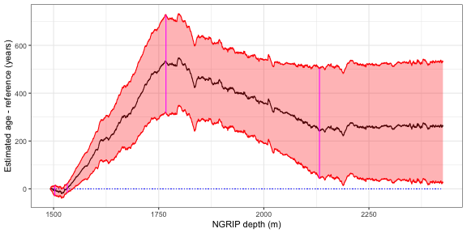

<!-- README.md is generated from README.Rmd. Please edit that file -->


# bremla

<!-- badges: start -->
[](https://github.com/eirikmn/bremla/actions/workflows/R-CMD-check.yaml)
[](https://www.gnu.org/licenses/old-licenses/gpl-2.0.en.html)
<!-- badges: end -->

This repository contains the bremla package (**B**ayesian **Re**gression **M**odeling of **L**ayer-counted **a**rchives) for uncertainty quantification and synchronization for layer-counted proxy archives, including the data and code to reproduce the results for

Myrvoll-Nilsen, E., Riechers, K., Rypdal, M. & Boers, N. (2022). Comprehensive uncertainty estimation of the timing of Greenland warmings of the Greenland Ice core records. Climate of the Past, 18, 1275-1294. doi.org/10.5194/cp-18-1275-2022

and 

Myrvoll-Nilsen, E., Riechers, K. & Boers, N. (202x). Tie-point paper (title TBD)

## installation

The simplest way to install the package is to install the remotes package and run

```r
#install.packages("devtools")
devtools::install_github("eirikmn/bremla")
```

To get started, see the documentation '?bremla' and the associated example.

The package includes the NGRIP/GICC05 data set 'NGRIP_d18O_and_dust_5cm' downloaded from [Centre for Ice and Climate](https://www.iceandclimate.nbi.ku.dk) at the Niels Bohr Institute of the University of Copenhagen, Denmark, and the table of stadial-interstadial events presented by [Rasmussen et al. (2014)](https://www.sciencedirect.com/science/article/pii/S0277379114003485). Also includes the tie-point presented in [Adolphi et al. (2018)](https://cp.copernicus.org/articles/14/1755/2018/) and [Muscheler et al. (2020)](https://www.cambridge.org/core/journals/radiocarbon/article/testing-and-improving-the-intcal20-calibration-curve-with-independent-records/D72D9214C47FE9441B5E730D33DCCE3D). Other data and tie-points should work as well.

Warning: The provided real data example generates several thousand simulated chronologies with individual lengths exceeding 18,000. More if both synchronized and unsynchronized chronologies computed. This will require a significant amount of memory. If needed, reduce the number of samples generated or free up memory before use.

## Example
This is a real data example for the GICC05 chronology of the NGRIP ice core record which produces 5000 simulations from a time scale synchronized using the Adolphi tie-points.

```r
require(INLA)
library(bremla)
data("event_intervals")
data("events_rasmussen")
data("NGRIP_5cm")

age = NGRIP_5cm$age
depth = NGRIP_5cm$depth
depth2 = depth^2/depth[1]^2 #normalize for stability
d18O = NGRIP_5cm$d18O

data = data.frame(age=age,dy=c(NA,diff(age)),depth=depth,depth2=depth2,d18O=d18O)
formula = dy~-1+depth2+d18O

events=list(locations = events_rasmussen$depth,
            locations_unit="depth",degree=1)

results = bremla(formula,data,reference.label="GICC05",
                nsims=5000,
                events=events,
                synchronization=list(method="adolphi"),
                control.fit=list(method="inla"),
                control.sim=list(synchronized=TRUE) )
summary(results)
#> 
#> Call:
#> knit("README.Rmd", "README.md")
#> 
#> Time used:
#>   Model fitting Chron. sampling           Total 
#>          9.5028         99.2515        111.3837 
#> 
#> The fixed component is explained by linear predictor: 
#> dy ~ -1 + depth2 + d18O + psi_fill(degree=1, n_events=69)
#> 
#> The noise component is explained by an ar1 process.
#> 
#> The model is fitted using INLA, with following estimates for the hyperparameters:
#>                 mean     sd quant0.025 quant0.25 quant0.5 quant0.75 quant0.975
#> sigma_epsilon 0.4445 0.0025     0.4396    0.4428   0.4444    0.4461     0.4493
#> phi           0.2639 0.0072     0.2498    0.2591   0.2639    0.2687     0.2779
#> 
#> Simulating 5000 chronologies, using GICC05 as reference.
#> 
#> 5000 synchronized chronologies sampled using 4 tie-point distributions (Adolphi).
#> Tie-points are fixed at GICC05 ages (yb2k):
#> 12050.3, 13050.62, 22050, 42049.59.
```



## Attribution

This code is associated and written for the papers Myrvoll-Nilsen et al. (2022) and Myrvoll-Nilsen et al. (202x) mentioned above. Feel free to use the code, but please cite the accompanying papers.

## License

The code in this repository is made available under the terms of the GNU (version >=2) License. For details, see LICENSE.md file.
